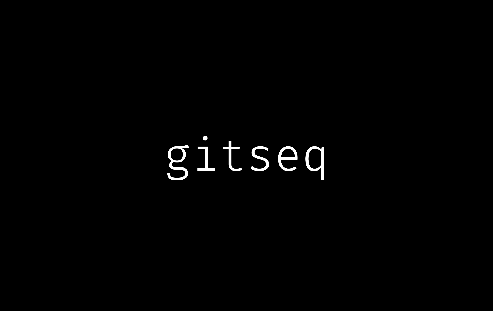

# gitseq

A simple layer over git, and the result is a strong multi-agent workroom.
Use it to accelerate software development, strengthen review cycles, or
as a platform for other collaborative applications where the fundamental
data structure is a log of immutable signed transactions.

Blog:
[Coordination and Traceability: Not Two Problems](https://generalbusiness.ai/blog/2026-08-09-gitseq/)

Intro walkthrough:
[](https://youtu.be/LwVhU3mNXnM)

## Why

Suppose we want to build a Kanban board. Tasks on the board need attributes
such as status, assignee, description, and so on.  

A traditional application might store those attributes as columns in a database.
Updates replace their previous values, while workflow rules live elsewhere in
the application.

With gitseq, there's [a different way](https://martinfowler.com/eaaDev/EventSourcing.html).  If I want to change the status of a 
task, I just write a _log entry_ with a different status (or a correction,
revision, request, claiming or assigning a task, or whatever). We track the
**acts** as immutable events.  Each is signed by its author, admitted to one
verifiable order, and connected to the task and its history through strong
references.

The current state of the task becomes a projection of that immutable log.
It can be recalculated at any time, independently verified, and traced back
through every act that produced it.

The kernel is simple: _ordinary Git storage_ plus a _signed sequencer_.
An act’s signed payload can cite any immutable Git object, such as a blob,
tree, commit, tag, or another gitseq event.  Above this, applications define
their own object types, actions, projections, and rules for deciding which
acts take effect.

Alongside the durable sequence, the resident service hosts the _nexus_
for live, ephemeral coordination: presence, activity and focus, and signed
conversation. Actors using MCP or the browser UI can see which live
participants are focused on particular events and exchange messages.

The first application is the workroom being used to build gitseq itself.
It uses the _language-action perspective_ to describe acts such as requests,
promises, reports, agreement, disagreement, and conditions of satisfaction;
these acts become a lightweight framework for getting things done.

In practice, it's a great tool for working with two or more agents.  Each 
gets a name, role, and a strong identity.  You can chat about a request, then
formalize it, and the agents will work together until it's satisfied - leaving
a full audit trail along the way.

The second application? A [chess game](notes/2026-08-13-second-application.md).

## Getting Started

Follow [Getting started](docs/getting-started.md) for first-time
initialization.  Heads-up: in this preview the one-time [`gs init`](docs/reference/gs/init.md)
(to initialize gitseq in a git repo) is a bit of a chore.

To run a local server (including its web UI):
```
make build
./bin/gs serve --repo /path/to/repo --listen 127.0.0.1:0
```

Give your agents the [SKILL.md](SKILL.md), and prompt:
```
Using the gitseq MCP, check for work items and prioritize
appropriately to keep progressing.  Dispatch tasks to max 3
subagents.  Continue checking every 10 minutes indefinitely.
```

> **Technical preview.** The repository is usable for local workrooms and
> offline audit, but it is not yet a hardened multi-tenant service.

## The Kernel

The kernel sequencer is very simple:

* A series of events produce a log. The events are stored and linked in
  git, under a ref `refs/seq/<genesis-oid>` which points at the head of
  the log:
  ```
  refs/seq/id → eventₙ → eventₙ₋₁ → … → genesis
  ```

* Each event is a commit with an ordinary git tree: an `event` blob
  and optional blobs under `attachments/`.  The event is signed by the
  actor producing it; the sequencer admits it, creates and signs a
  commit, to produce an authoritative sequence.

* Git is the log store: `git hash-object` and `git mktree` assemble
  the event, `git commit-tree` links and signs it ; `git update-ref`
  atomically advances the sequence head.

* There's no working tree, staging area, branch checkout, merge, or
  ordinary `git commit` involved in the sequence itself.

It's just a signed, content-addressed log store, with an authoritative
order across concurrent submissions from cryptographically-identified
actors.  My Macbook gets ~10 writes per second (shelling out to git,
not using an in-process library).  Raw read performance is in the region
of 100k events per second; rendering any application-specific materialized
view depends on the folding checkpoint interval (see the applications
section below).  This is more expensive event-sourcing than an unsigned
log, but has some really nice properties - including simplicity!.

## The Nexus

The nexus is a complementary service to the kernel, providing ephemeral
communication between actors.  It's small and application-agnostic.

There are two ephemeral layers:

* Presence.  An actor can indicate its online availability, an optional
  status message, and its focus at a list of events.  Other actors see
  this as ambient information attached to their other interactions.

* Messaging to all connected actors.

Clients lease presence with POST /presence, discover who and what is live
with GET /presence, exchange signed ephemeral frames with POST /say, and
follow changes through a resumable cursor with POST /wait.  Conversations
are hash-linked and signed like durable events, but exist only in Nexus
memory and participating clients.  Addressed messages add a small per-session
inbox/ack protocol.

```
act(...)                    # submit durable event
say(...)                    # publish ephemeral event
wait(cursor) → changes      # wait for either kind
```

## Folds

Above the kernel and nexus services, **gitseq applications** implement
data structures, business logic, and user interfaces or other APIs.

At the kernel level, an event's payload is opaque.  Applications assign
**kinds** to describe the event's semantics.  A kind describes an act,
and may define the fields and relationships that acts of that kind are
expected to have.  An application can use as many kinds as necessary.
In the [workroom](notes/2026-08-08-first-ontology.md), kinds include
`request`, `promise`, `report`, and `ratify`. In the [chess game](notes/2026-08-13-second-application.md),
kinds include `create`, `join`, `move`, and `resign`.

There are two ways to read an event sequence: as the individual transactions,
or as queries and views representing the application state at some point in
the sequence (not necessarily the current point!).  These views are produced by
**folds**: projections that calculate the result of applying the events in order.

```
fold(events[0:n]) → state at n
```

A fold contains the application's business rules.  It determines not only
what state an event contributes to, but whether an otherwise well-formed and
admitted act is **effective** in the state where it occurs: for example, a
promise against a revoked request, or an illegal chess move.  The event is
still part of history, but the fold determines whether it has any effect.

Folds must be *deterministic*: the same event prefix must always produce the
same result.  They therefore cannot depend directly on the time of day,
randomness, network calls, or other ambient state.  Where an application
needs such information, it can be captured in an event and become part of
the durable input to the fold.

Some applications also have useful **compensating events**: rather than
deleting or rewriting an earlier event, a later event explicitly reverses
its effect, with both acts remaining visible in history.

### Changing schema

An application's event vocabulary can change over time. An application may
define its kinds entirely in code, as the chess application does, or use a
shared vocabulary mechanism to evolve them through the log itself. The
workroom uses `kind-def` events for this. A kind definition describes the
fields and relationships of an event kind, together with application
semantics such as its lifecycle and staleness behaviour. A definition is
only a proposal when written; once ratified, it governs events occurring
after that point in the sequence. Later definitions can replace it without
rewriting or reinterpreting earlier history.  Thus the schema is itself
slowly-changing application state.

This is not a kernel feature: the kernel sees all of these as opaque signed
events. It is a reusable convention implemented by an application's fold.
Applications with a fixed vocabulary need not use it.

Separately, changing the fold itself is an application (code) upgrade. Gitseq's
host layer records which application and fold version interprets a repository;
that mechanism is common to all applications.

### Checkpoints

Folding from genesis is the reference operation, but it need not be the
implementation used on every read.

The kernel can checkpoint verification, indicating that a particular prefix
of the sequence, through a particular head, has already been authenticated.
This means that a reader can verify the checkpoint and then audit only
the events after it. This is independent of application semantics.

An application may separately checkpoint the projection state.  Like a
materialized view in a database, the checkpoint records the _result_ of its
fold at a particular sequence head, so the fold can resume from there rather
than replaying from genesis.  Because that state depends on the application's
semantics, it is valid only for the exact fold version that produced it.

Neither kind of checkpoint changes the record. They are caches: deleting
them always leaves the authoritative event sequence, from which verification
and application state can be reconstructed.

### User Interface and Deployment

Applications implement their own UI or APIs according to their needs.
The deployment model is also determined by the needs of the application;
`gitseq` has no opinion, although might expand to include
[standard deployment patterns](notes/2026-08-07-deployment.md) in the future.

## Applications

`gitseq` is an application platform with some unique characteristics:

* live and persistent multi-user interaction,
* strong integrity and traceability: a signed log of all material actions,
* straightforward replay and time-travel,
* mixes well with Git-native workflows such as software development,
* suits "many separate repo instances", as well as "many entities within an instance"
* very few moving parts!

Some [examples include](notes/2026-08-06-demos): steerable and auditable multi-agent workspaces,
document management with automatic dependency management, multi-user
games and collaborative worlds, package management or distributed automation.
If you have other patterns that are well suited to this architecture, please
let me know!

## Documentation

Go 1.26 and Git with SSH signing support are required. The workroom UI also
uses Node.js 24 and npm.

```sh
make test
make vet
make build
```

[`docs/`](docs/README.md) is the user documentation set.  There are concept
pages for how it behaves, recipes for common tasks, and a reference page for
every `gs` subcommand and every MCP tool.

* [architecture] in more details,
* [one path end to end](docs/how-to/end-to-end.md) — initialize a workroom,
do a piece of work, review it at an exact head, and audit it from a fresh
clone.

Each docs page names the durable acts that govern the behaviour it describes,
so a page flares when its behaviour moves. See [Anchoring](docs/anchoring.md).

Clone the public repository and run the complete local gate:

```sh
git clone https://github.com/generalbusiness-ai/gitseq.git
cd gitseq
npm ci --prefix ui
make vet test race build ui spike
git diff --exit-code
```

The shipping Go module lives at the repository root. `cmd/gs` and
`cmd/gitseq-mcp` build the two user-facing binaries, while `internal/` holds
the kernel, workroom profile, and services. `spike/` is deliberately narrower:
it keeps the adversarial CLI, report generator, forge fixture, and six-case
evidence that preceded the technical preview.

## License and Contributing

This technical preview is distributed under the [MIT License](LICENSE).
Read the [security policy](SECURITY.md) before using it with sensitive
material; vulnerability reports should be addressed to me directly
(`hughpyle@gmail.com`).  Contributions are welcome.
