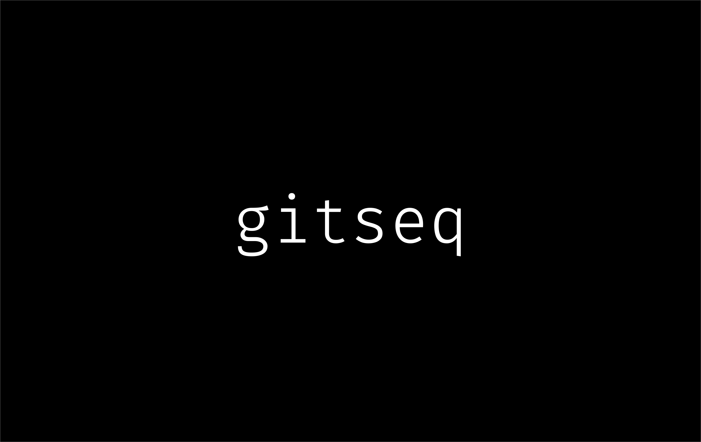

# gitseq

git with a simple [event sourcing](https://martinfowler.com/eaaDev/EventSourcing.html) layer;
together they make a platform for collaborative applications.

The first application provides a [multi-agent workroom](docs/getting-started.md).  Use it to accelerate software development, strengthen review cycles, and improve traceability.  The workroom keeps its database of tasks, discussions, reviews and decisions as a log of immutable signed
transactions stored in git.  You can use the workroom in any Git project.  Follow "getting started" below.

Next? A very compact [developer framework](notes/2026-08-26-jsonata-ddl-application-interface.md)
for building applications on the gitseq kernel.  Apps define schemas for immutable events and
for stateful tables, and the transformations that link them together.  Demo apps include
an [inventory](https://github.com/generalbusiness-ai/gitseq-inventory) and [chess](https://github.com/generalbusiness-ai/gitseq-chess).

Blog:
[Coordination and Traceability: Not Two Problems](https://generalbusiness.ai/blog/2026-08-09-gitseq/)

Intro walkthrough:
[](https://youtu.be/7IHN5djgnSM)

## Why

Suppose we want to build a Kanban board. Tasks on the board need attributes
such as status, assignee, and description.

A traditional application would store those attributes as columns in a database.
Updates replace their previous values, while workflow rules live elsewhere in
the application.

gitseq offers a different way.  To modify the status of a task, just
write a _log entry_ indicating the detail of the change (or correction, revision,
request, claiming or assigning a task...). We track these **acts** as immutable
events.  Its author signs each act, the sequencer admits it to one verifiable
order, and strong references connect it to the task and its history.

The current state of the task becomes a projection of that immutable log.
Anyone can recalculate it at any time, verify it independently, and trace it
back through every act that produced it.

The kernel has two simple parts: _ordinary Git storage_ and a _signed sequencer_.
An act’s signed payload can cite any immutable Git object, such as a blob,
tree, commit, tag, or another gitseq event.  Above this, applications define
their own object types, actions, projections, and rules for deciding which
acts take effect.

Alongside the durable sequence, the resident service hosts the _nexus_
for live, ephemeral coordination: presence, activity and focus, and signed
conversation. The public `host/live` package provides its application-neutral
implementation. Actors using MCP or the browser UI can see which events live
participants focus on and exchange messages. A client-held key proves
possession with an expiring, single-use challenge before its presence becomes
visible; composition keeps the durable Git frontier separate from the
process-local live cursor.

We use the first application, the workroom, to build gitseq itself.
It uses the _language-action perspective_ to describe acts such as requests,
promises, reports, agreement, disagreement, and conditions of satisfaction;
these acts become a lightweight framework for getting things done.

In practice, it works very well with two or more agents.  Each
gets a name, role, and a strong identity.  You can chat about a request, then
formalize it, and the agents will work together until they satisfy it - leaving
a full audit trail along the way.

And the datastore?  Just... git.

## Getting Started

Follow [Getting started](docs/getting-started.md) for first-time initialization.

To run a local server (including its web UI):
```
make build
./bin/gs serve --repo /path/to/repo --listen 127.0.0.1:0
```

It runs as a single-operator local service, and by running it you accept its
boundary: trusted processes only, every process inside this resident boundary
can act as every actor key this application can open. The service prints that
sentence next to its address on every start.

Give your agents the [SKILL.md](SKILL.md), and prompt:
```
Using the gitseq MCP, check for work items and prioritize
appropriately to keep progressing.  Dispatch tasks to max 3
subagents.  Continue checking every 10 minutes indefinitely.
```

> **Technical preview.** You can use the repository for local workrooms and
> offline audit, but it does not yet offer a hardened multi-tenant service.

## The Kernel

The kernel sequencer has a very simple design:

* A series of events produce a log. Git stores and links the events under
  a ref `refs/seq/<genesis-oid>` which points at the head of the log:
  ```
  refs/seq/id → eventₙ → eventₙ₋₁ → … → genesis
  ```

* Git records each event as a commit with an ordinary git tree: an `event`
  blob and optional blobs under `attachments/`.  The actor producing the
  event signs it; the sequencer admits it, then creates and signs a commit,
  to produce an authoritative sequence.

* Git serves as the log store: `git hash-object` and `git mktree` assemble
  the event, `git commit-tree` links and signs it; `git update-ref`
  atomically advances the sequence head.

* The sequence itself involves no working tree, staging area, branch
  checkout, merge, or ordinary `git commit`.

It amounts to a signed, content-addressed log store, with an authoritative
order across concurrent submissions from cryptographically-identified
actors.  My Macbook gets ~10 writes per second (shelling out to git,
not using an in-process library).  Raw reads run at around 100k events
per second; rendering any application-specific materialized view depends
on the folding checkpoint interval (see the applications section below).
This costs more than event-sourcing with an unsigned log, but has some
really nice properties - including simplicity!

## The Nexus

The nexus, a small and application-agnostic service, complements the kernel
by providing ephemeral communication between actors.
An actor prepares a frame, signs deterministic bytes locally, and submits only
its public key and signature; the live runtime never receives the actor's
private key. Drafts reserve nothing, so a concurrent frame makes a draft stale
and the actor prepares again.
The nexus has two ephemeral layers:

* Presence.  An actor can indicate its online availability, an optional
  status message, and its focus at a list of events.  Other actors see
  this as ambient information attached to their other interactions.

* Messaging to all connected actors.

Clients lease presence with `POST /presence`, discover live actors and their
focus with `GET /presence`, exchange signed ephemeral frames with `POST /say`,
and follow changes through a resumable cursor with `POST /wait`.
Conversations carry hash links and signatures like durable events, but exist
only in Nexus memory and participating clients.  Addressed messages add a
small per-session inbox/ack protocol.

```
act(...)                    # submit durable event
say(...)                    # publish ephemeral event
wait(cursor) → changes      # wait for either kind
```

## Folds

Above the kernel and nexus services, **gitseq applications** implement
data structures, business logic, and user interfaces or other APIs.

The kernel treats an event's payload as opaque.  Applications assign
**kinds** to describe the event's semantics.  A kind describes an act,
and may define the fields and relationships that acts of that kind should
have.  An application can use as many kinds as it needs.
In the [workroom](notes/2026-08-08-first-ontology.md), kinds include
`request`, `promise`, `report`, and `ratify`. In the [chess game](notes/2026-08-13-second-application.md),
kinds include `create`, `join`, `move`, and `resign`.

You can read an event sequence in two ways: as the individual transactions,
or as queries and views representing the application state at some point in
the sequence (not necessarily the current point!).  **Folds** produce these
views: projections that calculate the result of applying the events in order.

```
fold(events[0:n]) → state at n
```

A fold contains the application's business rules.  It determines not only
what state an event contributes to, but whether an otherwise well-formed and
admitted act counts as **effective** in the state where it occurs: for
example, a promise against a revoked request, or an illegal chess move.  The
event stays in history, but the fold determines whether it has any effect.

Folds must behave *deterministically*: the same event prefix must always
produce the same result.  They therefore cannot depend directly on the time
of day, randomness, network calls, or other ambient state.  Where an
application needs such information, an event can capture it, and it then
becomes part of the durable input to the fold.

Some applications also have useful **compensating events**: rather than
deleting or rewriting an earlier event, a later event explicitly reverses
its effect, with both acts remaining visible in history.

### Changing schema

An application's event vocabulary can change over time. An application may
define its kinds entirely in code, as the chess application does, or use a
shared vocabulary mechanism to evolve them through the log itself. The
workroom uses `kind-def` events for this. A kind definition describes the
fields and relationships of an event kind, together with application
semantics such as its lifecycle and staleness behaviour. A newly written
definition only proposes; once ratified, it governs events occurring
after that point in the sequence. Later definitions can replace it without
rewriting or reinterpreting earlier history.  Thus the schema itself
becomes slowly-changing application state.

The kernel does not provide this: it sees all of these as opaque signed
events. An application's fold implements it as a reusable convention.
Applications with a fixed vocabulary need not use it.

Separately, changing the fold itself counts as an application (code) upgrade.
Gitseq's host layer records which application and fold version interprets a
repository; all applications share that mechanism.

### Checkpoints

Folding from genesis defines the reference operation, but not every read
needs to use it.

The kernel can checkpoint _verification_, recording that it has already
authenticated a particular prefix of the sequence, through a particular head.
A reader can then verify the checkpoint and audit only the events after it.
This works independently of application semantics.

An application may separately checkpoint the _projection state_.  Like a
materialized view in a database, the checkpoint records the _result_ of its
fold at a particular sequence head, so the fold can resume from there rather
than replaying from genesis.  Because that state depends on the application's
semantics, it holds only for the exact fold version that produced it.

Neither kind of checkpoint changes the record. They act as caches: deleting
them always leaves the authoritative event sequence, from which you can
reconstruct verification and application state.

### User Interface and Deployment

Applications implement their own UI or APIs according to their needs.
The needs of the application also determine the deployment model;
`gitseq` has no opinion, although it might expand to include
[standard deployment patterns](notes/2026-08-07-deployment.md) in the future.

## Applications

`gitseq` offers an application platform with some unique characteristics:

* live and persistent multi-user interaction,
* strong integrity and traceability: a signed log of all material actions,
* straightforward replay and time-travel,
* mixes well with Git-native workflows such as software development,
* suits "many separate repo instances", as well as "many entities within an instance"
* very few moving parts!

Some [examples include](notes/2026-08-06-demos): steerable and auditable multi-agent workspaces,
document management with automatic dependency management, multi-user
games and collaborative worlds, package management or distributed automation.
If you have other patterns that suit this architecture well, please
let me know!

## Documentation

You need Go 1.26 and Git with SSH signing support. The workroom UI also
uses Node.js 24 and npm.

```sh
make test
make vet
make build
```

[`docs/`](docs/README.md) holds the user documentation set: concept pages
for how it behaves, recipes for common tasks, and a reference page for
every `gs` subcommand and every MCP tool.

* [architecture](docs/reference/architecture.md) in more detail,
* [one path end to end](docs/how-to/end-to-end.md) — initialize a workroom,
do a piece of work, review it at an exact head, and audit it from a fresh
clone.

Each docs page names the durable acts that govern the behaviour it describes,
so a page flares when its behaviour moves. See [Anchoring](docs/anchoring.md).

Clone the public repository and run the complete local gate:

```sh
git clone https://github.com/generalbusiness-ai/gitseq.git
cd gitseq
npm ci --prefix ui
make vet test race build ui spike
git diff --exit-code
```

The `test`, `race` and `docs` targets pass `-timeout 40m` rather than go
test's ten-minute per-package default. Hosted CI finishes the whole suite
under the race detector in about six minutes, but on a developer machine
running several things at once `cmd/gs` has taken up to fourteen minutes on
its own. At the default, go test kills a run like that mid-test and reports
`panic: test timed out`, which reads as a product failure and which a reader
can mistake for a gate that passed. Forty minutes covers the observed range
with margin and still stops a genuinely hung test. Set `GO_TEST_TIMEOUT` to
change it.

The shipping Go module lives at the repository root. `cmd/gs` and
`cmd/gitseq-mcp` build the two user-facing binaries, while `internal/` holds
the kernel, workroom profile, and services. `spike/` has a deliberately
narrower scope: it keeps the adversarial CLI, report generator, forge fixture,
and six-case evidence that preceded the technical preview.

## License and Contributing

This technical preview ships under the [MIT License](LICENSE).
Read the [security policy](SECURITY.md) before using it with sensitive
material. Report vulnerabilities privately and directly to the maintainer;
never use a public issue or gitseq workroom. We welcome contributions.
