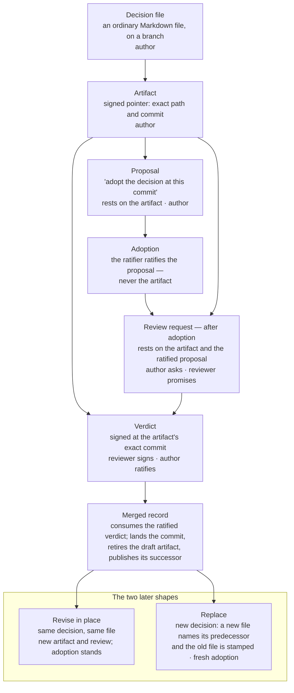

# Keep decision records

Many teams keep decision records — often called ADRs — as Markdown files
in the repository. The file says what was decided; nothing says who
accepted it, who reviewed it, or which decision replaced it. This page
shows what gitseq adds: a signed, append-only record of exactly those
facts, kept in the same repository, while the decision itself stays an
ordinary file.

Colleagues who do not use gitseq lose nothing. They see the files, the
branches, and merge commits whose messages summarise each decision.
Everything else is an overlay they can ignore.

You will take one decision from a draft to an adopted, reviewed, merged
record, then revise its wording, then replace it with a new decision.
Every command on this page runs; they are executed against a scratch
repository by `make test`.

The whole loop at a glance — the steps below walk through it once,
then revise and replace the result:



## Setup used below

A **workroom** is gitseq's overlay on a repository. `gs init` creates
one and names its first participant, the **operator** — here `alice`,
who thereby also holds the **ratifier** role, the authority to accept
proposals. `dana` writes decisions and `rae` reviews them; neither needs
any special role.

```sh
REPO="$(mktemp -d)/project"
git init -q -b main "$REPO"
git -C "$REPO" commit -q --allow-empty -m 'Initial commit'
BASE=$(git -C "$REPO" branch --show-current)
gs init --repo "$REPO" --operator alice >/dev/null
gs actor-add --repo "$REPO" --as alice --name dana --kind human >/dev/null
gs actor-add --repo "$REPO" --as alice --name rae --kind human >/dev/null
```

In your own repository you run `gs init` once and keep working; the
scratch repository here exists so the page can run from nothing.

## 1. Write the decision, on a branch

A decision record is a Markdown file like any other. Write it on a
branch, not on the integration branch, because it will be reviewed and
merged like code.

```sh
git -C "$REPO" switch -q -c decision/use-postgres
mkdir -p "$REPO/docs/decisions"
cat > "$REPO/docs/decisions/0001-use-postgres.md" <<'EOF'
---
title: Use PostgreSQL for the primary store
status: proposed
---

We need transactions and tooling that operations staff already know.
We accept running one more service to get both.
EOF
git -C "$REPO" add docs/decisions/0001-use-postgres.md
git -C "$REPO" commit -q -m 'Record the decision to use PostgreSQL'
HEAD_COMMIT=$(git -C "$REPO" rev-parse HEAD)
```

Now give the draft an identity the workroom can talk about: an
**artifact**, a signed statement naming the exact path and commit. Every
durable command prints an **event identifier**; capture it, because
later acts cite it.

```sh
ARTIFACT=$(gs state --repo "$REPO" --as dana --kind artifact \
  --text 'Decision record drafted for adoption' \
  --body path=docs/decisions/0001-use-postgres.md \
  --body commit="$HEAD_COMMIT")
```

This artifact rests on nothing, and that is correct: nobody asked for
this decision, so there is no earlier act for it to cite. Today you copy
the commit hash yourself; this is the manual step a publish tool would
later do from the push.

## 2. Propose adoption, and ratify it

An artifact is a pointer, not a decision. **An artifact cannot be
ratified** — the workroom refuses that outright. What carries the
authority is a **proposal**: one or two sentences saying "adopt the
decision recorded at this path, at this commit", resting on the
artifact. An actor holding the ratifier role then ratifies the proposal,
and the decision is adopted.

```sh
PROPOSAL=$(gs state --repo "$REPO" --as dana --kind propose \
  --text 'Adopt the decision recorded at docs/decisions/0001-use-postgres.md at this exact commit' \
  --rests-on "$ARTIFACT")
gs ratify --repo "$REPO" --as alice "$PROPOSAL"
```

Adoption comes **before** review on purpose. The review request in the
next step will rest on this ratified proposal, so the verdict, the merge
receipt, and the merged record all reach the adoption through that one
chain. Ratify after the merge instead, and the merged record could never
prove the decision was adopted.

## 3. Ask for a review

Review is an ordinary exchange: dana asks, rae promises, rae signs a
verdict against the exact commit. The request rests on both the artifact
and the ratified proposal — that is the link described above.

```sh
REVIEW_REQUEST=$(gs state --repo "$REPO" --as dana --kind request \
  --text 'Review the decision at its exact head' --body to=@rae \
  --body conditions='the decision states its consequences and the trade-off it accepts' \
  --body head="$HEAD_COMMIT" --body artifact="$ARTIFACT" \
  --rests-on "$ARTIFACT" --rests-on "$PROPOSAL")

REVIEW_PROMISE=$(gs state --repo "$REPO" --as rae --kind promise \
  --text 'I will review it' --rests-on "$REVIEW_REQUEST")

APPROVAL=$(gs review --repo "$REPO" --as rae --checkout "$REPO" \
  --artifact "$ARTIFACT" --promise "$REVIEW_PROMISE" \
  --verdict approved --text 'APPROVED: consequences and trade-off are stated')
```

`gs review` signs only if the checkout is clean and sitting on the
artifact's exact commit, so the verdict names a commit somebody actually
read. Then the verdict is ratified — and **only the review requester
may ratify a verdict**. Not the reviewer, not a ratifier; the person who
asked is the one positioned to say the question was answered.

```sh
gs ratify --repo "$REPO" --as dana "$APPROVAL"
```

## 4. Merge

```sh
git -C "$REPO" switch -q "$BASE"
gs merge --repo "$REPO" --as dana --checkout "$REPO" \
  --candidate "$HEAD_COMMIT" --approval "$APPROVAL" \
  --text 'Adopt: use PostgreSQL for the primary store.'
```

`gs merge` lands the exact approved commit, retires the draft artifact,
and publishes its successor at the merge commit, all in one step. The
`--text` begins the merge commit message — the one place the story
reaches people who never run `gs`: it travels with `git log`, with
GitHub, and with anything that links commits.

## 5. Revise the decision

The rule for later changes is one sentence: **amend the file in place
while it is the same decision; when the decision itself changes, write a
new file and stamp the old one.** This step is the first case.

A revision is the same loop at the same path. The decision was already
adopted, so no new proposal is needed — the review request cites the
existing one.

```sh
git -C "$REPO" switch -q -c decision/use-postgres-wording
cat > "$REPO/docs/decisions/0001-use-postgres.md" <<'EOF'
---
title: Use PostgreSQL for the primary store
status: adopted
---

We need transactions and tooling that operations staff already know.
We accept running one more service to get both. This decision covers
the primary transactional store only.
EOF
git -C "$REPO" commit -q -a -m 'Clarify the scope of the PostgreSQL decision'
HEAD2=$(git -C "$REPO" rev-parse HEAD)

ARTIFACT2=$(gs state --repo "$REPO" --as dana --kind artifact \
  --text 'Revised wording of the PostgreSQL decision' \
  --body path=docs/decisions/0001-use-postgres.md --body commit="$HEAD2")

REVIEW_REQUEST2=$(gs state --repo "$REPO" --as dana --kind request \
  --text 'Review the revised wording at its exact head' --body to=@rae \
  --body conditions='same decision, clearer scope' \
  --body head="$HEAD2" --body artifact="$ARTIFACT2" \
  --rests-on "$ARTIFACT2" --rests-on "$PROPOSAL")
REVIEW_PROMISE2=$(gs state --repo "$REPO" --as rae --kind promise \
  --text 'I will review the revision' --rests-on "$REVIEW_REQUEST2")
APPROVAL2=$(gs review --repo "$REPO" --as rae --checkout "$REPO" \
  --artifact "$ARTIFACT2" --promise "$REVIEW_PROMISE2" \
  --verdict approved --text 'APPROVED: same decision, clearer scope')
gs ratify --repo "$REPO" --as dana "$APPROVAL2"

git -C "$REPO" switch -q "$BASE"
gs merge --repo "$REPO" --as dana --checkout "$REPO" \
  --candidate "$HEAD2" --approval "$APPROVAL2" \
  --text 'Revise the PostgreSQL decision wording: scope clarified.'
```

The first merge retired the artifact the proposal rests on, so the
proposal is now **stale** — a recorded signal that something under it
moved, not a defect. Ordinary staleness does not block a merge: the
merge records what had moved in its receipt and lands the head the
reviewer signed for. The chain of artifacts at this path, one per merged
revision, is now the decision's published history.

## 6. Replace the decision

Now the decision itself changes — the second case of the rule. Write a
new file that names its predecessor, stamp the old file with one line
pointing forward, and do both in one commit. A reader with only git
opens either file and sees what replaced what.

```sh
git -C "$REPO" switch -q -c decision/managed-postgres
cat > "$REPO/docs/decisions/0002-use-managed-postgres.md" <<'EOF'
---
title: Use a managed PostgreSQL service
supersedes: docs/decisions/0001-use-postgres.md
---

Running our own PostgreSQL cost more operations time than it saved.
We accept the loss of superuser access.
EOF
cat > "$REPO/docs/decisions/0001-use-postgres.md" <<'EOF'
---
title: Use PostgreSQL for the primary store
status: superseded by docs/decisions/0002-use-managed-postgres.md
---

We need transactions and tooling that operations staff already know.
We accept running one more service to get both. This decision covers
the primary transactional store only.
EOF
git -C "$REPO" add docs/decisions
git -C "$REPO" commit -q -m 'Replace the PostgreSQL decision with a managed service'
HEAD3=$(git -C "$REPO" rev-parse HEAD)
```

The headers are for people; no tool reads them today. What the workroom
records is two artifacts — the replacement, and the stamped predecessor
resting on it — and a fresh adoption, because a replacement is a new
decision:

```sh
NEW=$(gs state --repo "$REPO" --as dana --kind artifact \
  --text 'Replacement decision: managed PostgreSQL' \
  --body path=docs/decisions/0002-use-managed-postgres.md \
  --body commit="$HEAD3")
STAMP=$(gs state --repo "$REPO" --as dana --kind artifact \
  --text 'The superseded decision, stamped with its replacement' \
  --body path=docs/decisions/0001-use-postgres.md \
  --body commit="$HEAD3" --rests-on "$NEW")

PROPOSAL2=$(gs state --repo "$REPO" --as dana --kind propose \
  --text 'Adopt the replacement decision at docs/decisions/0002-use-managed-postgres.md' \
  --rests-on "$NEW")
gs ratify --repo "$REPO" --as alice "$PROPOSAL2"
```

One review covers both files. Repeating `--artifact` signs the set the
reviewer read, and the merge may retire only what the verdict co-signed:

```sh
REVIEW_REQUEST3=$(gs state --repo "$REPO" --as dana --kind request \
  --text 'Review the replacement at its exact head' --body to=@rae \
  --body conditions='the new decision states why the old one changed; the old file names its replacement' \
  --body head="$HEAD3" --body artifact="$NEW" \
  --rests-on "$NEW" --rests-on "$PROPOSAL2")
REVIEW_PROMISE3=$(gs state --repo "$REPO" --as rae --kind promise \
  --text 'I will review the replacement' --rests-on "$REVIEW_REQUEST3")
APPROVAL3=$(gs review --repo "$REPO" --as rae --checkout "$REPO" \
  --artifact "$NEW" --artifact "$STAMP" --promise "$REVIEW_PROMISE3" \
  --verdict approved \
  --text 'APPROVED: the replacement explains itself and the old file points forward')
gs ratify --repo "$REPO" --as dana "$APPROVAL3"

git -C "$REPO" switch -q "$BASE"
gs merge --repo "$REPO" --as dana --checkout "$REPO" \
  --candidate "$HEAD3" --approval "$APPROVAL3" \
  --text 'Replace the PostgreSQL decision: use a managed service instead.'
```

After this merge both paths carry current artifacts: the replacement,
and the stamped predecessor whose file now points at it. The old-to-new
link lives in the two files and in this chain of records; the workroom
does not yet seal that link as a single fact of its own.

## 7. Read the record

```sh
gs status --repo "$REPO"
git -C "$REPO" log --oneline -3
```

`gs status` shows the current artifact at each path, the superseded ones
behind them, and the satisfied review commitments. The `git log` line is
what a colleague without gitseq sees: three merge messages that read as
the decision log.

## What you get for the ceremony

Each adopted decision costs one proposal, one ratification, one review
exchange, and one merge. In return, four questions that a directory of
Markdown files cannot answer are now signed facts anyone can audit from
a clone: who accepted this decision, who reviewed exactly which text,
what replaced it, and what still rests on it.

## See also

- [Run a work loop](run-a-work-loop.md) — the same review-and-merge
  loop, used for implementation work.
- [`gs review`](../reference/gs/review.md),
  [`gs merge`](../reference/gs/merge.md),
  [`gs ratify`](../reference/gs/ratify.md)
- [Staleness](../concepts/staleness.md) — what a stale mark means, and
  does not mean.
