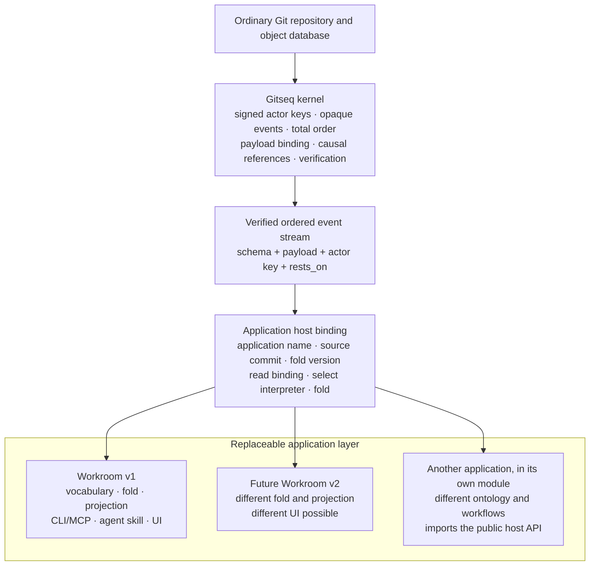

# Architecture layers

Gitseq is a signed sequencing kernel on ordinary Git storage. It can host an
application, but the application's vocabulary is not built into the kernel.
The application shipped in this repository is **Workroom**. Workroom is the
first application profile, not the definition of what every Gitseq sequence
must mean.

This distinction is the main architectural contract:

> The kernel proves who signed opaque bytes, which sequence admitted them, and
> where they stand. An application interpreter decides what those bytes mean.

The same verified stream can therefore feed the current Workroom interpreter,
a future Workroom interpreter, or an application with no commitment concept at
all. Sharing the stream does not make their meanings compatible.

Code, documentation, and reviews must preserve that boundary. A new
application can reuse the kernel without inheriting actors by name, roles,
commitments, artifacts, or the Workroom user interface.

## The layers

The layers build upward. A higher layer may use the guarantees below it; a
lower layer must not import meanings from above it.

### 1. Ordinary Git storage

Git stores objects and advances refs. A durable Gitseq sequence is a chain of
ordinary commits under `refs/seq/<genesis>`. Application files, branches,
tags, and worktrees remain ordinary Git content and are not placed inside the
sequence.

The storage layer knows object formats, commits, trees, refs, compare-and-swap,
and reachability. It does not know Gitseq event kinds or application state.
`internal/gitstore` is the adapter to this layer.

### 2. Kernel

The kernel turns signed requests into one verifiable order. Its public facts
are deliberately narrower than Workroom's facts.

The kernel owns:

- sequence creation, append order, compare-and-swap retry, continuation, and
  verification;
- actor-key attribution and verification of the actor's signature over the
  intent;
- the sequencer admission boundary and the sequencer's signature over each
  accepted position;
- binding an opaque schema name and opaque payload tree to the signed intent;
- carrying the signed `rests_on` strings without assigning them application
  semantics, while refusing at admission a submitted reference that claims a
  position in this log and does not name one;
- idempotency namespaces, keys, replay, and conflicting-retry detection;
- bounds on intent fields, causal-reference counts, envelopes, payloads, and
  attachments;
- verification of history, object shape, signatures, ordering, and payload
  binding;
- signed, profile-independent verification checkpoints containing only
  kernel-verified event material, plus authenticated descendant continuation,
  with an optional opaque selector supplied by the host; and
- sequencer key rotation, sealing, and verified continuation.

Reference resolvability is the one thing the kernel can check about `rests_on`
without an ontology. A canonical event identifier whose workroom half is the log
being submitted to asserts that its event half is a position in that sequence,
and Git alone settles whether it is. Admission refuses a submission that asserts
it falsely, because the sequence is append-only: a dangling reference admitted
once is inherited by every fold and every reader afterwards, and no later act
can repair it. A reference that makes no such assertion — another workroom's
identifier, a URL, any other opaque string — is carried unchanged, because the
kernel has nothing to resolve it against.

The check gates submission and nothing else. Verification, checkpoints and
continuation read history exactly as before, so records sequenced with dangling
references before the gate existed remain readable and remain part of the
verified order.

An application may supply an admission hook. The kernel owns when that hook is
enforced and what signed envelope and capability material it may inspect. The
application owns the policy. The hook cannot inspect application payload
bytes, so it cannot silently turn the kernel into an application interpreter.

The current compact checkpoint schema is `gitseq-checkpoint@3`. It authenticates
kernel identity and event material but carries no application profile. Readers
also accept authenticated JSON `@1` and compact `@2` checkpoints; their required
historical profile field is ignored rather than used as an eligibility key.

A full read may transfer verified events to the selected host interpreter as a
bounded stream instead of retaining a second depth-sized event slice. Delivery
during a cold audit is provisional until the whole kernel chain succeeds: a
later invalid event rejects the read, so callback effects cannot become visible
application state. A compact checkpoint candidate and its suffix are fully
authenticated before replay. `internal/app` folds either path into a private
folder and publishes the folder and projection together only after kernel
verification, complete application folding, frontier persistence and the
projection gate all succeed. This changes the transfer shape, not signature,
ordering, bounds, compare-and-swap or application-interpretation authority.

The kernel does **not** understand:

- actor names, membership, or retirement;
- kinds, roles, governed vocabulary, or authority rules;
- requests, promises, reports, commitments, or work status;
- ratification or supersession semantics;
- artifacts, reviews, retirement, or staleness;
- connector charters; or
- CLI, MCP, agent, browser, or other UI workflows.

`internal/intent` defines and verifies the signed opaque intent.
`internal/kernel` sequences and verifies it. Neither package imports
`internal/workroom`.

### 3. Nexus and live runtime

The nexus is a separate, amnesiac sequence for live coordination. It carries
leased presence, activity, and ephemeral signed conversation. Its cursor and
frames die with the process. It does not change the durable sequence and must
not pretend that live state survived a restart.

Addressed chat keeps this boundary. The Workroom-facing service resolves
mentions against the effective roster; the nexus receives opaque actor
fingerprints, validates exact reply handles, includes the final sorted
recipient list in the actor-signed payload, and retains the conversation for
every current matching lease. It enqueues priority delivery only for leases
that registered the versioned inbox protocol. Presence alone does not opt a
browser or older adapter into an inbox it cannot consume. Per-session inboxes
and acknowledgements are live attention state, not Workroom authority or
durable records. Acknowledgement changes no nexus cursor.

`internal/nexus` implements this layer. The resident in `internal/service`
hosts it alongside the durable application, but co-location is operational
convenience, not a claim that nexus data has kernel durability.

The supported host posture is one trusted operator account, not a partial
shared-host authentication system. `gs serve` discloses that posture on every
start, resolves the listener host to loopback only, and checks every mutation
Host and browser provenance before routing. Within that boundary, the resident
can open several actor keys and every process running as the account is
trusted to ask it to act as any of them. Direct local
`gs` key access and malicious same-account processes remain outside the
resident's protection.

Live credentials belong to this layer. The resident mints each from 256 bits
of system randomness, binds it to one repository and actor, and revokes it on
departure, expiry or restart. Browser and MCP clients keep it in process
memory and never choose it. Ordinary status, presence, tool results, logs,
diagnostics, durable events and URLs expose only a separate display handle,
not the credential. These controls protect the live transport boundary; they
do not change kernel verification or Workroom fold semantics.

Because this layer is per-process, one repository must have one resident.
Two would leave the durable sequence correct and still split presence and
conversation into two rooms whose participants cannot see each other. The
boundary that prevents it is an ownership claim, and it is separate from the
address advertisement:

- **Ownership** is the ref `refs/gitseq/resident/<genesis>`, whose blob holds
  the served address and a fresh random nonce. It is acquired, transferred and
  released only by a Git ref update carrying the expected old value — the same
  compare-and-swap the kernel's own append uses, in the same ref store, so it
  adds no assumption the durable log does not already make. The nonce makes
  each claim's object ID unique to one acquisition, so a swap that expects a
  claim can never match a later one. `internal/app` owns this; the ref never
  touches the event log.
- **Advertisement** is `.git/gitseq/resident.json`. It tells clients where to
  connect and confers nothing. Only a process already holding the claim writes
  it, and a client that reaches a withdrawn or stale address falls back to
  acting locally as before.

Ownership authorizes serving; binding a listener does not. A resident binds
first so the claim can carry the real address, contests ownership, and hands
the listener to the HTTP server only once the claim is held.

Liveness is the one part of this that is not a compare-and-swap, so it is
deliberately asymmetric. A claim is trusted as held unless the address it
names refuses a connection outright; a timeout, a silent port, an unparseable
answer, or an answer from another workroom all leave the claim standing and
refuse the start. `internal/residentclient` owns that probe, including the
duty to refuse to dial anything but loopback, because a claim is an ordinary
repository file and its address is untrusted input. The whole mechanism is
coordination between cooperating residents, not a defence against a hostile
local process, which already reaches the repository directly.

### 4. Application host binding

The host binding selects one application interpreter for the repository before
any application record is folded. Its vocabulary sits above the kernel and
below every application profile, because a host must read it without already
knowing whether the repository contains Workroom, chess, or another
application.

Every host recognizes the fixed binding schema family
`gitseq/app-binding@0`; application profiles cannot rename or extend it.

An effective binding records:

- the application name;
- the application's source commit as a format-qualified object ID;
- the source URL as provenance, never as authority; and
- the fold-profile version or hash that gives the application's records their
  exact meaning.

Reading or recording a binding never fetches, builds, or runs application
code. The source URL remains inert provenance until a person deliberately
uses it outside Gitseq.

The binding is effective only in the repository's bootstrap position, or as a
later replacement signed by the key that initialized the repository. A record
that merely resembles a binding anywhere else has no force. This authority is
a host fact below application roles: retiring an operator inside Workroom does
not revoke the initializing key's binding authority, because another
application has no Workroom roster to consult.

The bootstrap binding and a later replacement are one rule read once: the
binding in force is the last binding record signed by the initializing key, so
the newest effective binding wins. A binding-shaped record that is
unauthorized, unparseable, or malformed has no force and leaves the previous
answer standing. Nobody able to append can therefore make a repository
unreadable by recording one, and a host never refuses to interpret a
repository because of a record it should have ignored.

A fold upgrade is therefore a host-binding replacement, not an application
statement kind. Its source commit and fold version name the interpreter code,
and its position in the sequence is the transition. The initializing key is
the binding authority; the host accepts the replacement only when the named
application and fold are held by the build that opens the repository. The
source URL remains inert provenance and cannot install code.

Opening a repository has one fixed order: **read the binding, select the named
interpreter, then fold**. A host must never fold with a guessed interpreter and
repair the projection after discovering a mismatch. The selection is made when
the repository is opened and does not change while it stays open: a replacement
binding recorded afterwards is read by the next open, so no operation changes
meaning because of activity that followed the open. A repository whose log
cannot be read has no binding to read and does not open.

If the selected interpreter or fold version is unavailable, kernel verification
still stands, but application state is unavailable and the host must report the
repository as verifiable but uninterpretable. That report is a claim about a
verified repository, so it comes after kernel verification, never before it: an
unverifiable chain is reported as an unverifiable chain, and no history an
appender controls can present itself as a missing interpreter instead.

A host that verifies first reads the binding out of the exact frontier it
verified, and the binding read is told which revision to answer for rather than
consulting the ref itself. Asking the ref a second time would leave a gap
between the two questions that a concurrent appender can move in, and the
opened workspace would come back bound by a frontier nobody checked. A host
with no verified frontier yet — one whose audit runs later, when the fold first
reads the log — names the ref, and its selection is still fixed at open.

Repositories created before host bindings have a permanent compatibility
rule: no binding means Workroom at the version shipped by the reader, and the
binding authority is the bootstrap operator key in the opening records. This
avoids a flag-day backfill while making the legacy choice explicit.

The detailed product design is recorded in
`notes/2026-08-13-second-application.md`. Its merged historical filing was
artifact
`git:sha1:5d2622748872b7e2dec3fe5c59e4be73a35e0bc8#git:sha1:d5d30c17385f242466e3804a85e1d050a4e30d33`;
that event is cited here as design history, not as this page's causal basis.
`internal/apphost` holds this vocabulary and the repository state around it:
what a binding record is, who may record one, which one is in force, and what
a checkout must remember to reopen its own log. It imports no application
profile, which is what lets a program that has never heard of Workroom read a
binding a Workroom build wrote. The read is a bounded pre-audit read rather
than a verification — it authenticates the initializing actor's signature over
an intent that names the genesis and the tree the commit carries, and leaves
the sequencer chain to the audit that runs before any record is folded.

`internal/app` selects this build's interpreter from that vocabulary: it
records the binding at init for an application an absent binding does not
already name, and reads the binding in force as the workspace opens, before it
can fold or append anything.

#### Host identity

Identity sits in this layer for the same reason the binding does. An
application must not have to invent it, and a host must be able to read it
without already holding an application profile, so the vocabulary is fixed
here and inherited rather than redefined by each application.

The kernel already answers the only identity question it can answer without
meaning: which key signed this record. A key with nothing more than that is a
first-class actor, and a repository that never says anything else about it is
complete. Everything above that is an upgrade, never a requirement.

The upgrade is an **anchor**: a record saying that one signing key belongs to a
persistent identity, for this repository, within a scope, until an expiry.
Three fixed schema families carry it — `gitseq/identity-witness@0`,
`gitseq/identity-anchor@0`, and `gitseq/identity-revoke@0` — and application
profiles cannot rename or extend them.

An anchor is not simply strong or weak. Two independent things vary, and both
are reported, because collapsing them into one number hides which assumption a
reader is making. **Vouching** says who stands behind the endorsement.
**Verification** says what a reader must trust to check it: a signature carried
in the log verifies offline forever, while a claim needing a third party to
answer again verifies only while that third party cooperates.

One vouching rung is implemented: **witnessed**, where a deployment's key says
a provider said so. The stronger rung, where the identity's own key signs and
nobody beyond the identity has to be trusted, is deferred along with the
providers that would occupy it — Nostr, and a published forge signing key.
Nothing here names it, because a value the code can never produce reads to a
caller as a state to handle and to a reviewer as a rung that was built. The
axis is ordered so that adding it later is one more value and a reduction rule
the verification axis already follows.

Vouching is never claimed in a payload, only derived from which key signed the
record, so no record can promote itself. A witness declaration is in force only
when the key that initialized the repository signed it — the same authority the
binding answers to, and for the same reason, since another application has no
roster to consult. The last authorized declaration wins, so rotating the
witness key is one more record, and it does not reach back: anchors the
previous key signed keep the force they had where they stand. A witness is
declared for named identity schemes and cannot mint an identity outside them,
so adding a provider is a visible act rather than a silent widening.

An endorsement from any other key is a delegation — a new device, or an agent
credential. It names no identity and inherits the endorser's, reduced to the
weaker value on each axis, because nobody can hand on more than they hold. It
cannot outlive the anchor it rests on, and withdrawing that anchor withdraws
what it minted, or a revocation would leave standing the keys it was called to
stop.

Resolution is the authority, and nothing here gates appending. An identity
record that is unauthorized, unparseable, malformed, naming another repository,
or claiming an identity its signer cannot hand on is recorded exactly as signed
and resolves to nothing, leaving the previous answer standing. So no appender
can make a repository's identities unreadable by writing a record, and no
admission check has to be trusted to keep one out.

Expiry and withdrawal are judged against the sequencer's signed timestamp on
the record being folded, never against the reader's clock, so two clones
resolving one log reach the same answers. A provider check — verifying a login
with the provider that issued it — runs outside the fold, and only its result
is signed into the log; replaying a log makes no network request, and a clone
with no access to the provider reads exactly the same identities. That check
holds the person's bearer token, and the rule that keeps it out of a log is
that no byte of provider- or transport-controlled text reaches an error from
it: a refusal is reported as the numeric status with this program's own phrase
for it, and a transport failure or an unreadable answer in fixed words of the
package's own. Redaction was considered and refused, because it removes only
the spelling it goes looking for and the party echoing the credential chooses
the spelling.

This is the mechanism, not a login system. It authenticates nobody and
authorizes nothing: it says who a key belongs to and leaves what that is worth
to the application's fold. Custody of a witness private key belongs to the
deployment under the supported single-operator host posture, in which every
process inside the trusted boundary can use every key that deployment holds,
this one included. Authenticated shared-host support remains deferred, and the
two-axis display surface belongs to the application, not here.

### 5. Application profile and interpreter

An application profile gives opaque kernel events meaning. It owns its schema
family, payload decoding, governed vocabulary, admission policy, deterministic
fold, authority rules, and application decisions. Its interpreter consumes
the verified ordered records and produces application state.

An event whose schema or bound interpreter a reader does not hold remains
**kernel-verifiable**: its keys, signatures, position, payload binding, and
causal strings can still be checked. It is **application-uninterpretable**:
the reader cannot truthfully say what force it has. Consumers must surface
that gap and must not invent fallback meaning from field names, prose, an old
fold, or UI expectations.

#### Workroom, the current application

`internal/workroom` is the Workroom profile and interpreter. Workroom owns:

- the `workroom/*` schemas and governed kind vocabulary;
- its deterministic fold and fold-profile version;
- actor roster, names, membership, roles, and authority;
- commitment lifecycles and who is waiting on whom: an explicit report closes
  when its requester ratifies it, while a promisor's exact-head artifact acts
  as the implementation report and its sealed approved merge closes the
  commitment. A report answers exactly one lifecycle claim: the promise that
  took the work, or — when no promise of the reporter's stands on it — the
  request itself. What it answers is not the same as what it may cite: a
  report on a promise may also rest on that promise's governing request as
  provenance, which is what `gs review` writes, and any other request is
  refused. The direct shape is admitted only from the request's addressee, and
  refused while that actor holds a live promise on the same request, so one
  commitment keeps one closure; it projects as claim and complete, with the
  reporter as performer, no promise, and the requester waiting. Which claim a
  report answered is settled when it is folded and read from there afterwards,
  so a later withdrawal or a later promise cannot move a completion between
  commitments. Widening the basis reinterprets records already in the log — three
  reports refused for want of a promise become effective on a re-fold — so it
  advances the fold profile to `workroom-fold@8`;
- ratification and supersession rules. The projection names the ratification
  in force for a statement, not only that one exists, because the rule cannot
  be recovered from what it hands out: projected acts carry no retirement, so
  neither the first nor the last effective ratification of a target is
  reliably the surviving one. A reader that picked either would be rebuilding
  this layer's retirement rule for itself, so the answer is stated here and
  read everywhere else;
- path-at-commit artifact statements, retirement, succession, reviews, and
  staleness: ordinary staleness crosses governed reasoning edges, while the
  narrower `describes_superseded_world` fact crosses direct retired-artifact
  edges and artifact-to-artifact provenance only. A retirement is read for what
  its own act rested on: a supersession resting on an artifact covering the
  same path is succession and carries no staleness across reasoning edges,
  while one naming no covering successor is condemnation and propagates as
  before. Artifact-to-artifact provenance carries the flare either way, so the
  pages describing an implementation still move when it does;
- guarded review and merge semantics, including the merge receipt that lets the
  implementer of an approved head retire another actor's predecessors only on
  the path lineages of the artifacts that approval itself cites, each standing
  at the approved head and owned by the implementer, since the fold is pure over
  records and can verify no merge head, diff, or tree; merge receipts record
  ordinary reasoning staleness, while a world-stale approval or artifact must
  be re-anchored before merge; the explicitly ratified review approval remains
  a pre-merge requirement, and the same sealed receipt closes the implementation
  commitment whose reporting artifact it merges;
- Workroom MCP tools and their application meanings;
- the agent practice in `SKILL.md`;
- connector clauses and observations; and
- the Work board, event railway, artifact views, and other Workroom UI.

In precise terms, the kernel has no artifact ontology. It stores a signed
schema string, payload binding, and causal strings. The Workroom interpreter
decodes a Workroom state event, recognizes its governed `artifact` kind, and
projects `path@commit`, retirement, succession, and staleness. Another
application may have no artifacts or may define a different concept under a
different schema family.

Workroom also makes live membership an application-level authority boundary.
After the genesis operator seed, a state author must be a live participant,
and an originating requester must still be live to ratify a report. A
departed actor may still supersede an earlier act they authored; that narrow
cleanup exception confers no force on a new state or on a ratification. These
are fold rules rather than kernel admission or signature rules: the kernel
still accepts the signed record, and the application decides what it means.

Workroom state schemas are prospectively versioned when admission tightens.
`workroom/state@0` remains readable with the decisions it historically made;
`workroom/state@1` refuses whole-repository and comma-joined artifact paths.
`workroom/state@2` preserves those path rules and removes new in-fold
activation authority. `workroom/ratify@1` closes the other side of that
boundary: it cannot make an older, previously unratified activation take
effect after host binding took ownership of upgrades. This preserves the
append-only record while preventing new pointers that merge succession cannot
maintain. The schema version is Workroom application meaning, not a kernel
protocol feature.

The same bridge preserves state@0/state@1 `fold-activation` history ratified
with `workroom/ratify@0`:
the old transition and the uninterpretable seam after it replay exactly as
before. `fold-activation` is absent from the current starter vocabulary, new
state@2 records under that name are undefined, and the application refuses a
new state@0/state@1 activation or a ratification@0 submitted after the
boundary. A ratification@1 of an activation is ineffective even if it bypasses
application admission.
New upgrades are binding replacements at the host layer. `kind-def` remains a
finite declarative constraint language; a definition carrying `body.fold` is
uninterpretable and cannot introduce a code pointer.

#### An application outside this module

An application profile does not have to live in this repository. The `host`
package is the public surface a Go module outside this one imports to run on
the kernel, and it is the only gitseq package such a module can import: every
other package here is `internal/`, which the compiler enforces across the
module boundary. What that surface exports is therefore the whole contract.

It exports four acts and nothing else. `Init` creates a sequence and binds it
to the application permanently, recording the binding as the log's first record
so that the key which signed it is the initializing key from then on. `Open`
verifies the sequence and then hands it back only to the application it is
bound to, refusing anything else as verifiable but uninterpretable. `Append`
signs one act with a caller's key and gives it a position. `Records` returns
the verified ordered records.

There is no projection in that list, and its absence is the boundary. An
outside application holds its own fold and its own state; gitseq gives it
authenticated records in order and reads none of their payloads. Nothing
registers an outside interpreter inside this build, so `internal/app` cannot
fold those records and does not try: a Workroom build opening such a
repository reports it as verifiable but uninterpretable, which is the honest
answer.

Two postures differ from Workroom's and are deliberate. The public surface
keeps no roster and applies no admission allowlist, because an outside
application's actors are keys rather than named members; any well-formed act
carrying a good signature is admitted, and the fold decides what force it has.
And it keeps no local signed checkpoint, so each process verifies the log from
the beginning once at open. Both are the simple posture, not a permanent one:
the kernel's bounds still apply, and the signature — never the transport, and
never admission — is what says who acted.

### 6. Projections and queries

A projection is a read model derived from an application interpreter, not a
kernel fact. Workroom projects decisions, actors, commitments, artifacts,
reviews, vocabulary, and staleness. Bounded queries select from that derived
state. Live status may be joined to it, but the durable and live cursors remain
distinct.

`internal/statusview` builds Workroom summaries, orientations, bounded work
pages, exact-path artifact pages, exact-item inspection, the whole-log review
gate, the bounded staleness-wave summary, and the bounded join of a caller's
live priority inbox. The resident and MCP artifact contract remains the live
exact-path page. A separate CLI selection asks the same page-building core for
one of four lifecycle states — live, retired, succeeded, all — or for artifacts
whose chain of artifact bases reaches an anchor path transitively. The
review gate is a fixed answer rather than a composable filter: it reports
review requests awaiting a first verdict, references that resolve to no live
artifact, and the approved heads still worth asking Git about. Whether those
heads have landed is a Git question and is answered by the surface that can
ask, not by the projection. Work and status rows include the
request, report, exact-head, and latest-review facts needed for routine action;
write surfaces return the fold decision after an append rather than previewing
application force. `internal/app` opens a repository, joins the kernel records
to the interpreter the repository is bound to, and exposes the resulting
durable snapshot. Readers must report an unbound or unavailable interpreter
instead of presenting a partial
projection as authoritative. In particular, a degraded client marks priority
chat unavailable; it does not invent an empty live inbox.

The bounded views hold a record's staleness apart from its lifecycle, and the
omission rules that follow are part of the projection contract rather than
presentation detail. Ordinary reasoning staleness qualifies a status; it does
not reopen a finished commitment. A satisfied or withdrawn commitment is
omitted from every default lane whether or not it is stale, and the per-status
counts carry it instead, so a caller reading a default lane is reading work
still owed rather than history. The staleness policy on a work query is a
named value and not an absence: an omitted policy means `summary`, which is
not `include`, and the explicit `include`, `only` and `exclude` policies each
return what they always returned. Naming any lifecycle status also overrides
the summary. A page reports what the summary left out in
`closed_stale_omitted`, which is omitted when it is zero. Retirement and a
superseded world remain individually visible wherever they occur and are
counted apart from ordinary staleness in `retired_artifacts` and
`world_stale_artifacts`, both always present, because one figure covering
every non-current artifact answers nothing in a workroom of any age.

### 7. CLI, MCP, skills, connectors, and UI

The outer surfaces present one application to people and programs:

- `cmd/gs` combines storage and kernel operations with Workroom authoring,
  projection, query, review, merge, and resident commands. Its bounded query
  commands reuse the `internal/statusview` filtering and page builders used by
  the remote surfaces. CLI-only selector request types keep additional reach
  from widening the resident HTTP or MCP contracts as a side effect. Where a
  query needs a fact Git holds
  rather than the projection — whether an approved head is an ancestor of a
  branch — that join happens here, because Git remains outside the Workroom
  interpreter.
- `cmd/gitseq-mcp` exposes Workroom tools and live coordination over an MCP
  transport. The MCP protocol is a surface contract, not the Workroom fold.
  The `work` tool's `stale` enum admits `summary`, `include`, `only` and
  `exclude`, and `summary` is what a call that names no policy receives. The
  tool schema is the surface contract for that default; the selection it
  names belongs to the projection above. The adapter holds one resident-minted
  credential per exact repository, renews or replaces it internally, and never
  returns it through MCP.
- `SKILL.md` is the normative operating contract for an agent participating
  in the Workroom application.
- `internal/connector/github` and `cmd/gitseq-github` translate admitted
  tracker material into Workroom observations. They do not extend the kernel.
- `internal/service` composes repository access, the kernel-backed Workroom
  application, nexus, HTTP projections and queries, and the browser assets. It
  publishes the trusted-process posture in resident status and rejects unsafe
  mutation hosts before a route can act.
- `ui/` renders Workroom projections and live state, keeps its private resident
  credential only in tab memory, and displays the trust boundary before actor
  selection; it does not define durable meaning.

These surfaces may evolve or be replaced without changing kernel validity.
They must not infer application force that the selected interpreter did not
produce.

## Compatibility has six axes

"Compatible with Gitseq" is too broad to be useful. State which contract is
compatible:

| Axis | What must agree | Current marker or example |
|---|---|---|
| Kernel protocol | Genesis, intent and envelope encodings; sequence and signature rules; bounds; rotation and continuation | Kernel and intent version fields and wire markers |
| Host binding | Application name, pinned source commit, fold version, binding authority, and interpreter-selection order | `gitseq/app-binding@0`; legacy absence selects shipped Workroom |
| Application family | Schema family and governance bootstrap interpreted after host selection | `workroom/*` |
| Interpreter or fold | The exact deterministic meaning assigned to the application record | `workroom.ProfileVersion` and the projected fold binding |
| Projection contract | Names, types, limits, cursor behavior, and omission rules of derived read models | Workroom status, summary, work-query, and inspect shapes |
| Surface or UI | Commands, flags, MCP protocol/tool schemas, the exported Go API an outside application imports, connector behavior, browser routes and presentation | `gs`, the MCP protocol version, the exported surface of `host` and `host/identity`, connector flags, and the committed UI build |

A change on one axis does not automatically change the others. For example, a
new browser layout may preserve the projection and fold; a fold change may
preserve the kernel sequence; and a new application family may reuse the
kernel while sharing none of Workroom's tools.

Consumers negotiate or pin the axes they depend on. They must not use surface
similarity as evidence that an interpreter is available or that two folds give
the same result.

## Current package boundaries and coupling

| Package or surface | Layer | Present coupling and intended boundary |
|---|---|---|
| `internal/gitstore` | Ordinary Git storage | Implements object and ref operations, including plain history questions such as whether a branch already carries a commit. It must remain ignorant of application schemas, and it reports "cannot tell" separately from "no" so a failed query is never read as a negative. |
| `internal/intent` | Kernel | Owns canonical signed intents and actor-key fingerprints. Schema and `rests_on` are bounded opaque strings. |
| `internal/kernel` | Kernel | Uses only Git storage, intents, and an optional host interface that loads or stores an opaque checkpoint object ID. It performs no local checkpoint filesystem I/O. Its application admission callback receives envelope facts, not payload meaning. A checkpoint caches only kernel-verified events and kernel identity (schema, object format, genesis, and authenticated sequencer-key lineage), never projection state or an application profile; every candidate is verified from those kernel facts. |
| `internal/custody` | Example application interpreter | Folds opaque offer, acceptance and settlement records into asset-custody state. It manages no local signing keys and defines no kernel policy. |
| `internal/nexus` | Live runtime | Owns process-local coordination. It is independent of the durable Workroom fold. |
| `internal/workroom` | Application profile and interpreter | Owns Workroom schemas, vocabulary, fold, authority, commitments, artifacts, reviews, and staleness. It knows nothing about Git storage, HTTP, or MCP. |
| `internal/apphost` | Application host binding | Defines the application identity, pinned source, fold version, initializing-key authority, and the binding in force shared by every host, together with the repository configuration a checkout needs to reopen its own log. It imports no application profile and has no application ontology. |
| `host` | Application host, public surface | The only package a module outside this one can import. It exports binding at init, opening against a declared application, appending a signed act, and reading the verified record stream — and no projection, because the outside application owns its fold. It depends on the kernel and `internal/apphost`, never on an application profile. |
| `host/identity` | Application host, public surface | Holds the host identity vocabulary an application inherits rather than reinvents: the witness declaration, the anchor, the withdrawal, and the two-axis resolution that judges them. It imports `host` and no application profile, gates no append, and reads no clock. The provider check that turns a login into an identity runs outside the fold, and only its result is recorded. |
| `internal/app` | Application host and boundary adapter | The deliberate coupling point: it opens the repository's configured actor and sequencer key custody, builds Workroom payloads and signed kernel requests, applies application admission, owns the bounded repository-private checkpoint pointer and off switch, reads kernel events, and runs the fold. It also selects one interpreter from the recorded binding as a workspace opens, reports kernel verification ahead of any refusal to interpret, reuses the profile-independent authenticated kernel prefix across fold changes, and gates its separate projection cache on the selected application and fold version. Workroom is the one interpreter this build holds. The trusted resident may invoke this local custody for several actors; the nexus credential does not alter key files, kernel verification or fold authority. |
| `internal/statusview` | Projection and query | Reads Workroom application state, and optionally nexus state, into bounded public views. It does not establish durable meaning. |
| `internal/service` | Composition and transport | Hosts `app`, nexus, projections, queries, and UI over HTTP. It must preserve the distinctions between kernel refusal, application interpretation, durable state, live state, and ordinary Git history. A browser may ask whether named commits are on the mainline; it names commits, never the ref, which this layer resolves. |
| `cmd/gs` | Surface and composition | Contains both kernel-level administration and Workroom-level commands today. It reads Git's first-parent merge diff and composes the Workroom receipt, successor artifacts, and retirements, and it asks Git whether an approved head is already an ancestor of a branch; Git remains outside the Workroom interpreter. Command grouping must not move Workroom concepts into the kernel packages. |
| `cmd/gitseq-mcp` | Surface | Adapts MCP calls to Workroom and nexus operations. Protocol compatibility and fold compatibility are separate. |
| `internal/connector/github`, `cmd/gitseq-github` | Application connector | Applies Workroom charters and emits Workroom observations. It is replaceable and outside the kernel. |
| `AGENTS.md` | Repository policy | Governs implementation and review in this repository, including architecture, security, and simplification checks. It does not define Workroom behavior. |
| `SKILL.md` | Application guidance | Governs agent conduct in Workroom. It is not a kernel protocol specification. |
| `ui/`, `internal/service/uidist` | Surface and UI | Renders current Workroom projections, live runtime state, and the Git history facts the service exposes, as two screens: a sortable list of open requests and one thread drawn as a commitment spine. The committed build may not define new semantics; where the fold and Git disagree it shows both rather than choosing. |

The important existing dependency direction is real: `internal/kernel` does
not import `internal/workroom`; `internal/workroom` does not import Git, HTTP,
or MCP; and `internal/app` joins them. The host binding belongs at that seam,
not in either lower package or inside a particular application. New code
should keep application meaning above it. `host`, `host/identity` and
`internal/apphost` sit at
that seam and must stay free of any application profile: a public surface that
imported the Workroom-coupled adapter would put layer 4 on top of layer 5, and
an outside application would inherit meanings it never asked for. Where `cmd/gs` and
`internal/service` currently compose several layers, treat that as explicit
integration, not permission to make the lower layers understand Workroom.

## Review rule

Every implementation review identifies the affected layers in this page and
states whether the exact head preserves or changes their contract. If the
contract changes, that same head must update this page and re-anchor its
artifact. A reviewer must request changes when a contract-changing head does
not do both. This repository's mandatory pre-merge practice in `AGENTS.md`
adds two checks: security across the affected boundaries, and any opportunity
to achieve the same result more simply. `SKILL.md` remains the reusable
Workroom application guidance; it does not carry these repository policies.
