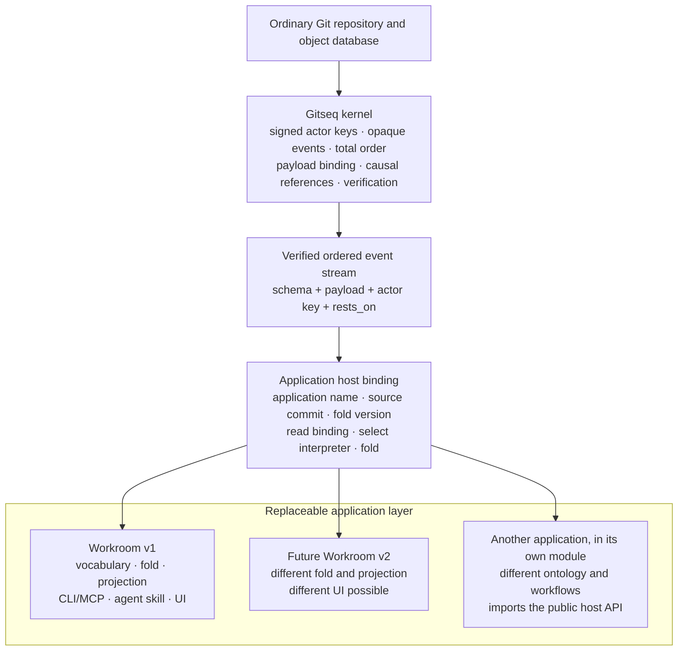

# Architecture layers

Gitseq is a signed sequencing kernel on ordinary Git storage. It can host an
application, but the application's vocabulary is not built into the kernel.
The application shipped in this repository is **Workroom**. Workroom is the
first application profile, not the definition of what every Gitseq sequence
must mean.

This distinction is the main architectural contract:

> The kernel proves who signed opaque bytes, which sequence admitted them, and
> where they stand. An application interpreter decides what those bytes mean.

One verified stream can feed the current Workroom interpreter, a future
Workroom interpreter, or an application with no commitment concept at all.
Sharing the stream does not make their meanings compatible.

Code, documentation, and reviews must preserve that boundary. A new
application can reuse the kernel without inheriting actors by name, roles,
commitments, artifacts, or the Workroom user interface.

## The layers

Seven layers, numbered from storage upward. Each section below says what its
layer owns, what it must never do, and which package holds it.

A higher layer may use the guarantees below it; a lower layer must not import
meanings from above it.

### 1. Ordinary Git storage

**What it owns:** object formats, commits, trees, refs, compare-and-swap, and
reachability.

A durable Gitseq sequence is a chain of ordinary commits under
`refs/seq/<genesis>`. Application files, branches, tags, and worktrees remain
ordinary Git content and are not placed inside the sequence.

This layer does not know Gitseq event kinds or application state.
`internal/gitstore` is the adapter to it.

### 2. Kernel

**What it owns:** turning signed requests into one verifiable order. Its
public facts are deliberately narrower than Workroom's.

The kernel owns:

- sequence creation, append order, compare-and-swap retry, continuation, and
  verification;
- actor-key attribution and verification of the actor's signature over the
  intent;
- the sequencer admission boundary and the sequencer's signature over each
  accepted position;
- binding an opaque schema name and opaque payload tree to the signed intent;
- carrying the signed `rests_on` strings without assigning them application
  semantics, while refusing at admission a submitted reference that claims a
  position in this log and does not name one;
- idempotency namespaces, keys, replay, conflicting-retry detection, and the
  verified read-only exact-replay check used before mutable client preflight;
- bounds on intent fields, causal-reference counts, envelopes, payloads, and
  attachments;
- verification of history, object shape, signatures, ordering, and payload
  binding;
- signed, profile-independent verification checkpoints containing only
  kernel-verified event material, plus authenticated descendant continuation,
  with an optional opaque selector supplied by the host; and
- sequencer key rotation, sealing, and verified continuation.

The kernel does **not** understand:

- actor names, membership, or retirement;
- kinds, roles, governed vocabulary, or authority rules;
- requests, promises, reports, commitments, or work status;
- ratification or supersession semantics;
- artifacts, reviews, retirement, or staleness;
- connector charters; or
- CLI, MCP, agent, browser, or other UI workflows.

`internal/intent` defines and verifies the signed opaque intent.
`internal/kernel` sequences and verifies it. Neither package imports
`internal/workroom`.

#### What the kernel checks about `rests_on`

Reference resolvability is the one thing the kernel can check about `rests_on`
without an ontology. A canonical event identifier whose workroom half is the
log being submitted to asserts that its event half is a position in that
sequence, and Git alone settles whether it is. Admission refuses a submission
that asserts it falsely. The sequence is append-only, so a dangling reference
admitted once is inherited by every fold and every reader afterwards, and no
later act can repair it.

A reference that makes no such assertion — another workroom's identifier, a
URL, any other opaque string — is carried unchanged, because the kernel has
nothing to resolve it against.

The check gates submission and nothing else. Verification, checkpoints and
continuation read history exactly as before, so records sequenced with
dangling references before the gate existed remain readable and remain part of
the verified order.

#### Two admission hooks

An application may supply an admission hook. The kernel owns when that hook is
enforced and what signed envelope and capability material it may inspect. The
application owns the policy. The hook cannot inspect application payload
bytes, so it cannot silently turn the kernel into an application interpreter.

A second, generic hook runs later in the same path: the application's
post-dedup admission callback. The kernel schedules exactly one call to it
after idempotency-replay detection has recognized an exact retry — so a replay
never re-judges history — and before any commit is written. The call hands the
application the decoded intent, the actor key, the payload bytes and
attachments uninterpreted, and the exact pre-sequence head the event would
extend.

The kernel learns nothing from what the callback reads and schedules nothing
else about it. The callback runs inside the compare-and-swap loop, so a log
that moved under a submission makes the application reevaluate the world the
event would actually join before the retried commit chains onto it. A refusal
leaves nothing sequenced.

#### Checkpoints and streamed reads

The current compact checkpoint schema is `gitseq-checkpoint@3`. It
authenticates kernel identity and event material but carries no application
profile. Readers also accept authenticated JSON `@1` and compact `@2`
checkpoints; their required historical profile field is ignored rather than
used as an eligibility key.

A full read may transfer verified events to the selected host interpreter as a
bounded stream instead of retaining a second depth-sized event slice. Delivery
during a cold audit is provisional until the whole kernel chain succeeds: a
later invalid event rejects the read, so callback effects cannot become
visible application state. A compact checkpoint candidate and its suffix are
fully authenticated before replay. `internal/app` folds either path into a
private folder and publishes the folder and projection together only after
kernel verification, complete application folding, frontier persistence and
the projection gate all succeed. This changes the transfer shape, not
signature, ordering, bounds, compare-and-swap or application-interpretation
authority.

### 3. Nexus and live runtime

**What it owns:** live coordination that dies with the process.

The nexus is a separate, amnesiac sequence. It carries leased presence,
activity, and ephemeral signed conversation. Its cursor and frames die with
the process. It does not change the durable sequence and must not pretend that
live state survived a restart.

#### Addressed chat

The Workroom-facing service resolves mentions against the effective roster.
The nexus receives opaque actor fingerprints, validates exact reply handles,
includes the final sorted recipient list in the actor-signed payload, and
retains the conversation for every current matching lease.

It enqueues priority delivery only for leases that registered the versioned
inbox protocol. Presence alone does not opt a browser or older adapter into an
inbox it cannot consume.

Per-session inboxes and acknowledgements are live attention state, not
Workroom authority or durable records. Acknowledgement changes no nexus
cursor.

#### Signing stays outside the runtime

`host/live` implements this layer as a public, application-neutral runtime.
An application prepares an optimistic frame draft, signs the canonical bytes
outside the runtime, and submits the public key and signature. The runtime
never receives an actor private key.

A draft retains no reservation: its generation, scope, conversation, sequence,
or previous hash moving before submission makes it stale, so the application
prepares again. For a new conversation, the conversation identifier hashes a
genesis envelope that binds the exact scope, runtime generation, and runtime
signing key before the actor signs that identifier.

#### Sessions and challenges

Public-key sessions follow the same custody rule. Preparing a session returns
a bounded, expiring challenge and publishes no presence. The client signs the
challenge bytes with the named actor key; only a valid proof opens the lease.
A challenge is consumed by its first opening attempt and cannot be replayed,
even after a failed signature.

Actor names, presence values, lease duration, pending challenges, total
sessions, and sessions per actor all have exported limits enforced before open
and again on renewal.

The separate `OpenTrustedSession` entry point is only for an in-process
custodial adapter which already authenticated the actor or holds its private
key. A public or browser transport must never route to that entry point.

#### Joining live state to durable state

`host/live` can wait on a caller-supplied durable reader and its own live
observation, but it treats the durable value as opaque and retains a
`DurableFrontier` separately from the process-local live cursor. Bounded
polling notices ordinary Git progress written by another process without
suggesting that a live cursor orders, authenticates, or survives with the
durable sequence. The application host, not the live runtime, chooses and
interprets the durable frontier.

The resident in `internal/service` hosts the same runtime alongside the
durable application and supplies Workroom message policy at that composition
boundary. Co-location is operational convenience, not a claim that live data
has kernel durability.

#### Host posture

The supported host posture is one trusted operator account, not a partial
shared-host authentication system. `gs serve` discloses that posture on every
start, and resolves the configured listener host to loopback only.

Before routing a request, it requires the Host to contain an explicit numeric
port and either a literal loopback IP or `localhost`, compared without case and
with one optional trailing dot. It never resolves request hostnames, so an
attacker cannot win admission by changing a DNS answer to point at loopback. It
also checks every mutation's browser provenance, and every response it gives a
browser carries one policy set in one place: a Content-Security-Policy that
admits only the service's own origin and denies framing, `X-Frame-Options`,
`X-Content-Type-Options: nosniff` and a no-referrer policy.

Within that boundary, the resident can open several actor keys, and every
process running as the account is trusted to ask it to act as any of them.
Direct local `gs` key access and malicious same-account processes remain
outside the resident's protection.

The operator's ambient Git environment is trusted on the same footing.
`GIT_DIR`, `GIT_WORK_TREE` and `GIT_COMMON_DIR`, which decide which
repository Git resolves; `GIT_CONFIG`, `GIT_CONFIG_GLOBAL`,
`GIT_CONFIG_SYSTEM` and the rest of the `GIT_CONFIG_*` family, which decide
what configuration it reads; and `HOME` and `XDG_CONFIG_HOME`, which locate
several of those files — all are outside the threat model. Gitseq trusts the
environment of the operator who runs it, and defending a hostile
operator-controlled environment is a non-goal.

The reason a defence there would buy little is worth stating exactly, because
the sweeping version of it is false. Some of these variables name a program
Git will run: `core.fsmonitor`, `core.pager` and `diff.external` are commands,
and an include can reach a configuration file outside the repository. Setting
one of those, and then reaching a Git invocation that consults it, gets code
run as the operator — which is the account the resident's keys already live
in, so such an attacker gains nothing they could not reach another way. Others
only route or select configuration, and whether they lead to anything depends
on a relevant Git invocation existing at all. So the claim is not that anyone
who can set any of these variables can already execute code; it is that this
boundary is not where gitseq stops an attacker who is already inside the
operator's account.

Two different things follow, and the page keeps them apart because they are
not the same kind of claim.

Where the code bounds the environment for **determinism**, it is not making a
security claim: a read that ignores the invoking shell answers for the
repository it was pointed at, whoever started the process. `internal/app`
states the environment for the Git commands behind `/v0/worktrees` on that
basis, and that is all it is doing.

`internal/gitstore`'s `hermeticGitEnvironment` is **defence in depth, and a
control that exists rather than a convenience**. It strips `GIT_CONFIG` and
every `GIT_CONFIG_*` variable from the inherited environment, then pins
`GIT_CONFIG_NOSYSTEM`, `GIT_CONFIG_SYSTEM` and `GIT_CONFIG_GLOBAL` at a
location that can hold nothing. It is applied on the paths that sign and
verify — `SignedCommit` and SSH commit verification run through
`runHermetic` — so operator configuration cannot redirect `gpg.ssh.program`
and substitute the program that signs or checks a signature. A test in
`internal/gitstore` sets a hostile `gpg.ssh.program` through both
`GIT_CONFIG_GLOBAL` and the `GIT_CONFIG_COUNT` family and asserts that
signing and verification are unchanged and the planted program is never
invoked. Describing this as determinism would erase a control the code
actually provides, and would tell the next maintainer that weakening the
signing and verification quarantine is free. It is not.

#### Live credentials

The resident mints each live credential from 256 bits of system randomness,
binds it to one repository and an actor fingerprint derived from that actor's
public key, and revokes it on departure, expiry or restart. Browser and MCP
clients keep it in process memory and never choose it.

Ordinary status, presence, tool results, logs, diagnostics, durable events and
URLs expose only a separate display handle, not the credential. These controls
protect the live transport boundary; they do not change kernel verification or
Workroom fold semantics.

#### One resident per repository

Because this layer is per-process, one repository must have one resident. Two
would leave the durable sequence correct and still split presence and
conversation into two rooms whose participants cannot see each other.

The boundary that prevents it is an ownership claim, separate from the address
advertisement:

- **Ownership** is the ref `refs/gitseq/resident/<genesis>`, whose blob holds
  the served address and a fresh random nonce. It is acquired, transferred and
  released only by a Git ref update carrying the expected old value — the same
  compare-and-swap the kernel's own append uses, in the same ref store, so it
  adds no assumption the durable log does not already make. The nonce makes
  each claim's object ID unique to one acquisition, so a swap that expects a
  claim can never match a later one. `internal/app` owns this; the ref never
  touches the event log.
- **Advertisement** is `.git/gitseq/resident.json`. It tells clients where to
  connect and confers nothing. Only a process already holding the claim writes
  it. `gs` uses it whenever no `--server` flag is given, so the resident a
  repository already runs answers by default. A bounded read whose resident
  refuses or diverges still falls back to the verified local fold, loudly; a
  durable act refuses instead, because a silent local fold is a whole-log
  rebuild the author never asked for and cannot see. `--server -` always acts
  locally.

Reading the advertisement answers one of three things, not two: nothing is
advertised, a record names this workroom at some address, or a record is there
and cannot be trusted. Only a genuinely missing file is absence. Unreadable,
larger than the 8 KiB bound, not a record, carrying no address, or naming
another workroom are all the third answer, and it carries the reason.

`internal/app` owns that read, and `internal/residentclient` owns the clause
naming which of the six failures it is — not each surface's complete sentence,
whose remainder is the way out that surface offers. That is what keeps the two
from drifting into separate accounts of the same record. `cmd/gs` turns the
third answer into a refusal of the whole command before it reads a signing key
or appends anything, and names `--server -` as the way out. `cmd/gitseq-mcp`
refuses the durable call for the same reason and before the same work, while
leaving the attachment and the session intact, and still lets a read answer
from the verified local fold. It judges the record on every durable act rather
than once per session, and again before any fall back to the local fold, so a
remembered address never stands in for a record that has since been rewritten
— see [`gs serve`](gs/serve.md).

Ownership authorizes serving; neither a liveness proof nor binding a listener
does. A resident first probes any incumbent claim so a
service already holding the requested port produces a precise ownership
refusal instead of an opaque bind error. It then binds, so a new claim can
carry the real address, and may spend the preflight's dead-claim proof only on
one compare-and-swap against the exact object it observed. If that position
moved, it discards the proof, re-reads and probes normally. It must hold the
post-bind claim before handing the listener to the HTTP server, so a claim that
appears or moves after preflight is still protected.

#### The liveness probe is deliberately asymmetric

Liveness is the one part of this that is not a compare-and-swap. A claim is
trusted as held unless the address it names refuses a connection outright; a
timeout, a silent port, an unparseable answer, or an answer from another
workroom all leave the claim standing and refuse the start.

`internal/residentclient` owns that probe, including the duty to refuse to
dial anything but loopback, because a claim is an ordinary repository file and
its address is untrusted input. The whole mechanism is coordination between
cooperating residents, not a defence against a hostile local process, which
already reaches the repository directly.

### 4. Application host binding

**What it owns:** selecting one application interpreter for the repository
before any application record is folded.

This vocabulary sits above the kernel and below every application profile,
because a host must read it without already knowing whether the repository
contains Workroom, chess, or another application.

Every host recognizes the fixed binding schema family
`gitseq/app-binding@0`; application profiles cannot rename or extend it.

#### What a binding records

An effective binding records:

- the application name;
- the application's source commit as a format-qualified object ID;
- the source URL as provenance, never as authority; and
- the fold-profile version or hash that gives the application's records their
  exact meaning.

Reading or recording a binding never fetches, builds, or runs application
code. The source URL remains inert provenance until a person deliberately uses
it outside Gitseq.

#### Replacing a binding

A replacement additionally records the exact genesis and outgoing fold
version. The signed intent already targets that genesis; carrying it in the
canonical replacement payload makes the transition legible on its own. The
outgoing version is a compare-and-set condition, not commentary: if another
replacement has moved the binding before this one can append, admission
refuses it instead of silently overwriting the newer choice.

A fold upgrade is therefore a host-binding replacement, not an application
statement kind. Its source commit and fold version name the interpreter code,
and its position in the sequence is the transition. The initializing key is
the binding authority; the host accepts the replacement only when the named
application and fold are held by the build that opens the repository. The
source URL remains inert provenance and cannot install code.

Replacing a binding authorizes the incoming fold to interpret every existing
record; it does not prove that the fold preserves the outgoing fold's
judgments. Before publishing a fold-version bump that anyone will migrate
across, the application must therefore publish either evidence that both folds
produce the same judgments over the existing log, or an enumeration of every
difference and why it is acceptable. A checked-in legacy projection fixture,
such as `internal/workroom/testdata/legacy_projection.golden.json`, is one
repeatable way to supply equivalence evidence. The replacement operation does
not manufacture this proof and must not be presented as doing so.

#### Who may bind

The binding is effective only in the repository's bootstrap position, or as a
later replacement signed by the key that initialized the repository. A record
that merely resembles a binding anywhere else has no force.

This authority is a host fact below application roles: retiring an operator
inside Workroom does not revoke the initializing key's binding authority,
because another application has no Workroom roster to consult.

The bootstrap binding and a later replacement are one rule read once: the
binding in force is the last binding record signed by the initializing key, so
the newest effective binding wins. A binding-shaped record that is
unauthorized, unparseable, or malformed has no force and leaves the previous
answer standing. Nobody able to append can therefore make a repository
unreadable by recording one, and a host never refuses to interpret a
repository because of a record it should have ignored.

#### The order in which a repository opens

Opening a repository has one fixed order: **read the binding, select the named
interpreter, then fold**. A host must never fold with a guessed interpreter and
repair the projection after discovering a mismatch.

The selection is made when the repository is opened and does not change while
it stays open: a replacement binding recorded afterwards is read by the next
open, so no operation changes meaning because of activity that followed the
open. A repository whose log cannot be read has no binding to read and does
not open.

If the selected interpreter or fold version is unavailable, kernel
verification still stands, but application state is unavailable and the host
must report the repository as verifiable but uninterpretable. That report is a
claim about a verified repository, so it comes after kernel verification,
never before it: an unverifiable chain is reported as an unverifiable chain,
and no history an appender controls can present itself as a missing
interpreter instead.

A host that verifies first reads the binding out of the exact frontier it
verified, and the binding read is told which revision to answer for rather
than consulting the ref itself. Asking the ref a second time would leave a gap
between the two questions that a concurrent appender can move in, and the
opened workspace would come back bound by a frontier nobody checked. A host
with no verified frontier yet — one whose audit runs later, when the fold
first reads the log — names the ref, and its selection is still fixed at open.

#### Repositories created before host bindings

They have a permanent compatibility rule: no binding means Workroom at the
version shipped by the reader, and the binding authority is the bootstrap
operator key in the opening records. This avoids a flag-day backfill while
making the legacy choice explicit.

#### Which packages hold this layer

`internal/apphost` holds the vocabulary and the repository state around it:
what a binding record is, who may record one, which one is in force, and what
a checkout must remember to reopen its own log. It imports no application
profile, which is what lets a program that has never heard of Workroom read a
binding a Workroom build wrote.

Its read is a bounded pre-audit read rather than a verification. It
authenticates the initializing actor's signature over an intent that names the
genesis and the tree the commit carries, and leaves the sequencer chain to the
audit that runs before any record is folded.

`internal/app` selects this build's interpreter from that vocabulary: it
records the binding at init for an application an absent binding does not
already name, and reads the binding in force as the workspace opens, before it
can fold or append anything.

The public `host` boundary keeps actor custody and sequencer custody separate.
For an actor-held key, `Prepare` returns the canonical encoded intent without
writing or reserving anything. `ActorSigningBytes` asks `internal/intent` for
the fresh domain-separated bytes the actor signs outside the host, so the
public boundary never names or reconstructs the kernel's domain tag.
`internal/intent.SigningBytes` canonical-decodes the intent before returning
those bytes, and both local `Sign` and admission `Verify` use that one
construction. `AppendSigned` receives only the prepared act, public key and
signature. Before submission it verifies the signature and requires the signed
sequence, application idempotency namespace, non-host schema and payload tree
to match this workspace. A malformed or tampered public submission therefore
reaches no Git write. `Append` remains the local-custody convenience over the
same kernel protocol.

Sequencer custody is explicit when an already-fetched clone becomes a writer.
`OpenAttached` takes a public attachment description containing the existing
genesis and a local OpenSSH sequencer-key path. It derives the object format
from the clone, verifies the existing sequence before interpreting its binding,
and creates neither a genesis nor repository configuration. The kernel still
checks that key against the verified current sequencer at append. This makes
opening an attached writer a different operation from `Init`, without exposing
`internal/apphost.Config` or changing sequencing semantics.

The detailed product design is recorded in
`notes/2026-08-13-second-application.md`. Its merged historical filing was
artifact
`git:sha1:5d2622748872b7e2dec3fe5c59e4be73a35e0bc8#git:sha1:d5d30c17385f242466e3804a85e1d050a4e30d33`;
that event is cited here as design history, not as this page's causal basis.

#### Repository configuration custody

The state a checkout remembers — the repository-private configuration holding
the genesis, object format, payload ceiling, sequencer key path, local actor
custody, and the last verified frontier — has its own custody contract.

**Creating it is exclusive.** The content is written and closed at a privately
named staging file in the same directory, and only the completed file is then
hard-linked to the destination. Of two concurrent creators exactly one wins
and the other is refused, so an attach that lost the creation race fails
instead of silently answering for a genesis it never stored. Because the link
publishes a file that is already whole, a concurrent reader sees the
destination as either absent or complete while the system stays up. A crash
keeps no such promise: nothing syncs the staging file or its directory before
the link, so a power loss can persist the directory entry ahead of the data.

**Replacing it is a rename.** A temporary file is written and renamed over the
destination. That is how an initialization stores the file and how every later
save publishes its result.

**Updating it takes a lock.** An update holds an exclusive advisory lock
across one whole load-modify-store, reloading the file inside the lock and
merging only what the caller declares, so a process holding stale memory
cannot erase custody another process recorded meanwhile. Rename-over alone
prevents torn reads, not lost updates. The lock lives in a dedicated
`.config.lock` beside the protected file and is never renamed, so a crash
cannot leave a lock dangling: the kernel drops it when the process dies. Where
no advisory locking exists, updates refuse loudly rather than lose updates
silently, while creating a first configuration stays available.

**The lock is one named, application-neutral primitive.** Its acquisition is
exported and takes a bare lock-file name in the metadata directory. A surface
above with its own read-modify-write to serialize — `gs publish` and its
outboxes — takes its own name through the same code rather than growing a
second answer to the same crash-safety question. Each name is a separate lock,
so a caller holding one may still update its configuration inside it.

**The two paths do not accept the same filesystems.** Creation requires hard
links within the metadata directory — a refused link is reported as the
creation's failure, with no rename fallback — so an attach can be refused on a
filesystem where an initialization succeeds.

**Both ends fail closed.** Where exclusive creation, the update lock, or the
rename is refused, the writer reports the failure and the writable
configuration does not proceed. A missing or partially visible file never
validates, so a reader refuses to open rather than acting on a configuration
nobody stored.

**In memory, the configuration is copied out and locked inside.** A
configuration leaves an open workspace only as a copy sharing no mutable state
with it. A holder therefore cannot alter the workspace's actor custody or
verified frontier through the value it was handed. The live configuration is a
private field of the workspace, so the compiler makes that copy the only read
path out of the owning package.

Inside the workspace, one in-memory configuration lock serializes every read
and write of those two mutable fields, the actor map and the verified
frontier. A copy is therefore a consistent observation, and no reader sees
either field mid-update.

That lock guards memory only. Persisting a change happens inside the update's
load-modify-store under the on-disk advisory lock, with the in-memory lock
released across it. Once the store completes, the freshly stored custody
fields are adopted back into memory under the in-memory lock. The in-memory
lock is distinct from the on-disk advisory lock that serializes separate
processes.

#### Host identity

Identity sits in this layer for the same reason the binding does. An
application must not have to invent it, and a host must be able to read it
without already holding an application profile, so the vocabulary is fixed
here and inherited rather than redefined by each application.

The kernel already answers the only identity question it can answer without
meaning: which key signed this record. A key with nothing more than that is a
first-class actor, and a repository that never says anything else about it is
complete. Everything above that is an upgrade, never a requirement.

**The upgrade is an anchor:** a record saying that one signing key belongs to
a persistent identity, for this repository, within a scope, until an expiry.
Three fixed schema families carry it — `gitseq/identity-witness@0`,
`gitseq/identity-anchor@0`, and `gitseq/identity-revoke@0` — and application
profiles cannot rename or extend them.

**Two axes, reported separately.** An anchor is not simply strong or weak, and
collapsing the two into one number hides which assumption a reader is making.
**Vouching** says who stands behind the endorsement. **Verification** says
what a reader must trust to check it: a signature carried in the log verifies
offline forever, while a claim needing a third party to answer again verifies
only while that third party cooperates.

Two vouching rungs are implemented. **Witnessed** means a deployment's key
says a provider said so. **Self-signed** means the identity's own Nostr key
signed the anchor, so nobody beyond that identity has to be trusted for the
claim. Both are reachable states produced by the resolver, and self-signed is
the stronger value when a delegation reduces the chain to its weakest rung. A
published forge signing key remains deferred because its verification would
need a live lookup.

**Nostr anchors.** A Nostr anchor carries a complete NIP-01 signed event, in
the shape returned by the standard NIP-07 `signEvent` browser call. Its
content is one deterministic, domain-separated delegation string binding the
repository, Gitseq subject key, application-owned scope and expiry. The event
uses the fixed ephemeral kind `20000` and an empty tag array, so neither field
can silently widen the grant; its `created_at` participates in the NIP-01
event id but grants no authority and does not govern Gitseq time. The proof is
not intended for relay publication. The subject's Ed25519 key also signs the
containing Gitseq record, so the persistent root and the session key both
accept the binding. The host identity interpreter recomputes the NIP-01 event
id and verifies its BIP-340 signature; the kernel continues to verify only its
own Ed25519 actor and order and never imports the curve or Nostr vocabulary.

**Withdrawal has two paths.** The session key that accepted a Nostr anchor may
withdraw it through the ordinary host act. The persistent Nostr root may also
use the same NIP-07 event envelope to sign a repository-bound withdrawal and
let any Gitseq actor submit it. That second path matters when the session key
was lost or compromised; the resolver admits it only when the withdrawal proof
names the same root as the anchor. A root withdrawal retires the signed NIP-01
grant event id, not merely one Gitseq record that carried it: every earlier or
later replay of that exact proof is ineffective from the withdrawal's log
position onward. A genuinely fresh root-signed event has a fresh id and can
grant again.

**Vouching is never claimed in a payload**, only derived from signatures the
host verifies, so no record can promote itself. A witness declaration is in force
only when the key that initialized the repository signed it — the same
authority the binding answers to, and for the same reason, since another
application has no roster to consult. The last authorized declaration wins, so
rotating the witness key is one more record, and it does not reach back:
anchors the previous key signed keep the force they had where they stand. A
witness is declared for named identity schemes and cannot mint an identity
outside them, so adding a provider is a visible act rather than a silent
widening.

**Delegation inherits, reduced.** An endorsement from any other anchored key
is a delegation — a new device, or an agent credential. It names no identity
and inherits the endorser's, reduced to the weaker value on each axis, because
nobody can hand on more than they hold. It cannot outlive the anchor it rests
on, and withdrawing that anchor withdraws what it minted, or a revocation
would leave standing the keys it was called to stop.

**Resolution is the authority, and nothing here gates appending.** An identity
record that is unauthorized, unparseable, malformed, naming another
repository, or claiming an identity its signer cannot hand on is recorded
exactly as signed and resolves to nothing, leaving the previous answer
standing. So no appender can make a repository's identities unreadable by
writing a record, and no admission check has to be trusted to keep one out.

**Time comes from the log, not the reader.** Anchor, delegation and withdrawal
boundaries are judged against verified log position, so records sharing one
signed second still follow their immutable order. The public identity boundary
resolves an exact record id and fails closed when that id is unknown or
changed; it offers no timestamp-only lookup. `NotAfter` expiry alone is judged
against the sequencer's signed timestamp on the record being folded, never
against the reader's clock, so two clones resolving one log reach the same
answers.

**Provider checks stay outside the fold.** Verifying a login with the provider
that issued it runs outside the fold, and only its result is signed into the
log. Replaying a log makes no network request, and a clone with no access to
the provider reads exactly the same identities.

That check holds the person's bearer token. The rule that keeps it out of a
log is that no byte of provider- or transport-controlled text reaches an error
from it. A refusal is reported as the numeric status with this program's own
phrase for it. A transport failure or an unreadable answer is reported in
fixed words of the package's own. Redaction is not enough, because it removes
only the spelling it goes looking for, and the party echoing the credential
chooses the spelling.

**This is the mechanism, not a login system.** It authenticates nobody and
authorizes nothing: it says who a key belongs to and leaves what that is worth
to the application's fold. The public display helper keeps anchored versus
unanchored state and both trust axes visible; applications still decide what
that presentation authorizes, if anything. Custody of a witness private key
belongs to the deployment under the supported single-operator host posture, in
which every process inside the trusted boundary can use every key that
deployment holds, this one included. Authenticated shared-host support remains
deferred.

### 5. Application profile and interpreter

**What it owns:** giving opaque kernel events meaning.

An application profile owns its schema family, payload decoding, governed
vocabulary, admission policy, deterministic fold, authority rules, and
application decisions. Its interpreter consumes the verified ordered records
and produces application state.

An event whose schema or bound interpreter a reader does not hold remains
**kernel-verifiable**: its keys, signatures, position, payload binding, and
causal strings can still be checked. It is **application-uninterpretable**:
the reader cannot truthfully say what force it has. Consumers must surface
that gap and must not invent fallback meaning from field names, prose, an old
fold, or UI expectations.

#### Workroom, the current application

`internal/workroom` is the Workroom profile and interpreter.

**Schemas and fold.** Workroom owns the `workroom/*` schemas and governed kind
vocabulary, its deterministic fold, and its fold-profile version.

**Actors.** It owns the actor roster, names, membership, roles, and authority.

**Commitments: who is waiting on whom.** An explicit report closes when its
requester ratifies it. A promisor's exact-head artifact acts as the
implementation report, and its sealed approved merge closes the commitment.

A report answers exactly one lifecycle claim: the promise that took the work,
or — when no promise of the reporter's stands on it — the request itself. What
it answers is not the same as what it may cite: a report on a promise may also
rest on that promise's governing request as provenance, which is what
`gs review` writes, and any other request is refused.

The direct shape is admitted only from the request's addressee, and refused
while that actor holds a live promise on the same request, so one commitment
keeps one closure. It projects as claim and complete, with the reporter as
performer, no promise, and the requester waiting.

Which claim a report answered is settled when it is folded and read from there
afterwards, so a later withdrawal or a later promise cannot move a completion
between commitments. Widening the basis reinterprets records already in the
log, so it advances the fold profile to `workroom-fold@8`.

**Unclaimed reassignment is a signed request-local compare and swap.** The
guarded retirement schema names the exact old request and explicitly expects
no admitted direct promise or completion. It is effective only while that
request is live and fresh. The guarded replacement schema names both the old
request and the one effective guarded retirement it follows; it refuses when a
promise or completion appeared between the acts. Unrelated records do not
matter. The fold reads its admitted dependency and completion facts rather
than a projected status word, because a retired request can project as
`withdrawn` while a late direct completion remains in its history.

Both schemas lower to the ordinary supersession and request shapes only after
their guards pass, so retirement, staleness, commitment, inspect, and status
projections keep one implementation. A fold that does not know the schemas
leaves them ineffective instead of treating them as unguarded acts. This
semantic change advances the profile to `workroom-fold@13`; a cache written
under `@12` is rejected and the same verified history is replayed.

**Every projected statement carries the lifecycle it was decided under** — the
definition bound at that record's own position, not whichever definition of
its kind stands now. A reader classifying a historical record by the current
vocabulary would disagree with the fold about what that record is, so a
redefined kind would silently change the meaning of claims already made. The
one place the current vocabulary is right is the statement not yet appended,
which has no position and will be decided under the definition standing when
it lands.

Carrying the lifecycle changes the exact projection bytes, which is what a
projection cache is keyed on, so it advances the profile again to
`workroom-fold@9`: a cache written under `@8` is rejected and the history
replayed, rather than answered from the old world.

**Ratification and supersession.** The projection names the ratification in
force for a statement, not only that one exists. A reader cannot recover that
rule from what the projection hands out: projected acts carry no retirement,
so neither the first nor the last effective ratification of a target is
reliably the surviving one. A reader that picked either would be rebuilding
this layer's retirement rule for itself. The answer is stated here and read
everywhere else.

**Artifacts and staleness.** Workroom owns path-at-commit artifact statements,
retirement, succession, reviews, and staleness. Ordinary staleness crosses
governed reasoning edges, while the narrower `describes_superseded_world` fact
crosses direct retired-artifact edges and artifact-to-artifact provenance
only.

A retirement is read for what its own act rested on. A supersession resting on
an artifact covering the same path is succession, and carries no staleness
across reasoning edges. One naming no covering successor is condemnation, and
propagates as before. Artifact-to-artifact provenance carries the flare either
way, so the pages describing an implementation still move when it does.

**Review and merge.** Workroom owns guarded review and merge semantics,
including the merge receipt. That receipt lets the implementer of an approved
head retire another actor's predecessors only on the path lineages of the
artifacts that approval itself cites, each standing at the approved head and
owned by the implementer. The bound exists because the fold is pure over
records and can verify no merge head, diff, or tree.

Merge receipts record ordinary reasoning staleness. An approval or artifact
that already described a superseded world when the verdict was signed must be
re-anchored before merge; one the world moved under afterwards is recorded
instead. The explicitly ratified review approval remains a pre-merge
requirement, and the same sealed receipt closes the implementation commitment
whose reporting artifact it merges.

The `cmd/gs` composition surface also owns phase-one merge authorization. An
optional `--authorization` names an ordinary ratified Workroom report that
closes an authorization request and binds the exact candidate, ratified
approval, original implementation request, and measured target head. The CLI
identifies the exact implementation and authorization commitments and admits
only a report signed by the original implementation requester, the live actor
named exactly `planner`, or a live actor carrying `ratifier`. It checks those
facts and bindings twice before Git moves. A newer target is accepted only
under an explicit `disjoint-paths` remeasurement whose candidate and target
path sets do not intersect.

The Git receipt seals both the authorization report and its exact
sequencer-admitted `RatifiedBy` event. Embedding that unpredictable event ID in
the later Git commit is the temporal witness that the report had force before
Git moved. Recovery requires the pair, revalidates the commitments, signer,
bindings and target measurement against the sealed pre-head, and appends no
durable suffix if the current ratification differs. A receipt with neither
field is legacy; one with authorization but no witness fails closed. The
durable receipt preserves the same pair, so later ratification cannot rewrite
the order in which a merge occurred. This changes no kernel guarantee,
Workroom vocabulary, fold rule, projection, or cache profile.

Phase two should use a declared application seam rather than search request
prose. A future `workroom/state@3` request field
`merge_authorization=required`, projected under the next fold profile, can make
the flag mandatory after every resident and adapter restarts on that binding.
Until then omission warns and preserves the in-flight phase-one migration.

For an added or modified file, and a rename destination, the merge adapter
publishes the successor at the exact changed-file path and selects only live
predecessors at that same exact string. A wider artifact covering the landed
destination stays live and is sealed in the receipt: it is a separate path
lineage, not a predecessor a narrower successor may retire. Removing a rename
source or deleted file retires its exact-file artifact with no successor there
and changes its covering directories, so in-target directory pointers may be
retired and the widest directory successor published.

The receipt also accounts for every other live artifact covered by the
first-parent diff without granting authority over it: it seals a wider pointer
already current in the target world as carried, or records an outside-world
candidate as protected by an unsettled durable commitment or abandoned. A
carried pointer has no cleanup duty. Accepting and rendering this class changes
the deterministic projection for a fixed log, so it advances the profile from
`workroom-fold@17` to `workroom-fold@18`; a cache written under `@17` is
rejected and history is replayed. The Git and durable receipts also seal the
canonical exact old/new path set from the first-parent diff, so the fold can
verify coverage without interpreting a Git tree or treating every artifact
below a broad successor as changed. The fold verifies the testimony from log
facts at the receipt's position and fixes the successor's succession warning
there; receipts without the two prospective fields retain the historical
moving, current-fold calculation.

Before Git moves, the CLI also constructs every signed succession request and
applies the kernel's exact genesis-ceiling measure plus the resident JSON
transport limit when that surface is selected. Thus the application cannot
land a merge whose required durable receipt or later succession act is too
large to admit. This projection change advances the profile to
`workroom-fold@11`.

**The receipt freshness checkpoint.** A sealed prospective receipt is a
checkpoint on the single edge from that receipt to a successor the same merge
published. Ordinary staleness causes already active at or before the
receipt's own position were settled by the merge and do not make that
successor stale at birth. A cause arising after the receipt still propagates,
direct retirement of the receipt still flares the successor, and the receipt
itself stays historically stale: only the successor begins a new current
implementation epoch.

The exception is narrow and fail-closed. It needs an authorized retirement
plan carrying both `merge_left_live` and a canonical `merge_changed_paths`,
cited directly by an artifact its own author signed, standing at the receipt's
exact merge head, at a path the receipt declared it would publish. A malformed
half-pair, a historical receipt without the pair, and a record that merely
cites a receipt gain nothing. Whether individual left-live testimony verifies
is not read: that testimony is accounting about other actors' candidates and
grants no freshness.

Causes are weighed one at a time and dated, because comparing staleness now
against staleness as of the receipt cannot separate an old cause from a new
one while both are live, and a cause the fold cannot date fails closed.
`describes_superseded_world` is unchanged in every branch.

Ownership is this layer: the rule lives in the fold's staleness computation
and projection, not in the kernel and not in `gs`, which continues only to
validate and construct receipts and successors. This projection change
advances the profile to `workroom-fold@12`, so a cache written under `@11` is
rejected and the history replayed.

**The admitted-time authority rule.** A ratification is decided by the
satisfier on the target kind's definition **as that definition stood when the
target statement was admitted**, never by whichever definition of the kind
governs now. The fold has always decided this way: the definition is bound to
the record at admission and read back from there. It is the rule `lifecycle`
already follows, for the same reason — a kind redefined later must not change
what earlier records mean, or what may be done to them.

What changes here is that the fold now publishes that captured satisfier per
statement instead of keeping it to itself. It has to. The value is not
recoverable from what a reader is given: the captured definition is not in the
projection, and reconstructing it would mean replaying every kind definition
and its ratifications in reading order — this layer's authority rule, rebuilt
outside this layer. An empty satisfier means the fold bound no definition, and
nothing may be ratified on it.

This projection change advances the profile to `workroom-fold@14`, so a cache
written under `@13` is rejected and the history replayed. Without that gate a
cache predating the field would answer every reader "no satisfier", and every
ratification would be silently withheld from actors entitled to make it.

**Truthful artifact completion.** An explicit report and an implementation
artifact have different closing authority, so the fold projects different
states. An explicit report is `reported` and waits on its originating
requester, whose ratification can satisfy it. An artifact is
`awaiting-merge` and waits on its performer: its admitted satisfier is
`none`, so the requester cannot ratify it, and only an independently approved
exact-head merge, which the performer signs, closes the implementation
commitment. The application write boundary reads that same
admission-time satisfier before signing a ratification. When it is `none`, it
refuses and names the target kind, the satisfier, and the applicable workflow
act, rather than adding an ineffective attempt to the permanent log.

The browser and bounded status/query projections preserve `awaiting-merge` as
unfinished work. Naming no waiting party at all, as `@15` did, left approved
heads in nobody's queue; naming the performer puts each one in the lane of the
actor who must sign its merge. Each of those projection changes altered the
application projection bytes and lifecycle meaning, so each advanced the
profile: `@14` to `@15`, then `@15` to `workroom-fold@16`; a cache written
under an older profile is rejected and history is replayed.

**Rejected-round successor transfer.** A ratified `changes-requested` verdict
rejects an implementation head but does not say where its required repair went.
The fold recognizes that transfer only from an explicit supersession of the old
request. At the supersession's own position it requires one effective child
request cited after the target, the same requester on both requests, a direct
child-to-parent provenance edge, and a live ratified changes-requested verdict
that explicitly names the reporting artifact and its exact commit. The old
commitment then becomes terminal `superseded` and carries
`successor_request`; it is never relabelled satisfied, cancelled, or reneged.
The qualification is sealed on the supersession, so retiring or failing the
child later changes only the child row. Retiring the supersession itself
restores the ordinary parent state.

This also changes projection bytes and lifecycle meaning. It shipped in the
same `workroom-fold@15` candidate as the empty-waiting-party projection, so
that deployed transition was one step from `@14` to `@15`; the later step to
`@16` names the performer and is described above.

**Write-boundary guards.** One Workroom admission evaluation serves every
state surface — `gs state`, `gs batch`, the MCP state and review tools, and
the canonical guarded review path. It runs once before signing for early
feedback, and authoritatively through the kernel's post-dedup callback against
the exact pre-sequence frontier, read from a private verified world that
shares nothing with reader snapshots, checkpoint cadence, or the rollback
witness.

An undefined state kind refuses before signing with no override:
command-shaped kinds point at their dedicated commands and tools, and any
other absent kind lists the live vocabulary with the ratified kind-def that
must establish it. Declared custom kinds stay valid.

A report whose `body.verdict` or `body.status` is exactly approved or
changes-requested is a review verdict and refuses on generic paths, naming the
guarded route. Canonical review paths carry the reserved `body.review_path`
marker, and reserved admission fields are never caller input.

A state resting on an already-retired basis refuses by default until the
author asks for the recorded escape (`body.dead_basis_override=true`), while
an effective supersession stays advisory. A basis whose only problem is
staleness stands where it stood, so the state is admitted and the boundary
stamps the reserved `body.stale_bases` field with the same one-line staleness
note a merge receipt carries. That field is never caller input, and the
authoritative half does not trust a signature over it: it computes the same
note from the pre-sequence frontier and refuses any act whose signed
`body.stale_bases` is not exactly that, absence included on fresh ground, so a
writer that skipped the client surface cannot sign testimony of its own.
`body.dead_basis_override` is deliberately unlike it — a request the author is
entitled to make, recorded and granting nothing — and is honoured wherever it
is found. Neither the refusal, the override, nor the recorded note removes
staleness or grants authority.

The guarded verdict path owns head-news discovery — statements sequenced
strictly after the review request that name the reviewed head or lane —
exact-set acknowledgment validation, canonical acknowledgment encoding,
frontier binding, and act construction, shared by `gs review` and the MCP
review tool so they cannot drift.

Guarded reassignment uses the same exact-frontier admission boundary, but only
after kernel idempotency replay detection. A genuinely new act is refused
before append when its request-local expectation no longer holds; an exact
retry replays without re-judging history that moved afterwards. The fold still
enforces both new schemas, so an older or admission-skipping resident cannot
grant unguarded force. The expectation is about claims alone — zero admitted
promises and zero admitted direct completions. A stale request is reassignable,
because a basis moving under it does not claim it.

Admitting reassignment of a stale request changes what the fold decides about
existing histories, so it advances the profile again, to `workroom-fold@17`; a
cache written under `@16` is rejected and history is replayed. Two fold changes
landed in sequence and each took its own step: the waiting party on
awaiting-merge commitments at `@16`, and admissible stale bases at `@17`.

**Surfaces and guidance.** Workroom also owns its MCP tools and their
application meanings; the agent practice in `SKILL.md`; connector clauses and
observations; and the Work board, event railway, artifact views, and other
Workroom UI.

**What this means precisely.** The kernel has no artifact ontology. It stores
a signed schema string, payload binding, and causal strings. The Workroom
interpreter decodes a Workroom state event, recognizes its governed `artifact`
kind, and projects `path@commit`, retirement, succession, and staleness.
Another application may have no artifacts or may define a different concept
under a different schema family.

**Live membership is an application-level authority boundary.** After the
genesis operator seed, a state author must be a live participant, and an
originating requester must still be live to ratify a report. A departed actor
may still supersede an earlier act they authored; that narrow cleanup
exception confers no force on a new state or on a ratification. These are fold
rules rather than kernel admission or signature rules: the kernel still
accepts the signed record, and the application decides what it means.

**An affordance and a signature are different questions, and the browser asks
both.** What a control offers is drawn from the projection at render time;
what may be signed is decided at the moment of signing, from the projection as
it stands then. The two answers differ whenever authority moves under an open
form — a lease expires, a membership grant is superseded, a target is retired
— and the fold judges the record by what is true when it arrives, not by what
was true when the button appeared. So the browser guards at the boundary that
signs rather than only at the button: `signingRefusal` in `ui/src/lib`, asked
by `doAct` in `App.tsx` and `send` in `Thread.tsx`. Publishing is the third
durable path and asks `publishRefusal` at its own boundary.

That guard dispatches by act, because the fold does not apply one rule to all
of them, and a browser that pretended otherwise would refuse work the fold
accepts. For a ratification the fold settles *standing* first — a target it has
not ruled effective, and a retired target, are refused before any satisfier is
consulted — and only then asks who may satisfy the kind. Standing fails closed:
a caller that cannot resolve the target's decision is refused, because a guard
that cannot see the fact must not vouch for it. Effectiveness is not carried on
the statement; it is published per record in `decisions`, so the boundary must
be handed the decision as well as the record.

For a supersession the same guard is narrowed to the ordinary withdraw path the
browser actually offers, and fails closed everywhere else. It refuses without a
resolved target — `decideSupersede` refuses an unknown target before it reads
anything else — and without a resolved viewer, since every branch past that
compares the signer against somebody. The departed own-author exception is held
to that ordinary path: `decideSupersede` sends a roster target through
governance first, where the founding seed can never be retired, an operator
grant or a membership carrying operator needs `operator`, and every other roster
change needs `ratifier`, and authorship is not consulted at all. The projection
carries a statement row for every state record, roster included, so those
records reach the generic row affordance like any other; the browser withholds
`withdraw` from them and refuses them at the boundary rather than restating the
governance ladder, which would be a second copy of the fold to keep in step.
Excluding is a refusal the fold would not always make, and that is the safe
direction: `gs supersede` files the act and the fold rules on it.

The cost of getting this wrong is not a failed click. Offering an act the fold
refuses appends a permanent ineffective row to an append-only log: a durable
record that somebody tried to do something they were never allowed to do.

**Workroom state schemas are prospectively versioned when admission tightens.**
`workroom/state@0` remains readable with the decisions it historically made.
`workroom/state@1` refuses whole-repository and comma-joined artifact paths.
`workroom/state@2` preserves those path rules and removes new in-fold
activation authority. `workroom/ratify@1` closes the other side of that
boundary: it cannot make an older, previously unratified activation take
effect after host binding took ownership of upgrades. This preserves the
append-only record while preventing new pointers that merge succession cannot
maintain. The schema version is Workroom application meaning, not a kernel
protocol feature.

The same bridge preserves state@0/state@1 `fold-activation` history ratified
with `workroom/ratify@0`: the old transition and the uninterpretable seam
after it replay exactly as before. `fold-activation` is absent from the
current starter vocabulary, new state@2 records under that name are undefined,
and the application refuses a new state@0/state@1 activation or a
ratification@0 submitted after the boundary. A ratification@1 of an activation
is ineffective even if it bypasses application admission.

New upgrades are binding replacements at the host layer. `kind-def` remains a
finite declarative constraint language; a definition carrying `body.fold` is
uninterpretable and cannot introduce a code pointer.

#### An application outside this module

An application profile does not have to live in this repository. The `host`
package is the public surface a Go module outside this one imports to run on
the kernel, and it is the only gitseq package such a module can import: every
other package here is `internal/`, which the compiler enforces across the
module boundary. What that surface exports is therefore the whole contract.

It exports five acts and nothing else:

- `Init` creates a sequence and records the first application binding, making
  that record's signer the initializing key.
- `Open` verifies the sequence and then hands it back only to the application
  and exact fold it is bound to, refusing anything else as verifiable but
  uninterpretable.
- `ReplaceBinding` lets the initializing key record an evidenced transition to
  another exact fold without weakening that open-time equality.
- `Append` signs one application act with a caller's key and gives it a
  position.
- `Records` returns the verified ordered records.

There is no projection in that list, and its absence is the boundary. An
outside application holds its own fold and its own state; gitseq gives it
authenticated records in order and reads none of their payloads. Nothing
registers an outside interpreter inside this build, so `internal/app` cannot
fold those records and does not try: a Workroom build opening such a
repository reports it as verifiable but uninterpretable, which is the honest
answer.

Two postures differ from Workroom's and are deliberate. The public surface
keeps no roster and applies no admission allowlist, because an outside
application's actors are keys rather than named members; any well-formed act
carrying a good signature is admitted, and the fold decides what force it has.
And it keeps no local signed checkpoint, so each process verifies the log from
the beginning once at open. Both are the simple posture, not a permanent one:
the kernel's bounds still apply, and the signature — never the transport, and
never admission — is what says who acted.

### 6. Projections and queries

**What it owns:** read models derived from an application interpreter.

A projection is not a kernel fact. Workroom projects decisions, actors,
commitments, artifacts, reviews, vocabulary, and staleness. Bounded queries
select from that derived state. Live status may be joined to it, but the
durable and live cursors remain distinct.

`internal/statusview` builds Workroom summaries, orientations, bounded work
pages, exact-path artifact pages, exact-item inspection, the whole-log review
gate, the bounded staleness-wave summary, and the bounded join of a caller's
live priority inbox.

The resident and MCP artifact contract remains the live exact-path page. A
separate CLI selection asks the same page-building core for one of four
lifecycle states — live, retired, succeeded, all — or for artifacts whose
chain of artifact bases reaches an anchor path transitively.

The review gate is a fixed answer rather than a composable filter. It reports
review requests awaiting a first verdict, references that resolve to no live
artifact, and the approved heads still worth asking Git about. Whether those
heads have landed is a Git question and is answered by the surface that can
ask, not by the projection.

Work and status rows include the request, report, exact-head, and
latest-review facts needed for routine action. Write surfaces return the fold
decision after an append rather than previewing application force.

Pending ratification is a separate attention lane, not a commitment state.
`internal/statusview` selects effective, unratified, live proposals whose
captured `role:<name>` satisfier is held by the actor being viewed. It reads the
satisfier projected on each statement, never the current vocabulary, because
the fold admits a ratification under the definition captured with that
statement. Ratification, proposal supersession, or a standing effective direct
dissent removes the row; ordinary staleness remains a qualifier on it. Status,
wait, and work expose the same bounded selection. Work uses an `event` field
for these rows and leaves `request` empty, so the query does not manufacture a
request, performer, promise, or waiting party around a proposal. The browser's
awaiting-ratification population applies the same standing and captured-role
rules to the full projection.

`internal/app` opens a repository, joins the kernel records to the interpreter
the repository is bound to, and exposes the resulting durable snapshot.
Readers must report an unbound or unavailable interpreter instead of
presenting a partial projection as authoritative. In particular, a degraded
client marks priority chat unavailable; it does not invent an empty live
inbox.

Its read-only snapshot path is separate from the resident snapshot cache. It
verifies and folds the complete signed sequence without publishing a
checkpoint, advancing the persisted verified-frontier witness, or changing the
workspace's in-memory reader state. A diagnostic surface whose contract
includes no local mutation uses that path even when a normal snapshot could
repair useful acceleration state.

#### Staleness is held apart from lifecycle

The bounded views hold a record's staleness apart from its lifecycle, and the
omission rules that follow are part of the projection contract rather than
presentation detail.

Ordinary reasoning staleness qualifies a status; it does not reopen a finished
commitment. A superseded, satisfied, or withdrawn commitment is omitted from every default
lane whether or not it is stale, and the per-status counts carry it instead,
so a caller reading a default lane is reading work still owed rather than
history.

The staleness policy on a work query is a named value and not an absence: an
omitted policy means `summary`, which is not `include`, and the explicit
`include`, `only` and `exclude` policies each return what they always
returned. Naming any lifecycle status also overrides the summary.

A page reports what the summary left out in `closed_stale_omitted`, which is
omitted when it is zero. Retirement and a superseded world remain individually
visible wherever they occur and are counted apart from ordinary staleness in
`retired_artifacts` and `world_stale_artifacts`, both always present, because
one figure covering every non-current artifact answers nothing in a workroom
of any age.

#### A superseded world carries its date

`world_superseded_at` on a statement and on an artifact is the log position of
the earliest retirement **still accounting for** that moved world, and the
fold is the only layer that computes it.

A reader deciding whether a judgement was made before or after the world moved
needs that position, and cannot recover it from the acts alone: the acts say a
supersession happened, not whether its own supersession has since withdrawn
it. Two retirements can account for one moved world, and withdrawing the
earlier leaves the later as the only live cause, which moves the date forward.

The date is taken across **every** basis a record cites, not the first one
carrying the flag. Stopping at the first would let the order a signer wrote
its citations in decide the date, hiding an older cause behind a newer one,
and that date gates an irreversible merge. Deriving the same rule a second
time outside the fold means a second copy of it, and the copy is what drifts.

The field is zero when the fold finds no active cause. For a record that
describes a superseded world that is a fact to fail closed on, never
permission: `gs merge` refuses an undated superseded world rather than reading
the absence as "after the verdict", because a projection it cannot date is not
a projection it may merge on. This carries the fold profile to
`workroom-fold@10`, since the published projection bytes change.

### 7. CLI, MCP, skills, connectors, and UI

**What it owns:** presenting one application to people and programs.

- `cmd/gs` combines storage and kernel operations with Workroom authoring,
  projection, query, review, merge, and resident commands. Its bounded query
  commands reuse the `internal/statusview` filtering and page builders used by
  the remote surfaces. CLI-only selector request types keep additional reach
  from widening the resident HTTP or MCP contracts as a side effect. Where a
  query needs a fact Git holds rather than the projection — whether an
  approved head is an ancestor of a branch — that join happens here, because
  Git remains outside the Workroom interpreter.

  Its merge command adds one prospective surface rule the fold does not hold:
  a reviewed path bounds cross-author retirement at itself and beneath it,
  never above it. That rule is checked once, in fresh-merge preflight: after
  Git reserves the receipt ref and stages the tentative merge, but before the
  target moves and before any durable workroom record is appended.

  Succession recording never re-applies that guard. Resuming an already-sealed
  receipt appends its recorded suffix without replanning, so the symmetric
  lineage rule of layer 5 keeps judging everything already admitted.

  `reassign-if-unclaimed` composes the two guarded schemas and derives stable
  per-act idempotency keys from one required key. Batch exposes the same two
  verbs and lets its labels carry the exact retirement into the replacement.
  Both paths can resume after the first act without weakening the guard. The
  retirement's signed `cited_ok` is an explicit checkout/admission escape
  carried across remote sequencing and replay; it is not part of the
  `UnclaimedExpectation` compare-and-swap tuple and grants no fold authority.

  Its publication adapter joins two facts that deliberately live in different
  layers: the exact head an ordinary Git remote already accepted, and the
  repository-owned watch globs read from the tracked `.gitseq` at that head.
  It records **no artifact**. Merge succession above already lands an
  artifact at every changed path, so a second live artifact minted per push
  at a source path would be an accounting row the merger did not create and
  often cannot lawfully retire. What it records instead is an app-validated
  `assert` per changed watched path, carrying the path, the accepted head and
  the remote under `publication_`-prefixed fields, which no governed kind
  requires and this surface therefore validates itself. Asserts never enter
  the artifact map, so publication changes nothing about succession or
  left-live accounting. The adapter holds one operating-system-released
  advisory lock across the repository-wide remote/ref frontier and the
  actor-specific durable outboxes, queues the derived acts before submission,
  and verifies each against the decision of the sequencer that accepted it —
  never against a different frontier. This is a CLI reconciliation contract:
  it adds no file meaning to the kernel and no Git or outbox access to the
  Workroom fold.
- `cmd/gitseq-mcp` exposes Workroom tools and live coordination over an MCP
  transport. The MCP protocol is a surface contract, not the Workroom fold.
  The `work` tool's `stale` enum admits `summary`, `include`, `only` and
  `exclude`, and `summary` is what a call that names no policy receives. The
  tool schema is the surface contract for that default; the selection it names
  belongs to the projection above. Every tool call may select `repo` and
  `agent`; omitted values use startup defaults. The pair selects a repository
  and an existing accessible actor key. It never creates a key or grants an
  identity, and a missing key, fingerprint mismatch, absent roster actor or
  unavailable repository refuses instead of falling back to either default.
  This is custody routing, not a new trust grant: the development key model
  still derives keys from actor names, so access becomes a real boundary only
  when deployments protect actor keys as secrets.

  The adapter holds one resident-minted credential per validated repository
  and actor selection, renews or replaces it internally, and never returns it
  through MCP. A configuration or roster change invalidates the old lease;
  cached repository state cannot turn an obsolete selector into signing
  authority.
  Its `reassign_if_unclaimed` tool owns the same guarded pair and retry
  choreography as the CLI, rather than asking callers to construct a
  commitment expectation from generic state and supersede tools.
- `SKILL.md` is the normative operating contract for an agent participating
  in the Workroom application.
- `internal/connector/github` and `cmd/gitseq-github` translate admitted
  tracker material into Workroom observations. They do not extend the kernel.
- `internal/service` composes repository access, the kernel-backed Workroom
  application, nexus, HTTP projections and queries, and the browser assets. It
  publishes the trusted-process posture in resident status and rejects unsafe
  mutation hosts before a route can act.

  `/v0/worktrees` carries an optional `remote` alongside the served path. It
  is local Git state, never durable projection, and it is the one value this
  surface emits that a browser will navigate to. Three properties are the
  contract, not implementation detail. It comes from the repository this
  resident was pointed at, and from that repository's own configuration: two
  bounds, because they answer different questions and neither implies the
  other. `git config --local --no-includes` bounds the scope, so no outer
  configuration scope can name a remote the repository never configured, and
  the read consults exactly one file. The flag pins a Git default rather than
  changing this answer: `git config` documents `--includes` as off when a
  scope is named, and that was checked on git 2.50. The cost, unchanged by the
  flag, is that a repository reaching its remotes through an `include`, or
  through worktree configuration, reports no remote and gets no link. The
  environment of every Git command this layer runs is stated rather than
  filtered for known-bad names: it inherits nothing whatever from the process
  that started the resident, and this layer names every variable itself. On
  Unix, which is where this is exercised, that stated set is the whole of the
  child's environment, so a variable nobody here has heard of is absent by
  construction. That shape is the correction of four rounds in which a denied
  set was escaped — by
  command-scope injection, which needs no file; by a variable naming a
  configuration *file*, whose contents name programs Git runs, so that
  admitting such a variable by name bounds nothing at all; by `HOME` reaching
  `~/.gitconfig` with no such variable set; and finally by `HOME` reached from
  *inside* the one scope that has to stay admitted, because a repository-local
  `include.path = ~/attack.cfg` expands its tilde. `HOME` and
  `XDG_CONFIG_HOME` are therefore pointed at a location that can hold nothing,
  which is what makes `~/.gitconfig`, the default ignore and attributes files
  Git reads through those two variables without any scope rule mentioning
  them, their `$HOME/.config` fallbacks, and any tilde inside an admitted
  scope resolve to nothing rather than to the caller's files. The system and
  global scopes are pinned by this layer rather than forwarded from whoever
  started the process, and the variables that decide which repository Git
  resolves — `GIT_DIR`, `GIT_COMMON_DIR`, `GIT_WORK_TREE` and their family —
  are absent along with everything else unnamed, because those redirect the
  repository before any scope rule applies, and a strictly local read of the
  wrong repository is still the wrong repository. What remains admitted is a
  scope rather than a file: the repository's own configuration, its worktree
  configuration at `$GIT_DIR/config.worktree` where the repository sets
  `extensions.worktreeConfig`, and whatever an `include.path` or an
  `includeIf` condition inside either of those names, by absolute or relative
  path. All of it is executable — `core.fsmonitor` set in any of those five
  places was measured running a program of its author's choosing during an
  ordinary `git status` under this stated environment — and it stays admitted
  because reading the repository this resident was pointed at is what the
  answers are made of. `PATH` is not forwarded either. `os/exec` resolves
  `git` against the *starting* process's `PATH` and records the absolute
  result before any child environment exists, so which binary named `git` runs
  was settled before this bound applied, and forwarding `PATH` would not have
  changed that while additionally letting the caller name the programs Git
  resolves for itself. Choosing that binary is a deployment trust boundary
  this layer does not close and cannot; closing it takes an absolute path to a
  trusted `git`, named by whoever deploys the resident. Windows is a second
  boundary this layer does not state. The package builds for it, nothing here
  has been exercised on it, and the closed-environment property is false there:
  Go's `os/exec` adds `SYSTEMROOT` from the starting process to what the child
  receives when the stated set carries no such name. The contract above is a
  Unix contract. The cost is stated rather than hidden. Two ownership allowances Git would otherwise take from the
  environment do not reach these commands: `safe.directory`, which Git honours
  only from protected configuration and so only from the scopes now pinned,
  and the widening Git applies when it runs as root under `sudo`, where it
  reads `SUDO_UID` and trusts that uid's repositories as well as root's.
  Running these reads under `sudo` therefore refuses repositories it would
  once have read. The refusal is a visible error rather than a wrong answer.
  The same mechanism belongs in `internal/gitstore`, which bounds its own Git
  environment separately and closes less of this; sharing one statement of
  what Git may see is a separate change. The guard that refuses a
  retirement the documentation still cites states a property rather than a
  list of what it defends against: it refuses whenever it cannot positively
  confirm that no live document cites the target. A lookup that does not run
  at all — a broken Git, a resource limit, a setting anywhere in the
  repository's own configuration scope — yields a refusal, never a silent
  pass. Bounding the
  environment narrows how such a lookup is reached; it is not what makes the
  answer safe, and no enumeration of variables, admitted or denied, is what
  the guard rests on. The remote read
  is bounded in size and in count, and a repository past either bound reports
  no remote rather than a partial one. It is admitted by an allowlist: `http`
  and `https` only, never userinfo, a query, or a fragment — including the
  empty `?` and `#`, which are tested on the remote as configured rather than
  on the parsed form, since one parser records an empty fragment and another
  does not. Each can carry a credential, and declining keeps it out of the
  response body rather than trusting later rendering to drop it. Refused
  means absent: the field is omitted, and the reader is told nothing about
  why.
- `ui/` renders Workroom projections and live state, keeps its private
  resident credential only in tab memory, and displays the trust boundary
  before actor selection; it does not define durable meaning.

  It navigates to that remote, which is the only place a string from local
  Git configuration becomes an `href`. Being the site where the attribute is
  written, it applies the same allowlist again to the value it received
  rather than trusting the field: an older resident, a stale embed, or any
  future caller gets the same answer. A refused remote renders byte-for-byte
  as a repository with no remote does, so the page never distinguishes the
  two.

These surfaces may evolve or be replaced without changing kernel validity.
They must not infer application force that the selected interpreter did not
produce.

#### Layer 5 and layer 7: what the browser may derive

"It does not define durable meaning" needs a boundary, because the browser
plainly does derive things: it sorts rows, counts a queue, and picks which
button a row offers. The line is not "derives nothing". It is this.

Layer 7 may **read** any field layer 5 projects and **combine** those fields
for presentation. It may not **name a relation that layer 5 does not project**
and then treat that relation as a fact about the workroom.

Adoption is the case that fixed the wording. `docs/how-to/keep-decision-records.md`
describes a decision file as adopted once a proposal citing its artifact is
ratified, and describes that adoption as standing across later revisions of the
same file. The Workroom fold projects none of that. It projects proposals,
ratifications, artifacts, paths and citation edges; it projects no relation
between a proposal and a decision record, and no notion of an adoption that
stands. A browser that joined those fields into "the decision at this path is
adopted" would be inventing an application fact, and every screen reading it
would present that invention as the workroom's answer. Projecting adoption is a
layer 5 change: a fold rule, a projected field, and a fold version to carry the
changed projection bytes. Until that exists, the browser does not have the
fact and must not act as though it does.

Two consequences follow, and both are visible in `ui/`:

- **No affordance is gated on adoption.** An artifact row offers both the
  proposal and the review request, and the operator chooses which the decision
  needs. Choosing for them would require the fact the fold does not project.
- **Prefilled citations are a convenience, not a claim.** Where a record the
  browser offers to file would otherwise need an identifier copied by hand, the
  browser may fill the causal references from projected provenance alone: the
  records resting **directly** on the record on screen, filtered only by
  projected fields, ordered by the fold's own sequence so the result never
  depends on serialization order, and bounded by a fixed limit so no screen can
  drive a record past the kernel's causal-reference ceiling or make several
  contradictory records appear to govern one act. The operator reads the
  citation in the composer before signing, and the fold judges it afterwards.

An affordance is also bounded by authority. The browser offers a ratification
only when the fold's own published rule says this actor may make it: the
satisfier **projected on the target statement**, which is the one admitted with
that statement, checked against the projected roster. It is not the satisfier
the live vocabulary publishes for that kind now. The two are the same value
until a kind is redefined and different afterwards, and the difference is the
whole point — layer 5 decides ratifications on the admitted value, so a screen
reading the live one disagrees with the fold in both directions:

- **Narrowed since admission.** The screen hides an act the fold would accept,
  and says nothing. An actor entitled to ratify is silently denied, with no
  error to notice and nothing on screen to appeal to.
- **Widened since admission.** The screen offers an act the fold refuses.
  Pressing it appends a durable record judged ineffective, which stays in an
  append-only log forever, saying somebody tried to do something they were
  never allowed to do — and they were told the act was available.

The hazard is not only a coding error. A page that states the live-vocabulary
rule and a browser that implements it agree with each other and both diverge
from the fold, which is the shape of contradiction a reader has no way to
detect: two layers describing one rule, neither of them the layer that decides
it. Layer 7 derives no authority of its own. It reads the value layer 5
publishes for this exact record, and where layer 5 publishes none it offers
nothing rather than guessing.

The citation rule above is enforced the same way. "The operator reads the
citation in the composer before signing" is a claim about rendered output, so
it is asserted on rendered output: the composer names every event it will put
in `rests_on` before its send control can be used. Prefilling a causal
reference and never showing it is not a convenience, it is signing on somebody
else's behalf.

## Compatibility has six axes

"Compatible with Gitseq" is too broad to be useful. State which contract is
compatible:

| Axis | What must agree | Current marker or example |
|---|---|---|
| Kernel protocol | Genesis, intent and envelope encodings; sequence and signature rules; bounds; rotation and continuation | Kernel and intent version fields and wire markers |
| Host binding | Application name, pinned source commit, fold version, binding authority, and interpreter-selection order | `gitseq/app-binding@0`; legacy absence selects shipped Workroom |
| Application family | Schema family and governance bootstrap interpreted after host selection | `workroom/*` |
| Interpreter or fold | The exact deterministic meaning assigned to the application record | `workroom.ProfileVersion` and the projected fold binding |
| Projection contract | Names, types, limits, cursor behavior, and omission rules of derived read models | Workroom status, summary, work-query, and inspect shapes |
| Surface or UI | Commands, flags, MCP protocol/tool schemas, the exported Go API an outside application imports, connector behavior, browser routes and presentation | `gs`, the MCP protocol version, the exported surface of `host` and `host/identity`, connector flags, and the committed UI build |

A change on one axis does not automatically change the others. For example, a
new browser layout may preserve the projection and fold; a fold change may
preserve the kernel sequence; and a new application family may reuse the
kernel while sharing none of Workroom's tools.

Consumers negotiate or pin the axes they depend on. They must not use surface
similarity as evidence that an interpreter is available or that two folds give
the same result.

## Current package boundaries and coupling

| Package or surface | Layer | Present coupling and intended boundary |
|---|---|---|
| `internal/gitstore` | Ordinary Git storage | Implements object and ref operations, including plain history questions such as whether a branch already carries a commit. It must remain ignorant of application schemas, and it reports "cannot tell" separately from "no" so a failed query is never read as a negative. |
| `internal/intent` | Kernel | Owns canonical signed intents and actor-key fingerprints. Schema and `rests_on` are bounded opaque strings. |
| `internal/kernel` | Kernel | Uses only Git storage, intents, and an optional host interface that loads or stores an opaque checkpoint object ID. It performs no local checkpoint filesystem I/O. Its pre-append admission callback receives envelope facts, not payload meaning; its scheduled post-dedup application admission hook is handed the payload bytes and attachments uninterpreted so the application can judge the submission that would extend the log, and still assigns no meaning to them. A checkpoint caches only kernel-verified events and kernel identity (schema, object format, genesis, and authenticated sequencer-key lineage), never projection state or an application profile; every candidate is verified from those kernel facts. |
| `internal/custody` | Example application interpreter | Folds opaque offer, acceptance and settlement records into asset-custody state. It manages no local signing keys and defines no kernel policy. |
| `host/live` | Live runtime, public surface | Owns the single process-local coordination runtime. It opens public-key leases only after an expiring single-use possession proof, exposes a separate trusted-only custodial entry point, prepares deterministic application-neutral frame drafts, verifies actor signatures made outside the runtime, binds conversations to exact scopes, supplies runtime ordering, and retains bounded live state. Its optional composition helper keeps caller-owned durable frontiers separate from live cursors. It imports no application profile and is independent of the durable Workroom fold. |
| `internal/workroom` | Application profile and interpreter | Owns Workroom schemas, vocabulary, fold, authority, commitments, artifacts, reviews, and staleness. It knows nothing about Git storage, HTTP, or MCP. |
| `internal/apphost` | Application host binding | Defines the application identity, pinned source, fold version, initializing-key authority, and the binding in force shared by every host, together with the repository configuration a checkout needs to reopen its own log, and the one advisory-lock primitive that serializes a read-modify-write on a named file in that directory. It imports no application profile and has no application ontology. |
| `host` | Durable application host, public surface | Exports binding at init, configured and attached-clone opening against a declared application, local-custody append, prepare/submit for externally actor-signed acts, and the verified record stream — and no projection, because the outside application owns its fold. It delegates canonical signing-byte construction to `internal/intent`, so no public host API names the kernel's domain tag. Attached opening receives a genesis and sequencer-key path through public fields, verifies before interpreting, and never initializes or exposes `internal/apphost.Config`. It depends on the kernel and `internal/apphost`, never on an application profile. |
| `host/identity` | Application host, public surface | Holds the host identity vocabulary an application inherits rather than reinvents: witness declarations, witnessed GitHub and self-signed Nostr anchors, withdrawal, and two-axis resolution with a plain display at an exact verified record position. It imports `host` and no application profile, gates no append, and reads no clock. Nostr BIP-340 verification stays in this host interpreter, outside the Ed25519 kernel. The provider check that turns a GitHub login into an identity runs outside the fold, and only its result is recorded. Endorsement has two entry points over one validation and encoding site: `Endorse` signs with a held actor key, and `PrepareEndorsement` fills the genesis, validates the anchor, BIP-340-verifies any carried Nostr proof, and returns a `host.PreparedAct` for an actor to sign outside the process, taking and retaining no actor private key and writing nothing. |
| `internal/app` | Application host and boundary adapter | The deliberate coupling point: it opens the repository's configured actor and sequencer key custody, builds Workroom payloads and signed kernel requests, applies application admission, owns the bounded repository-private checkpoint pointer and off switch, reads kernel events, and runs the fold. It also selects one interpreter from the recorded binding as a workspace opens, reports kernel verification ahead of any refusal to interpret, reuses the profile-independent authenticated kernel prefix across fold changes, and gates its separate projection cache on the selected application and fold version. Workroom is the one interpreter this build holds. The trusted resident may invoke this local custody for several actors; the nexus credential does not alter key files, kernel verification or fold authority. |
| `internal/mergeplan` | Application workflow evaluation | Owns the typed, read-only Workroom merge preflight shared by CLI, MCP, and the mutating merge path: exact approval and implementer checks, isolated prospective Git merge, reviewed scope, live-artifact classification and succession, and prospective admission of the canonical durable suffix. It may read ordinary Git and Workroom state, but it does not append acts or write the source repository. |
| `internal/statusview` | Projection and query | Reads Workroom application state, and optionally nexus state, into bounded public views. It does not establish durable meaning. |
| `internal/service` | Composition and transport | Hosts `app`, nexus, projections, queries, and UI over HTTP. It must preserve the distinctions between kernel refusal, application interpretation, durable state, live state, and ordinary Git history. A browser may ask whether named commits are on the mainline; it names commits, never the ref, which this layer resolves. |
| `cmd/gs` | Surface and composition | Contains both kernel-level administration and Workroom-level commands today. It reads Git's first-parent merge diff, validates optional structured merge authorization and target-path remeasurement, composes the Workroom receipt, successor artifacts, and retirements, and asks Git whether an approved head is already an ancestor of a branch; Git remains outside the Workroom interpreter. Its publication adapter reads the head an ordinary remote accepted and the watch globs tracked at that head, and records app-validated publication asserts — never artifacts, which merge succession alone mints at source paths. The read-only merge-plan surface stages the prospective merge only in a disposable clone and exposes the same typed approval, classification, succession, and reviewed-scope evaluator that `merge` consumes. Command grouping must not move Workroom concepts into the kernel packages. |
| `cmd/gitseq-mcp` | Surface | Adapts MCP calls, including read-only merge planning, to Workroom and nexus operations. Per-call `repo` and `agent` values select an existing accessible key and effective roster actor, fail closed without changing either startup default, and keep resident leases scoped to that validated pair. Protocol compatibility and fold compatibility are separate. |
| `internal/connector/github`, `cmd/gitseq-github` | Application connector | Applies Workroom charters and emits Workroom observations. It is replaceable and outside the kernel. |
| `AGENTS.md` | Repository policy | Governs implementation and review in this repository, including architecture, security, and simplification checks. It does not define Workroom behavior. |
| `SKILL.md` | Application guidance | Governs agent conduct in Workroom. It is not a kernel protocol specification. |
| `ui/`, `internal/service/uidist` | Surface and UI | Renders current Workroom projections, live runtime state, and the Git history facts the service exposes, as two screens: a sortable list of open requests and one thread drawn as a commitment spine. The committed build may not define new semantics; where the fold and Git disagree it shows both rather than choosing, and where the fold projects no relation at all it neither invents one nor gates an affordance on it, per "Layer 5 and layer 7: what the browser may derive" above. Before opening an ordinary state composer route, it reads the projected participant role to show the fold's refusal early; the signing boundary and fold remain the guarantee. Direct ratification and own-author supersession keep their distinct fold rules. Where it navigates away — the repository's remote is the one such link — it re-applies the service's allowlist at the site the `href` is written rather than trusting the field it was handed. |

The important existing dependency direction is real: `internal/kernel` does
not import `internal/workroom`; `internal/workroom` does not import Git, HTTP,
or MCP; and `internal/app` joins them. The host binding belongs at that seam,
not in either lower package or inside a particular application. New code
should keep application meaning above it.

`host`, `host/identity`, `host/live` and `internal/apphost` sit at that seam
and must stay free of any application profile: a public surface that imported
the Workroom-coupled adapter would put layer 4 on top of layer 5, and an
outside application would inherit meanings it never asked for.

Where `cmd/gs` and `internal/service` currently compose several layers, treat
that as explicit integration, not permission to make the lower layers
understand Workroom.

## Review rule

Every implementation review identifies the affected layers in this page and
states whether the exact head preserves or changes their contract. If the
contract changes, that same head must update this page and re-anchor its
artifact. A reviewer must request changes when a contract-changing head does
not do both. This repository's mandatory pre-merge practice in `AGENTS.md`
adds two checks: security across the affected boundaries, and any opportunity
to achieve the same result more simply. `SKILL.md` remains the reusable
Workroom application guidance; it does not carry these repository policies.
