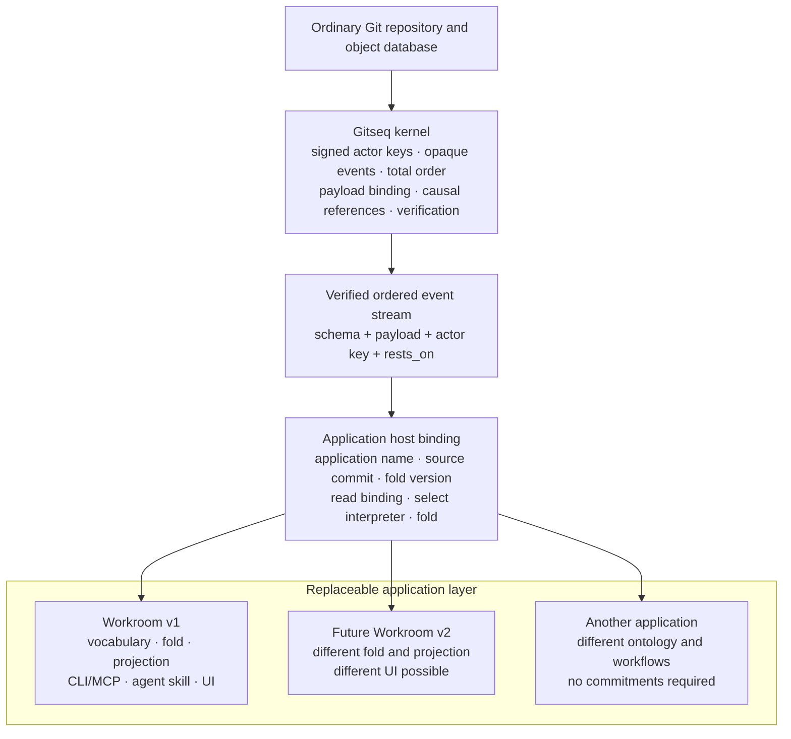

# Architecture layers

Gitseq is a signed sequencing kernel on ordinary Git storage. It can host an
application, but the application's vocabulary is not built into the kernel.
The application shipped in this repository is **Workroom**. Workroom is the
first application profile, not the definition of what every Gitseq sequence
must mean.

This distinction is the main architectural contract:

> The kernel proves who signed opaque bytes, which sequence admitted them, and
> where they stand. An application interpreter decides what those bytes mean.

The same verified stream can therefore feed the current Workroom interpreter,
a future Workroom interpreter, or an application with no commitment concept at
all. Sharing the stream does not make their meanings compatible.

Code, documentation, and reviews must preserve that boundary. A new
application can reuse the kernel without inheriting actors by name, roles,
commitments, artifacts, or the Workroom user interface.

## The layers

The layers build upward. A higher layer may use the guarantees below it; a
lower layer must not import meanings from above it.

### 1. Ordinary Git storage

Git stores objects and advances refs. A durable Gitseq sequence is a chain of
ordinary commits under `refs/seq/<genesis>`. Application files, branches,
tags, and worktrees remain ordinary Git content and are not placed inside the
sequence.

The storage layer knows object formats, commits, trees, refs, compare-and-swap,
and reachability. It does not know Gitseq event kinds or application state.
`internal/gitstore` is the adapter to this layer.

### 2. Kernel

The kernel turns signed requests into one verifiable order. Its public facts
are deliberately narrower than Workroom's facts.

The kernel owns:

- sequence creation, append order, compare-and-swap retry, continuation, and
  verification;
- actor-key attribution and verification of the actor's signature over the
  intent;
- the sequencer admission boundary and the sequencer's signature over each
  accepted position;
- binding an opaque schema name and opaque payload tree to the signed intent;
- carrying the signed `rests_on` strings without assigning them application
  semantics;
- idempotency namespaces, keys, replay, and conflicting-retry detection;
- bounds on intent fields, causal-reference counts, envelopes, payloads, and
  attachments;
- verification of history, object shape, signatures, ordering, and payload
  binding;
- signed, profile-independent verification checkpoints containing only
  kernel-verified event material, plus authenticated descendant continuation,
  with an optional opaque selector supplied by the host; and
- sequencer key rotation, sealing, and verified continuation.

An application may supply an admission hook. The kernel owns when that hook is
enforced and what signed envelope and capability material it may inspect. The
application owns the policy. The hook cannot inspect application payload
bytes, so it cannot silently turn the kernel into an application interpreter.

The current compact checkpoint schema is `gitseq-checkpoint@3`. It authenticates
kernel identity and event material but carries no application profile. Readers
also accept authenticated JSON `@1` and compact `@2` checkpoints; their required
historical profile field is ignored rather than used as an eligibility key.

The kernel does **not** understand:

- actor names, membership, or retirement;
- kinds, roles, governed vocabulary, or authority rules;
- requests, promises, reports, commitments, or work status;
- ratification or supersession semantics;
- artifacts, reviews, retirement, or staleness;
- connector charters; or
- CLI, MCP, agent, browser, or other UI workflows.

`internal/intent` defines and verifies the signed opaque intent.
`internal/kernel` sequences and verifies it. Neither package imports
`internal/workroom`.

### 3. Nexus and live runtime

The nexus is a separate, amnesiac sequence for live coordination. It carries
leased presence, activity, and ephemeral signed conversation. Its cursor and
frames die with the process. It does not change the durable sequence and must
not pretend that live state survived a restart.

Addressed chat keeps this boundary. The Workroom-facing service resolves
mentions against the effective roster; the nexus receives opaque actor
fingerprints, validates exact reply handles, includes the final sorted
recipient list in the actor-signed payload, and retains the conversation for
every current matching lease. It enqueues priority delivery only for leases
that registered the versioned inbox protocol. Presence alone does not opt a
browser or older adapter into an inbox it cannot consume. Per-session inboxes
and acknowledgements are live attention state, not Workroom authority or
durable records. Acknowledgement changes no nexus cursor.

`internal/nexus` implements this layer. The resident in `internal/service`
hosts it alongside the durable application, but co-location is operational
convenience, not a claim that nexus data has kernel durability.

### 4. Application host binding

The host binding selects one application interpreter for the repository before
any application record is folded. Its vocabulary sits above the kernel and
below every application profile, because a host must read it without already
knowing whether the repository contains Workroom, chess, or another
application.

Every host recognizes the fixed binding schema family
`gitseq/app-binding@0`; application profiles cannot rename or extend it.

An effective binding records:

- the application name;
- the application's source commit as a format-qualified object ID;
- the source URL as provenance, never as authority; and
- the fold-profile version or hash that gives the application's records their
  exact meaning.

Reading or recording a binding never fetches, builds, or runs application
code. The source URL remains inert provenance until a person deliberately
uses it outside Gitseq.

The binding is effective only in the repository's bootstrap position, or as a
later replacement signed by the key that initialized the repository. A record
that merely resembles a binding anywhere else has no force. This authority is
a host fact below application roles: retiring an operator inside Workroom does
not revoke the initializing key's binding authority, because another
application has no Workroom roster to consult.

The bootstrap binding and a later replacement are one rule read once: the
binding in force is the last binding record signed by the initializing key, so
the newest effective binding wins. A binding-shaped record that is
unauthorized, unparseable, or malformed has no force and leaves the previous
answer standing. Nobody able to append can therefore make a repository
unreadable by recording one, and a host never refuses to interpret a
repository because of a record it should have ignored.

A fold upgrade is therefore a host-binding replacement, not an application
statement kind. Its source commit and fold version name the interpreter code,
and its position in the sequence is the transition. The initializing key is
the binding authority; the host accepts the replacement only when the named
application and fold are held by the build that opens the repository. The
source URL remains inert provenance and cannot install code.

Opening a repository has one fixed order: **read the binding, select the named
interpreter, then fold**. A host must never fold with a guessed interpreter and
repair the projection after discovering a mismatch. The selection is made when
the repository is opened and does not change while it stays open: a replacement
binding recorded afterwards is read by the next open, so no operation changes
meaning because of activity that followed the open. A repository whose log
cannot be read has no binding to read and does not open.

If the selected interpreter or fold version is unavailable, kernel verification
still stands, but application state is unavailable and the host must report the
repository as verifiable but uninterpretable. That report is a claim about a
verified repository, so it comes after kernel verification, never before it: an
unverifiable chain is reported as an unverifiable chain, and no history an
appender controls can present itself as a missing interpreter instead.

Repositories created before host bindings have a permanent compatibility
rule: no binding means Workroom at the version shipped by the reader, and the
binding authority is the bootstrap operator key in the opening records. This
avoids a flag-day backfill while making the legacy choice explicit.

The detailed product design is recorded in
`notes/2026-08-13-second-application.md`. Its merged historical filing was
artifact
`git:sha1:5d2622748872b7e2dec3fe5c59e4be73a35e0bc8#git:sha1:d5d30c17385f242466e3804a85e1d050a4e30d33`;
that event is cited here as design history, not as this page's causal basis.
`internal/app` implements this contract: it records the binding at init for an
application an absent binding does not already name, and reads the binding in
force to select one interpreter as the workspace opens, before it can fold or
append anything. The
read is a bounded pre-audit read rather than a verification — it authenticates
the initializing actor's signature over an intent that names the genesis and
the tree the commit carries, and leaves the sequencer chain to the audit that
runs before any record is folded.

### 5. Application profile and interpreter

An application profile gives opaque kernel events meaning. It owns its schema
family, payload decoding, governed vocabulary, admission policy, deterministic
fold, authority rules, and application decisions. Its interpreter consumes
the verified ordered records and produces application state.

An event whose schema or bound interpreter a reader does not hold remains
**kernel-verifiable**: its keys, signatures, position, payload binding, and
causal strings can still be checked. It is **application-uninterpretable**:
the reader cannot truthfully say what force it has. Consumers must surface
that gap and must not invent fallback meaning from field names, prose, an old
fold, or UI expectations.

#### Workroom, the current application

`internal/workroom` is the Workroom profile and interpreter. Workroom owns:

- the `workroom/*` schemas and governed kind vocabulary;
- its deterministic fold and fold-profile version;
- actor roster, names, membership, roles, and authority;
- commitment lifecycles and who is waiting on whom: an explicit report closes
  when its requester ratifies it, while a promisor's exact-head artifact acts
  as the implementation report and its sealed approved merge closes the
  commitment;
- ratification and supersession rules;
- path-at-commit artifact statements, retirement, succession, reviews, and
  staleness: ordinary staleness crosses governed reasoning edges, while the
  narrower `describes_superseded_world` fact crosses direct retired-artifact
  edges and artifact-to-artifact provenance only;
- guarded review and merge semantics, including the merge receipt that lets the
  implementer of an approved head retire another actor's predecessors only on
  the path lineages of the artifacts that approval itself cites, each standing
  at the approved head and owned by the implementer, since the fold is pure over
  records and can verify no merge head, diff, or tree; merge receipts record
  ordinary reasoning staleness, while a world-stale approval or artifact must
  be re-anchored before merge; the explicitly ratified review approval remains
  a pre-merge requirement, and the same sealed receipt closes the implementation
  commitment whose reporting artifact it merges;
- Workroom MCP tools and their application meanings;
- the agent practice in `SKILL.md`;
- connector clauses and observations; and
- the Work board, event railway, artifact views, and other Workroom UI.

In precise terms, the kernel has no artifact ontology. It stores a signed
schema string, payload binding, and causal strings. The Workroom interpreter
decodes a Workroom state event, recognizes its governed `artifact` kind, and
projects `path@commit`, retirement, succession, and staleness. Another
application may have no artifacts or may define a different concept under a
different schema family.

Workroom state schemas are prospectively versioned when admission tightens.
`workroom/state@0` remains readable with the decisions it historically made;
`workroom/state@1` refuses whole-repository and comma-joined artifact paths.
`workroom/state@2` preserves those path rules and removes new in-fold
activation authority. `workroom/ratify@1` closes the other side of that
boundary: it cannot make an older, previously unratified activation take
effect after host binding took ownership of upgrades. This preserves the
append-only record while preventing new pointers that merge succession cannot
maintain. The schema version is Workroom application meaning, not a kernel
protocol feature.

The same bridge preserves state@0/state@1 `fold-activation` history ratified
with `workroom/ratify@0`:
the old transition and the uninterpretable seam after it replay exactly as
before. `fold-activation` is absent from the current starter vocabulary, new
state@2 records under that name are undefined, and the application refuses a
new state@0/state@1 activation or a ratification@0 submitted after the
boundary. A ratification@1 of an activation is ineffective even if it bypasses
application admission.
New upgrades are binding replacements at the host layer. `kind-def` remains a
finite declarative constraint language; a definition carrying `body.fold` is
uninterpretable and cannot introduce a code pointer.

### 6. Projections and queries

A projection is a read model derived from an application interpreter, not a
kernel fact. Workroom projects decisions, actors, commitments, artifacts,
reviews, vocabulary, and staleness. Bounded queries select from that derived
state. Live status may be joined to it, but the durable and live cursors remain
distinct.

`internal/statusview` builds Workroom summaries, orientations, bounded work
pages, exact-path live-artifact pages, exact-item inspection, and the bounded
join of a caller's live priority inbox. Work and status rows include the
request, report, exact-head, and latest-review facts needed for routine action;
write surfaces return the fold decision after an append rather than previewing
application force. `internal/app` opens a repository, joins the kernel records to the
interpreter the repository is bound to, and exposes the resulting durable
snapshot. Readers must
report an unbound or unavailable interpreter instead of presenting a partial
projection as authoritative. In particular, a degraded client marks priority
chat unavailable; it does not invent an empty live inbox.

### 7. CLI, MCP, skills, connectors, and UI

The outer surfaces present one application to people and programs:

- `cmd/gs` combines storage and kernel operations with Workroom authoring,
  projection, review, merge, and resident commands.
- `cmd/gitseq-mcp` exposes Workroom tools and live coordination over an MCP
  transport. The MCP protocol is a surface contract, not the Workroom fold.
- `SKILL.md` is the normative operating contract for an agent participating
  in the Workroom application.
- `internal/connector/github` and `cmd/gitseq-github` translate admitted
  tracker material into Workroom observations. They do not extend the kernel.
- `internal/service` composes repository access, the kernel-backed Workroom
  application, nexus, HTTP projections and queries, and the browser assets.
- `ui/` renders Workroom projections and live state; it does not define their
  durable meaning.

These surfaces may evolve or be replaced without changing kernel validity.
They must not infer application force that the selected interpreter did not
produce.

## Compatibility has six axes

"Compatible with Gitseq" is too broad to be useful. State which contract is
compatible:

| Axis | What must agree | Current marker or example |
|---|---|---|
| Kernel protocol | Genesis, intent and envelope encodings; sequence and signature rules; bounds; rotation and continuation | Kernel and intent version fields and wire markers |
| Host binding | Application name, pinned source commit, fold version, binding authority, and interpreter-selection order | `gitseq/app-binding@0`; legacy absence selects shipped Workroom |
| Application family | Schema family and governance bootstrap interpreted after host selection | `workroom/*` |
| Interpreter or fold | The exact deterministic meaning assigned to the application record | `workroom.ProfileVersion` and the projected fold binding |
| Projection contract | Names, types, limits, cursor behavior, and omission rules of derived read models | Workroom status, summary, work-query, and inspect shapes |
| Surface or UI | Commands, flags, MCP protocol/tool schemas, connector behavior, browser routes and presentation | `gs`, the MCP protocol version, connector flags, and the committed UI build |

A change on one axis does not automatically change the others. For example, a
new browser layout may preserve the projection and fold; a fold change may
preserve the kernel sequence; and a new application family may reuse the
kernel while sharing none of Workroom's tools.

Consumers negotiate or pin the axes they depend on. They must not use surface
similarity as evidence that an interpreter is available or that two folds give
the same result.

## Current package boundaries and coupling

| Package or surface | Layer | Present coupling and intended boundary |
|---|---|---|
| `internal/gitstore` | Ordinary Git storage | Implements object and ref operations. It must remain ignorant of application schemas. |
| `internal/intent` | Kernel | Owns canonical signed intents and actor-key fingerprints. Schema and `rests_on` are bounded opaque strings. |
| `internal/kernel` | Kernel | Uses only Git storage, intents, and an optional host interface that loads or stores an opaque checkpoint object ID. It performs no local checkpoint filesystem I/O. Its application admission callback receives envelope facts, not payload meaning. A checkpoint caches only kernel-verified events and kernel identity (schema, object format, genesis, and authenticated sequencer-key lineage), never projection state or an application profile; every candidate is verified from those kernel facts. |
| `internal/custody` | Operational kernel support | Manages local keys and migrations above the kernel. Custody policy is not event ontology. |
| `internal/nexus` | Live runtime | Owns process-local coordination. It is independent of the durable Workroom fold. |
| `internal/workroom` | Application profile and interpreter | Owns Workroom schemas, vocabulary, fold, authority, commitments, artifacts, reviews, and staleness. It knows nothing about Git storage, HTTP, or MCP. |
| Host binding vocabulary | Application host binding | Defines the application identity, pinned source, fold version, initializing-key authority, and read-binding/select/fold order shared by every host. It has no application ontology. |
| `internal/app` | Application host and boundary adapter | The deliberate coupling point: it builds Workroom payloads and signed kernel requests, applies application admission, owns the bounded repository-private checkpoint pointer and off switch, reads kernel events, and runs the fold. It also reads the host binding and selects one interpreter as a workspace opens, reports kernel verification ahead of any refusal to interpret, reuses the profile-independent authenticated kernel prefix across fold changes, and gates its separate projection cache on the selected application and fold version. Workroom is the one interpreter this build holds. |
| `internal/statusview` | Projection and query | Reads Workroom application state, and optionally nexus state, into bounded public views. It does not establish durable meaning. |
| `internal/service` | Composition and transport | Hosts `app`, nexus, projections, queries, and UI over HTTP. It must preserve the distinctions between kernel refusal, application interpretation, durable state, and live state. |
| `cmd/gs` | Surface and composition | Contains both kernel-level administration and Workroom-level commands today. It reads Git's first-parent merge diff and composes the Workroom receipt, successor artifacts, and retirements; Git remains outside the Workroom interpreter. Command grouping must not move Workroom concepts into the kernel packages. |
| `cmd/gitseq-mcp` | Surface | Adapts MCP calls to Workroom and nexus operations. Protocol compatibility and fold compatibility are separate. |
| `internal/connector/github`, `cmd/gitseq-github` | Application connector | Applies Workroom charters and emits Workroom observations. It is replaceable and outside the kernel. |
| `AGENTS.md` | Repository policy | Governs implementation and review in this repository, including architecture, security, and simplification checks. It does not define Workroom behavior. |
| `SKILL.md` | Application guidance | Governs agent conduct in Workroom. It is not a kernel protocol specification. |
| `ui/`, `internal/service/uidist` | Surface and UI | Renders current Workroom projections and live runtime state. The committed build may not define new semantics. |

The important existing dependency direction is real: `internal/kernel` does
not import `internal/workroom`; `internal/workroom` does not import Git, HTTP,
or MCP; and `internal/app` joins them. The host binding belongs at that seam,
not in either lower package or inside a particular application. New code
should keep application meaning above it. Where `cmd/gs` and
`internal/service` currently compose several layers, treat that as explicit
integration, not permission to make the lower layers understand Workroom.

## Review rule

Every implementation review identifies the affected layers in this page and
states whether the exact head preserves or changes their contract. If the
contract changes, that same head must update this page and re-anchor its
artifact. A reviewer must request changes when a contract-changing head does
not do both. This repository's mandatory pre-merge practice in `AGENTS.md`
adds two checks: security across the affected boundaries, and any opportunity
to achieve the same result more simply. `SKILL.md` remains the reusable
Workroom application guidance; it does not carry these repository policies.
