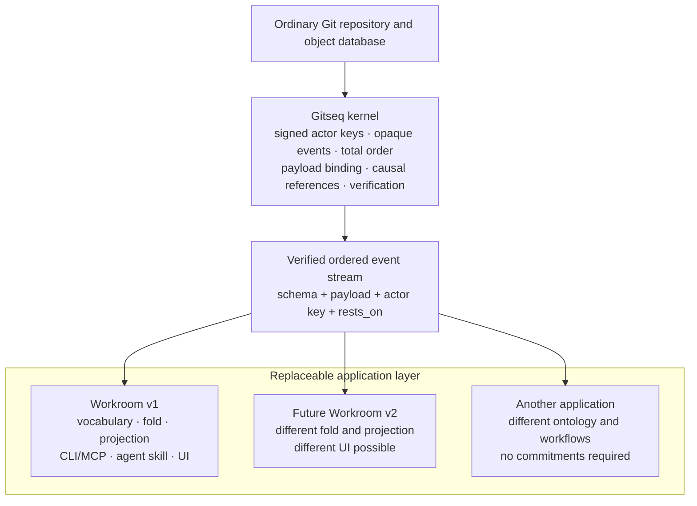

# Architecture layers

Gitseq is a signed sequencing kernel on ordinary Git storage. It can host an
application, but the application's vocabulary is not built into the kernel.
The application shipped in this repository is **Workroom**. Workroom is the
first application profile, not the definition of what every Gitseq sequence
must mean.

This distinction is the main architectural contract:

> The kernel proves who signed opaque bytes, which sequence admitted them, and
> where they stand. An application interpreter decides what those bytes mean.

The same verified stream can therefore feed the current Workroom interpreter,
a future Workroom interpreter, or an application with no commitment concept at
all. Sharing the stream does not make their meanings compatible.

Code, documentation, and reviews must preserve that boundary. A new
application can reuse the kernel without inheriting actors by name, roles,
commitments, artifacts, or the Workroom user interface.

## The layers

The layers build upward. A higher layer may use the guarantees below it; a
lower layer must not import meanings from above it.

### 1. Ordinary Git storage

Git stores objects and advances refs. A durable Gitseq sequence is a chain of
ordinary commits under `refs/seq/<genesis>`. Application files, branches,
tags, and worktrees remain ordinary Git content and are not placed inside the
sequence.

The storage layer knows object formats, commits, trees, refs, compare-and-swap,
and reachability. It does not know Gitseq event kinds or application state.
`internal/gitstore` is the adapter to this layer.

### 2. Kernel

The kernel turns signed requests into one verifiable order. Its public facts
are deliberately narrower than Workroom's facts.

The kernel owns:

- sequence creation, append order, compare-and-swap retry, continuation, and
  verification;
- actor-key attribution and verification of the actor's signature over the
  intent;
- the sequencer admission boundary and the sequencer's signature over each
  accepted position;
- binding an opaque schema name and opaque payload tree to the signed intent;
- carrying the signed `rests_on` strings without assigning them application
  semantics;
- idempotency namespaces, keys, replay, and conflicting-retry detection;
- bounds on intent fields, causal-reference counts, envelopes, payloads, and
  attachments;
- verification of history, object shape, signatures, ordering, and payload
  binding; and
- sequencer key rotation, sealing, and verified continuation.

An application may supply an admission hook. The kernel owns when that hook is
enforced and what signed envelope and capability material it may inspect. The
application owns the policy. The hook cannot inspect application payload
bytes, so it cannot silently turn the kernel into an application interpreter.

The kernel does **not** understand:

- actor names, membership, or retirement;
- kinds, roles, governed vocabulary, or authority rules;
- requests, promises, reports, commitments, or work status;
- ratification or supersession semantics;
- artifacts, reviews, retirement, or staleness;
- connector charters; or
- CLI, MCP, agent, browser, or other UI workflows.

`internal/intent` defines and verifies the signed opaque intent.
`internal/kernel` sequences and verifies it. Neither package imports
`internal/workroom`.

### 3. Nexus and live runtime

The nexus is a separate, amnesiac sequence for live coordination. It carries
leased presence, activity, and ephemeral signed conversation. Its cursor and
frames die with the process. It does not change the durable sequence and must
not pretend that live state survived a restart.

Addressed chat keeps this boundary. The Workroom-facing service resolves
mentions against the effective roster; the nexus receives opaque actor
fingerprints, validates exact reply handles, includes the final sorted
recipient list in the actor-signed payload, and retains the conversation for
every current matching lease. It enqueues priority delivery only for leases
that registered the versioned inbox protocol. Presence alone does not opt a
browser or older adapter into an inbox it cannot consume. Per-session inboxes
and acknowledgements are live attention state, not Workroom authority or
durable records. Acknowledgement changes no nexus cursor.

`internal/nexus` implements this layer. The resident in `internal/service`
hosts it alongside the durable application, but co-location is operational
convenience, not a claim that nexus data has kernel durability.

### 4. Application profile and interpreter

An application profile gives opaque kernel events meaning. It owns its schema
family, payload decoding, governed vocabulary, admission policy, deterministic
fold, authority rules, and application decisions. Its interpreter consumes
the verified ordered records and produces application state.

An event whose schema or bound interpreter a reader does not hold remains
**kernel-verifiable**: its keys, signatures, position, payload binding, and
causal strings can still be checked. It is **application-uninterpretable**:
the reader cannot truthfully say what force it has. Consumers must surface
that gap and must not invent fallback meaning from field names, prose, an old
fold, or UI expectations.

#### Workroom, the current application

`internal/workroom` is the Workroom profile and interpreter. Workroom owns:

- the `workroom/*` schemas and governed kind vocabulary;
- its deterministic fold and fold-profile version;
- actor roster, names, membership, roles, and authority;
- commitment lifecycles and who is waiting on whom;
- ratification and supersession rules;
- path-at-commit artifact statements, retirement, succession, reviews, and
  staleness;
- guarded review and merge semantics, including the merge receipt that lets the
  implementer of an approved head retire another actor's predecessors only on
  the path lineages of the artifacts that approval itself cites, each standing
  at the approved head and owned by the implementer, since the fold is pure over
  records and can verify no merge head, diff, or tree;
- Workroom MCP tools and their application meanings;
- the agent practice in `SKILL.md`;
- connector clauses and observations; and
- the Work board, event railway, artifact views, and other Workroom UI.

In precise terms, the kernel has no artifact ontology. It stores a signed
schema string, payload binding, and causal strings. The Workroom interpreter
decodes a Workroom state event, recognizes its governed `artifact` kind, and
projects `path@commit`, retirement, succession, and staleness. Another
application may have no artifacts or may define a different concept under a
different schema family.

Workroom state schemas are prospectively versioned when admission tightens.
`workroom/state@0` remains readable with the decisions it historically made;
`workroom/state@1` refuses whole-repository and comma-joined artifact paths.
This preserves the append-only record while preventing new pointers that
merge succession cannot maintain. The schema version is Workroom application
meaning, not a kernel protocol feature.

### 5. Projections and queries

A projection is a read model derived from an application interpreter, not a
kernel fact. Workroom projects decisions, actors, commitments, artifacts,
reviews, vocabulary, and staleness. Bounded queries select from that derived
state. Live status may be joined to it, but the durable and live cursors remain
distinct.

`internal/statusview` builds Workroom summaries, orientations, bounded work
pages, exact-item inspection, and the bounded join of a caller's live priority
inbox. `internal/app` opens a repository, joins the kernel records to the
Workroom interpreter, and exposes the resulting durable snapshot. Readers must
report an unbound or unavailable interpreter instead of presenting a partial
projection as authoritative. In particular, a degraded client marks priority
chat unavailable; it does not invent an empty live inbox.

### 6. CLI, MCP, skills, connectors, and UI

The outer surfaces present one application to people and programs:

- `cmd/gs` combines storage and kernel operations with Workroom authoring,
  projection, review, merge, and resident commands.
- `cmd/gitseq-mcp` exposes Workroom tools and live coordination over an MCP
  transport. The MCP protocol is a surface contract, not the Workroom fold.
- `SKILL.md` is the normative operating contract for an agent participating
  in the Workroom application.
- `internal/connector/github` and `cmd/gitseq-github` translate admitted
  tracker material into Workroom observations. They do not extend the kernel.
- `internal/service` composes repository access, the kernel-backed Workroom
  application, nexus, HTTP projections and queries, and the browser assets.
- `ui/` renders Workroom projections and live state; it does not define their
  durable meaning.

These surfaces may evolve or be replaced without changing kernel validity.
They must not infer application force that the selected interpreter did not
produce.

## Compatibility has five axes

"Compatible with Gitseq" is too broad to be useful. State which contract is
compatible:

| Axis | What must agree | Current marker or example |
|---|---|---|
| Kernel protocol | Genesis, intent and envelope encodings; sequence and signature rules; bounds; rotation and continuation | Kernel and intent version fields and wire markers |
| Application family | Schema family, governance bootstrap, and the rules for selecting an interpreter | `workroom/*` |
| Interpreter or fold | The exact deterministic meaning assigned to the application record | `workroom.ProfileVersion` and the projected fold binding |
| Projection contract | Names, types, limits, cursor behavior, and omission rules of derived read models | Workroom status, summary, work-query, and inspect shapes |
| Surface or UI | Commands, flags, MCP protocol/tool schemas, connector behavior, browser routes and presentation | `gs`, the MCP protocol version, connector flags, and the committed UI build |

A change on one axis does not automatically change the others. For example, a
new browser layout may preserve the projection and fold; a fold change may
preserve the kernel sequence; and a new application family may reuse the
kernel while sharing none of Workroom's tools.

Consumers negotiate or pin the axes they depend on. They must not use surface
similarity as evidence that an interpreter is available or that two folds give
the same result.

## Current package boundaries and coupling

| Package or surface | Layer | Present coupling and intended boundary |
|---|---|---|
| `internal/gitstore` | Ordinary Git storage | Implements object and ref operations. It must remain ignorant of application schemas. |
| `internal/intent` | Kernel | Owns canonical signed intents and actor-key fingerprints. Schema and `rests_on` are bounded opaque strings. |
| `internal/kernel` | Kernel | Uses only Git storage and intents. Its application admission callback receives envelope facts, not payload meaning. |
| `internal/custody` | Operational kernel support | Manages local keys and migrations above the kernel. Custody policy is not event ontology. |
| `internal/nexus` | Live runtime | Owns process-local coordination. It is independent of the durable Workroom fold. |
| `internal/workroom` | Application profile and interpreter | Owns Workroom schemas, vocabulary, fold, authority, commitments, artifacts, reviews, and staleness. It knows nothing about Git storage, HTTP, or MCP. |
| `internal/app` | Application host and boundary adapter | The deliberate coupling point: it builds Workroom payloads and signed kernel requests, applies application admission, reads kernel events, and runs the Workroom fold. |
| `internal/statusview` | Projection and query | Reads Workroom application state, and optionally nexus state, into bounded public views. It does not establish durable meaning. |
| `internal/service` | Composition and transport | Hosts `app`, nexus, projections, queries, and UI over HTTP. It must preserve the distinctions between kernel refusal, application interpretation, durable state, and live state. |
| `cmd/gs` | Surface and composition | Contains both kernel-level administration and Workroom-level commands today. It reads Git's first-parent merge diff and composes the Workroom receipt, successor artifacts, and retirements; Git remains outside the Workroom interpreter. Command grouping must not move Workroom concepts into the kernel packages. |
| `cmd/gitseq-mcp` | Surface | Adapts MCP calls to Workroom and nexus operations. Protocol compatibility and fold compatibility are separate. |
| `internal/connector/github`, `cmd/gitseq-github` | Application connector | Applies Workroom charters and emits Workroom observations. It is replaceable and outside the kernel. |
| `AGENTS.md` | Repository policy | Governs implementation and review in this repository, including architecture, security, and simplification checks. It does not define Workroom behavior. |
| `SKILL.md` | Application guidance | Governs agent conduct in Workroom. It is not a kernel protocol specification. |
| `ui/`, `internal/service/uidist` | Surface and UI | Renders current Workroom projections and live runtime state. The committed build may not define new semantics. |

The important existing dependency direction is real: `internal/kernel` does
not import `internal/workroom`; `internal/workroom` does not import Git, HTTP,
or MCP; and `internal/app` joins them. New code should keep application
meaning above that seam. Where `cmd/gs` and `internal/service` currently
compose several layers, treat that as explicit integration, not permission to
make the lower layers understand Workroom.

## Review rule

Every implementation review identifies the affected layers in this page and
states whether the exact head preserves or changes their contract. If the
contract changes, that same head must update this page and re-anchor its
artifact. A reviewer must request changes when a contract-changing head does
not do both. This repository's mandatory pre-merge practice in `AGENTS.md`
adds two checks: security across the affected boundaries, and any opportunity
to achieve the same result more simply. `SKILL.md` remains the reusable
Workroom application guidance; it does not carry these repository policies.
