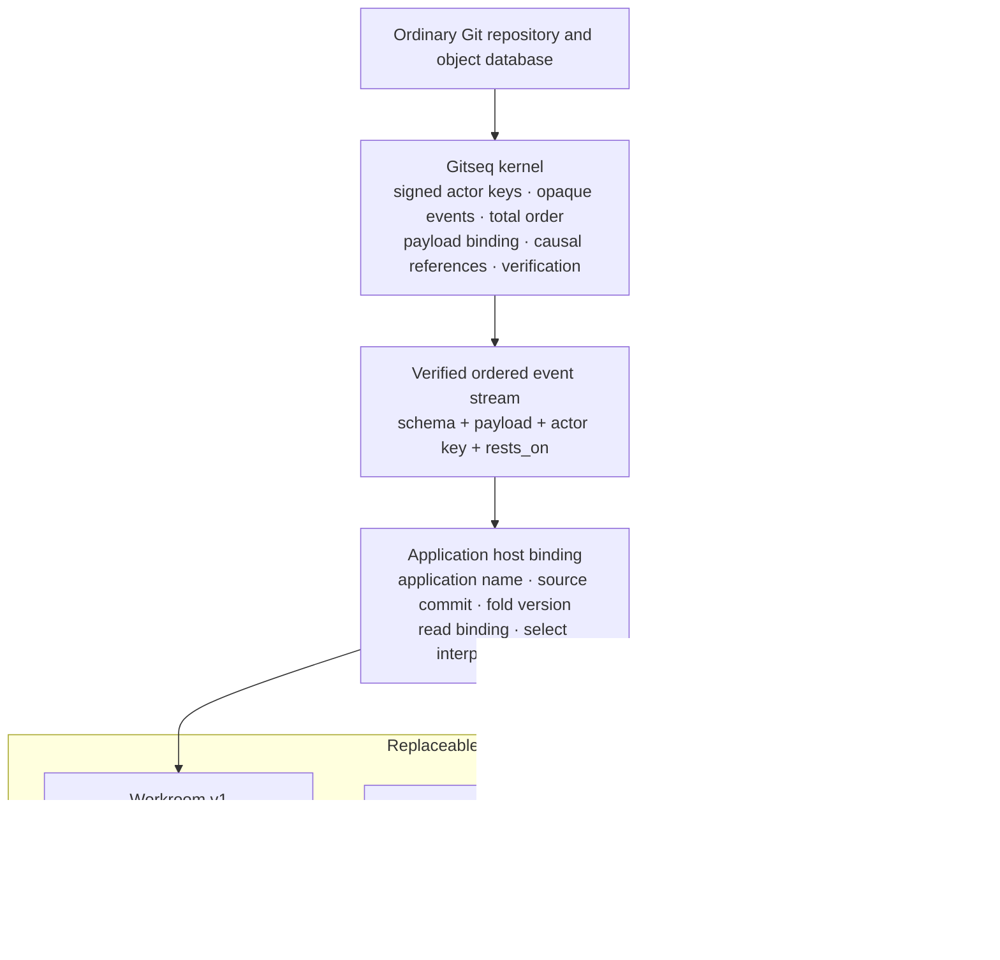

# Architecture layers

Gitseq provides a signed sequencing kernel on ordinary Git storage. It can
host an application, but the kernel does not build in the application's
vocabulary. This repository ships one application, **Workroom**. Workroom
serves as the first application profile, not the definition of what every
Gitseq sequence must mean.

This distinction forms the main architectural contract:

> The kernel proves who signed opaque bytes, which sequence admitted them, and
> where they stand. An application interpreter decides what those bytes mean.

```mermaid
flowchart TB
  Git["Ordinary Git repository and object database"]

  Kernel["Gitseq kernel<br/>signed actor keys · opaque events · total order<br/>payload binding · causal references · verification"]

  Stream["Verified ordered event stream<br/>schema + payload + actor key + rests_on"]

  Host["Application host binding<br/>application name · source commit · fold version<br/>read binding · select interpreter · fold"]

  subgraph Apps["Replaceable application layer"]
    W1["Workroom v1<br/>vocabulary · fold · projection<br/>CLI/MCP · agent skill · UI"]
    W2["Future Workroom v2<br/>different fold and projection<br/>different UI possible"]
    Other["Another application, in its own module<br/>different ontology and workflows<br/>imports the public host API"]
  end

  Git --> Kernel
  Kernel --> Stream
  Stream --> Host
  Host --> W1
  Host --> W2
  Host --> Other
```

One verified stream can feed the current Workroom interpreter, a future
Workroom interpreter, or an application with no commitment concept at all.
Sharing the stream does not make their meanings compatible.

Code, documentation, and reviews must preserve that boundary. A new
application can reuse the kernel without inheriting actors by name, roles,
commitments, artifacts, or the Workroom user interface.

## The layers

Seven layers, numbered from storage upward. Each section below says what its
layer owns, what it must never do, and which package holds it.

A higher layer may use the guarantees below it; a lower layer must not import
meanings from above it.

### 1. Ordinary Git storage

**What it owns:** object formats, commits, trees, refs, compare-and-swap, and
reachability.

A durable Gitseq sequence consists of a chain of ordinary commits under
`refs/seq/<genesis>`. Application files, branches, tags, and worktrees remain
ordinary Git content, and Gitseq does not place them inside the sequence.

This layer does not know Gitseq event kinds or application state.
`internal/gitstore` provides the adapter to it.

### 2. Kernel

**What it owns:** turning signed requests into one verifiable order. Its
public facts stay deliberately narrower than Workroom's.

The kernel owns:

- sequence creation, append order, compare-and-swap retry, continuation, and
  verification;
- actor-key attribution and verification of the actor's signature over the
  intent;
- the sequencer admission boundary and the sequencer's signature over each
  accepted position;
- binding an opaque schema name and opaque payload tree to the signed intent;
- carrying the signed `rests_on` strings without assigning them application
  semantics, while refusing at admission a submitted reference that claims a
  position in this log and does not name one; a verified record's envelope
  trailers must equal its signed references element by element, in order and
  with duplicates, so the kernel refuses a trailer the actor did not sign even
  when it carries an empty value;
- idempotency namespaces, keys, replay, conflicting-retry detection, and the
  verified read-only exact-replay check used before mutable client preflight;
- bounds on intent fields, causal-reference counts, envelopes, payloads, and
  attachments, and the exported form of that same accounting for an act not
  yet signed, so the application can apply the kernel's one measurement
  before it spends a signature rather than a second formula of its own;
- verification of history, object shape, signatures, ordering, and payload
  binding;
- signed, profile-independent verification checkpoints containing only
  kernel-verified event material, plus authenticated descendant continuation,
  with an optional opaque selector supplied by the host; and
- sequencer key rotation, sealing, and verified continuation.

The kernel does **not** understand:

- actor names, membership, or retirement;
- kinds, roles, governed vocabulary, or authority rules;
- requests, promises, reports, commitments, or work status;
- ratification or supersession semantics;
- artifacts, reviews, retirement, or staleness;
- connector charters; or
- CLI, MCP, agent, browser, or other UI workflows.

`internal/intent` defines and verifies the signed opaque intent.
`internal/kernel` sequences and verifies it. Neither package imports
`internal/workroom`.

#### What the kernel checks about `rests_on`

Without an ontology, the kernel can check only one thing about `rests_on`:
whether a reference resolves. A canonical event identifier whose workroom half
names the log receiving the submission asserts that its event half names a
position in that sequence, and Git alone settles whether it does. Admission
refuses a submission that asserts it falsely. The sequence only appends, so
every later fold and every later reader inherits a dangling reference admitted
once, and no later act can repair it.

The kernel carries unchanged a reference that makes no such assertion —
another workroom's identifier, a URL, any other opaque string — because it has
nothing to resolve it against.

The check gates submission and nothing else. Verification, checkpoints and
continuation read history exactly as before, so records sequenced with
dangling references before the gate existed remain readable and remain part of
the verified order.

#### Two admission hooks

An application may supply an admission hook. The kernel owns when it enforces
that hook and what signed envelope and capability material the hook may inspect. The
application owns the policy. The hook cannot inspect application payload
bytes, so it cannot silently turn the kernel into an application interpreter.

A second, generic hook runs later in the same path: the application's
post-dedup admission callback. The kernel schedules exactly one call to it
after idempotency-replay detection has recognized an exact retry — so a replay
never re-judges history — and before the kernel writes any commit. The call hands the
application the decoded intent, the actor key, the payload bytes and
attachments uninterpreted, and the exact pre-sequence head the event would
extend.

The kernel learns nothing from what the callback reads and schedules nothing
else about it. The callback runs inside the compare-and-swap loop, so a log
that moved under a submission makes the application reevaluate the world the
event would actually join before the retried commit chains onto it. A refusal
leaves nothing sequenced.

#### Checkpoints and streamed reads

The current compact checkpoint schema, `gitseq-checkpoint@3`, authenticates
kernel identity and event material but carries no application profile.
Readers also accept authenticated JSON `@1` and compact `@2` checkpoints; they
ignore the required historical profile field in those rather than use it as an
eligibility key.

A full read may transfer verified events to the selected host interpreter as a
bounded stream instead of retaining a second depth-sized event slice. Delivery
during a cold audit stays provisional until the whole kernel chain succeeds: a
later invalid event rejects the read, so callback effects cannot become
visible application state. The reader fully authenticates a compact checkpoint
candidate and its suffix before replay. `internal/app` folds either path into a
private folder and publishes the folder and projection together only after
kernel verification, complete application folding, frontier persistence and
the projection gate all succeed. This changes the transfer shape, not
signature, ordering, bounds, compare-and-swap or application-interpretation
authority.

### 3. Nexus and live runtime

**What it owns:** live coordination that dies with the process.

The nexus forms a separate, amnesiac sequence. It carries leased presence,
activity, and ephemeral signed conversation. Its cursor and frames die with
the process. It does not change the durable sequence and must not pretend that
live state survived a restart.

#### Addressed chat

The Workroom-facing service resolves mentions against the effective roster.
The nexus receives opaque actor fingerprints, validates exact reply handles,
includes the final sorted recipient list in the actor-signed payload, and
retains the conversation for every current matching lease.

It enqueues priority delivery only for leases that registered the versioned
inbox protocol. Presence alone does not opt a browser or older adapter into an
inbox it cannot consume.

Per-session inboxes and acknowledgements hold live attention state, not
Workroom authority or durable records. Acknowledgement changes no nexus
cursor.

#### Signing stays outside the runtime

`host/live` implements this layer as a public, application-neutral runtime.
An application prepares an optimistic frame draft, signs the canonical bytes
outside the runtime, and submits the public key and signature. The runtime
never receives an actor private key.

A draft retains no reservation: its generation, scope, conversation, sequence,
or previous hash moving before submission makes it stale, so the application
prepares again. For a new conversation, the conversation identifier hashes a
genesis envelope that binds the exact scope, runtime generation, and runtime
signing key before the actor signs that identifier.

#### Sessions and challenges

Public-key sessions follow the same custody rule. Preparing a session returns
a bounded, expiring challenge and publishes no presence. The client signs the
challenge bytes with the named actor key; only a valid proof opens the lease.
A challenge's first opening attempt consumes it, and no one can replay it,
even after a failed signature.

Actor names, presence values, lease duration, pending challenges, total
sessions, and sessions per actor all have exported limits enforced before open
and again on renewal.

The separate `OpenTrustedSession` entry point serves only an in-process
custodial adapter which already authenticated the actor or holds its private
key. A public or browser transport must never route to that entry point.

#### Joining live state to durable state

`host/live` can wait on a caller-supplied durable reader and its own live
observation, but it treats the durable value as opaque and retains a
`DurableFrontier` separately from the process-local live cursor. Bounded
polling notices ordinary Git progress written by another process without
suggesting that a live cursor orders, authenticates, or survives with the
durable sequence. The application host, not the live runtime, chooses and
interprets the durable frontier.

The resident in `internal/service` hosts the same runtime alongside the
durable application and supplies Workroom message policy at that composition
boundary. Co-location offers operational convenience, not a claim that live
data has kernel durability.

#### Host posture

The supported host posture assumes one trusted operator account, not a
partial shared-host authentication system. `gs serve` discloses that posture on every
start, and resolves the configured listener host to loopback only.

Before routing a request, it requires the Host to contain an explicit numeric
port and either a literal loopback IP or `localhost`, compared without case and
with one optional trailing dot. It never resolves request hostnames, so an
attacker cannot win admission by changing a DNS answer to point at loopback. It
also checks every mutation's browser provenance, and every response it gives a
browser carries one policy set in one place: a Content-Security-Policy that
admits only the service's own origin and denies framing, `X-Frame-Options`,
`X-Content-Type-Options: nosniff` and a no-referrer policy.

Within that boundary, the resident can open several actor keys, and it trusts
every process running as the account to ask it to act as any of them.
Direct local `gs` key access and malicious same-account processes remain
outside the resident's protection.

Gitseq trusts the operator's ambient Git environment on the same footing.
`GIT_DIR`, `GIT_WORK_TREE` and `GIT_COMMON_DIR`, which decide which
repository Git resolves; `GIT_CONFIG`, `GIT_CONFIG_GLOBAL`,
`GIT_CONFIG_SYSTEM` and the rest of the `GIT_CONFIG_*` family, which decide
what configuration it reads; and `HOME` and `XDG_CONFIG_HOME`, which locate
several of those files — all fall outside the threat model. Gitseq trusts the
environment of the operator who runs it, and does not aim to defend a hostile
operator-controlled environment.

The reason a defence there would buy little deserves an exact statement,
because the sweeping version of it does not hold. Some of these variables name
a program Git will run: `core.fsmonitor`, `core.pager` and `diff.external`
name commands, and an include can reach a configuration file outside the
repository. Setting one of those, and then reaching a Git invocation that
consults it, gets code run as the operator — the account the resident's keys
already live in, so such an attacker gains nothing they could not reach
another way. Others only route or select configuration, and whether they lead
to anything depends on a relevant Git invocation existing at all. So the claim
does not say that anyone who can set any of these variables can already
execute code; it says that gitseq does not stop, at this boundary, an attacker
who already sits inside the operator's account.

Two different things follow, and the page keeps them apart because they make
different kinds of claim.

Where the code bounds the environment for **determinism**, it makes no
security claim: a read that ignores the invoking shell answers for the
repository someone pointed it at, whoever started the process. `internal/app`
states the environment for the Git commands behind `/v0/worktrees` on that
basis, and does nothing more.

`internal/gitstore`'s `hermeticGitEnvironment` provides **defence in depth, and a
control that exists rather than a convenience**. It strips `GIT_CONFIG` and
every `GIT_CONFIG_*` variable from the inherited environment, then pins
`GIT_CONFIG_NOSYSTEM`, `GIT_CONFIG_SYSTEM` and `GIT_CONFIG_GLOBAL` at a
location that can hold nothing. Gitseq applies it on the paths that sign and
verify — `SignedCommit` and SSH commit verification run through
`runHermetic` — so operator configuration cannot redirect `gpg.ssh.program`
and substitute the program that signs or checks a signature. A test in
`internal/gitstore` sets a hostile `gpg.ssh.program` through both
`GIT_CONFIG_GLOBAL` and the `GIT_CONFIG_COUNT` family and asserts that
signing and verification stay unchanged and nothing ever invokes the planted
program. Describing this as determinism would erase a control the code
actually provides, and would tell the next maintainer that weakening the
signing and verification quarantine costs nothing. It does cost.

#### Live credentials

The resident mints each live credential from 256 bits of system randomness,
binds it to one repository and an actor fingerprint derived from that actor's
public key, and revokes it on departure, expiry or restart. Browser and MCP
clients keep it in process memory and never choose it.

Ordinary status, presence, tool results, logs, diagnostics, durable events and
URLs expose only a separate display handle, not the credential. These controls
protect the live transport boundary; they do not change kernel verification or
Workroom fold semantics.

#### One resident per repository

Because this layer lives per process, one repository must have one resident. Two
would leave the durable sequence correct and still split presence and
conversation into two rooms whose participants cannot see each other.

An ownership claim, separate from the address advertisement, forms the
boundary that prevents it:

- **Ownership** lives in the ref `refs/gitseq/resident/<genesis>`, whose blob
  holds the served address and a fresh random nonce. Only a Git ref update
  carrying the expected old value acquires, transfers and releases it — the same
  compare-and-swap the kernel's own append uses, in the same ref store, so it
  adds no assumption the durable log does not already make. The nonce makes
  each claim's object ID unique to one acquisition, so a swap that expects a
  claim can never match a later one. `internal/app` owns this; the ref never
  touches the event log.
- **Advertisement** lives in `.git/gitseq/resident.json`. It tells clients where to
  connect and confers nothing. Only a process already holding the claim writes
  it. `gs` uses it whenever the caller gives no `--server` flag, so the resident a
  repository already runs answers by default. A bounded read whose resident
  refuses or diverges still falls back to the verified local fold, loudly; a
  durable act refuses instead, because a silent local fold means a whole-log
  rebuild the author never asked for and cannot see. `--server -` always acts
  locally.

Reading the advertisement answers one of three things, not two: no one
advertises, a record names this workroom at some address, or a record exists
and cannot earn trust. Only a genuinely missing file counts as absence.
Unreadable, larger than the 8 KiB bound, not a record, carrying no address, or
naming another workroom all give the third answer, and it carries the reason.

`internal/app` owns that read, and `internal/residentclient` owns the routing
rule built on it (`ResolveServerURL`): an explicit loopback URL, `-` for the
local fold, or the advertisement by default, with the third answer turned into
a refusal that names `--server -` as the way out, and `RefusedDial` wording a
resident that does not listen. `cmd/gs` and `cmd/gitseq-github` both call
that one rule before they read a signing key or build a request, so a durable
`gs` act and a connector observation route the same way and refuse in the same
words; the connector never falls back to a local append on its own. `cmd/gitseq-mcp`
refuses the durable call for the same reason and before the same work, while
leaving the attachment and the session intact, and still lets a read answer
from the verified local fold. It judges the record on every durable act rather
than once per session, and again before any fall back to the local fold, so a
remembered address never stands in for a record that someone has since rewritten
— see [`gs serve`](gs/serve.md).

Ownership authorizes serving; neither a liveness proof nor binding a listener
does. A resident first probes any incumbent claim so a
service already holding the requested port produces a precise ownership
refusal instead of an opaque bind error. It then binds, so a new claim can
carry the real address, and may spend the preflight's dead-claim proof only on
one compare-and-swap against the exact object it observed. If that position
moved, it discards the proof, re-reads and probes normally. It must hold the
post-bind claim before handing the listener to the HTTP server, so it still
protects a claim that appears or moves after preflight.

#### A deliberately asymmetric liveness probe

Liveness forms the one part of this that does not use compare-and-swap. A
resident trusts a claim as held unless the address it names refuses a connection outright; a
timeout, a silent port, an unparseable answer, or an answer from another
workroom all leave the claim standing and refuse the start.

`internal/residentclient` owns that probe, including the duty to refuse to
dial anything but loopback, because a claim lives in an ordinary repository
file and its address counts as untrusted input. The whole mechanism coordinates
cooperating residents; it does not defend against a hostile local process,
which already reaches the repository directly.

### 4. Application host binding

**What it owns:** selecting one application interpreter for the repository
before anything folds an application record.

This vocabulary sits above the kernel and below every application profile,
because a host must read it without already knowing whether the repository
contains Workroom, chess, or another application.

Every host recognizes the fixed binding schema family
`gitseq/app-binding@0`; application profiles cannot rename or extend it.

#### What a binding records

An effective binding records:

- the application name;
- the application's source commit as a format-qualified object ID;
- the source URL as provenance, never as authority; and
- the fold-profile version or hash that gives the application's records their
  exact meaning.

Reading or recording a binding never fetches, builds, or runs application
code. The source URL remains inert provenance until a person deliberately uses
it outside Gitseq.

#### Replacing a binding

A replacement additionally records the exact genesis and outgoing fold
version. The signed intent already targets that genesis; carrying it in the
canonical replacement payload makes the transition legible on its own. The
outgoing version acts as a compare-and-set condition, not commentary: if another
replacement has moved the binding before this one can append, admission
refuses it instead of silently overwriting the newer choice.

A fold upgrade therefore takes the form of a host-binding replacement, not an
application statement kind. Its source commit and fold version name the
interpreter code, and its position in the sequence marks the transition. The
initializing key holds the binding authority; the host accepts the replacement
only when the build that opens the repository holds the named application and
fold. The
source URL remains inert provenance and cannot install code.

Replacing a binding authorizes the incoming fold to interpret every existing
record; it does not prove that the fold preserves the outgoing fold's
judgments. Before publishing a fold-version bump that anyone will migrate
across, the application must therefore publish either evidence that both folds
produce the same judgments over the existing log, or an enumeration of every
difference and why it does no harm. A checked-in legacy projection fixture,
such as `internal/workroom/testdata/legacy_projection.golden.json`, offers one
repeatable way to supply equivalence evidence. The replacement operation does
not manufacture this proof, and no one may present it as doing so.

#### Who may bind

The binding takes effect only in the repository's bootstrap position, or as a
later replacement signed by the key that initialized the repository. A record
that merely resembles a binding anywhere else has no force.

This authority belongs to the host, below application roles: retiring an operator
inside Workroom does not revoke the initializing key's binding authority,
because another application has no Workroom roster to consult.

The bootstrap binding and a later replacement follow one rule read once: the
binding in force equals the last binding record signed by the initializing
key, so the newest effective binding wins. An unauthorized, unparseable, or
malformed binding-shaped record has no force and leaves the previous
answer standing. Nobody able to append can therefore make a repository
unreadable by recording one, and a host never refuses to interpret a
repository because of a record it should have ignored.

#### The order in which a repository opens

Opening a repository has one fixed order: **read the binding, select the named
interpreter, then fold**. A host must never fold with a guessed interpreter and
repair the projection after discovering a mismatch.

The host makes the selection when it opens the repository, and the selection
does not change while it stays open: the next open reads a replacement binding
recorded afterwards, so no operation changes meaning because of activity that
followed the open. A repository whose log no one can read has no binding to read and does
not open.

If the build lacks the selected interpreter or fold version, kernel
verification still stands, but application state becomes unavailable and the
host must report the repository as verifiable but uninterpretable. That report
makes a claim about a verified repository, so it comes after kernel
verification, never before it: the host reports an unverifiable chain as an
unverifiable chain, and no history an appender controls can present itself as
a missing interpreter instead.

A host that verifies first reads the binding out of the exact frontier it
verified, and the host tells the binding read which revision to answer for
rather than letting it consult the ref itself. Asking the ref a second time would leave a gap
between the two questions that a concurrent appender can move in, and the
opened workspace would come back bound by a frontier nobody checked. A host
with no verified frontier yet — one whose audit runs later, when the fold
first reads the log — names the ref, and its selection still stays fixed at open.

#### Repositories created before host bindings

They have a permanent compatibility rule: no binding means Workroom at the
version shipped by the reader, and the bootstrap operator key in the opening
records holds the binding authority. This avoids a flag-day backfill while
making the legacy choice explicit.

#### Which packages hold this layer

`internal/apphost` holds the vocabulary and the repository state around it:
what a binding record contains, who may record one, which one holds force, and
what a checkout must remember to reopen its own log. It imports no application
profile, and that lets a program that has never heard of Workroom read a
binding a Workroom build wrote.

Its read performs a bounded pre-audit read rather than a verification. It
authenticates the initializing actor's signature over an intent that names the
genesis and the tree the commit carries, and leaves the sequencer chain to the
audit that runs before anything folds a record.

`internal/app` selects this build's interpreter from that vocabulary: it
records the binding at init for an application an absent binding does not
already name, and reads the binding in force as the workspace opens, before it
can fold or append anything.

The public `host` boundary keeps actor custody and sequencer custody separate.
For an actor-held key, `Prepare` returns the canonical encoded intent without
writing or reserving anything. `ActorSigningBytes` asks `internal/intent` for
the fresh domain-separated bytes the actor signs outside the host, so the
public boundary never names or reconstructs the kernel's domain tag.
`internal/intent.SigningBytes` canonical-decodes the intent before returning
those bytes, and both local `Sign` and admission `Verify` use that one
construction. `AppendSigned` receives only the prepared act, public key and
signature. Before submission it verifies the signature and requires the signed
sequence, application idempotency namespace, non-host schema and payload tree
to match this workspace. A malformed or tampered public submission therefore
reaches no Git write. `Append` remains the local-custody convenience over the
same kernel protocol.

Sequencer custody stays explicit when an already-fetched clone becomes a writer.
`OpenAttached` takes a public attachment description containing the existing
genesis and a local OpenSSH sequencer-key path. It derives the object format
from the clone, verifies the existing sequence before interpreting its binding,
and creates neither a genesis nor repository configuration. The kernel still
checks that key against the verified current sequencer at append. This makes
opening an attached writer a different operation from `Init`, without exposing
`internal/apphost.Config` or changing sequencing semantics.

`notes/2026-08-13-second-application.md` records the detailed product design.
Its merged historical filing appeared as artifact
`git:sha1:5d2622748872b7e2dec3fe5c59e4be73a35e0bc8#git:sha1:d5d30c17385f242466e3804a85e1d050a4e30d33`;
this page cites that event as design history, not as its causal basis.

#### Sequence transport and verified import

`cmd/gs` fetches remote sequences into `refs/remotes/<remote>/seq/*`, separate
from authoritative `refs/seq/*`. It removes the two historical direct fetch
mappings while preserving other configuration. Tracking refs may follow a
remote rewind: they record untrusted observations. Attachment fetches the exact
selected genesis, so a deleted remote sequence refuses even if an older
tracking value remains locally. Git also updates tracking
refs after a push, so their separation protects an append admitted during a
successful publication. Non-forcing publication alone does not provide that
protection when the fetch destination names the authoritative ref.

The kernel's `VerifyAt` audits an immutable fetched candidate without moving a
ref or assigning application meaning. The application boundary imports only a
fully verified candidate that continues both the authoritative ref observed
before transport and the saved verified frontier. It compares the saved
frontier under the configuration lock, then uses Git compare-and-swap against
the original authoritative ref. Rollback, sibling, verification and validation
refusals, or a lost comparison, change neither that ref nor saved memory. First
attachment remains read-only and creates no signing custody. Exclusive
configuration creation precedes the initial CAS: a losing first import can
leave that read-only identity with no saved frontier. It never deletes the
configuration on failure or overwrites a concurrent creator’s identity; retry
uses the actual local ref and stored configuration.

The authoritative ref and configuration live in separate stores. If the ref CAS
succeeds but checkpoint persistence fails, the operation reports failure with
the verified ref installed and the previous checkpoint retained. It never
rewinds a ref to compensate: a newer append may already follow the import.
After restoring metadata write access, a retry verifies and remembers the
installed head; if the local sequence advanced further, reopening and auditing
that actual head does no harm, while an older remote candidate still refuses. This
contract does not promise crash atomicity across the two stores. Kernel
signature and history rules, configuration custody and Workroom authority stay
unchanged; transport/import ordering at the CLI and application boundary
changes.

#### Repository configuration custody

The state a checkout remembers — the repository-private configuration holding
the genesis, object format, payload ceiling, sequencer key path, local actor
custody, and the last verified frontier — has its own custody contract.

**Creation stays exclusive.** The creator writes and closes the content at a
privately named staging file in the same directory, and only then hard-links
the completed file to the destination. Of two concurrent creators exactly one
wins and the other gets a refusal, so an attach that lost the creation race fails
instead of silently answering for a genesis it never stored. Because the link
publishes a file already whole, a concurrent reader sees the
destination as either absent or complete while the system stays up. A crash
keeps no such promise: nothing syncs the staging file or its directory before
the link, so a power loss can persist the directory entry ahead of the data.

**Replacement renames.** The writer writes a temporary file and renames
it over the destination. An update publishes its result that way, inside the
lock, and no caller reaches that path on its own: initialization creates the
first record exclusively, and every later change goes through an update.

**Updating it takes a lock.** An update holds an exclusive advisory lock
across one whole load-modify-store, reloading the file inside the lock and
merging only what the caller declares, so a process holding stale memory
cannot erase custody another process recorded meanwhile. Rename-over alone
prevents torn reads, not lost updates. The lock lives in a dedicated
`.config.lock` beside the protected file, and nothing ever renames it, so a crash
cannot leave a lock dangling: the kernel drops it when the process dies. Where
no advisory locking exists, updates refuse loudly rather than lose updates
silently, while creating a first configuration stays available.

**An update never creates the record, and never changes a different one.**
Where the file stores nothing, the update refuses rather than write the caller's
in-memory snapshot, which would resurrect whatever custody that snapshot still
remembers after a deletion. And before the caller's change runs, every
immutable field of the stored file — everything but the actor map and the
verified frontier — gets compared against the configuration the caller opened.
A divergence in any one of them refuses the whole update without changing a
stored byte: a workspace holding a different identity has not gone stale; it
opened a different configuration.

**Reading it takes the shared side of the same lock.** Not every platform
this code runs on promises rename atomicity toward a reader that already
opened the old file, so exclusion, not rename, makes a read
complete-or-refused everywhere. Shared readers exclude exclusive updaters and
not each other. A reader that cannot take the shared lock refuses rather than
read uncoordinated.

**An update that changes nothing returns what the file holds.** The caller
declares whether it changed anything; where it did not, nothing rewrites the
file, and the update returns a copy of the configuration taken before the
caller's change ran. The update discards anything the caller wrote into its
argument and then abandoned, rather than adopting it back into memory as if
stored.

**One named, application-neutral primitive provides the lock.** The package exports
its acquisition, which takes a bare lock-file name in the metadata directory. A surface
above with its own read-modify-write to serialize — `gs publish` and its
outboxes, or the complete mutating `gs merge` transaction — takes its own name
through the same code rather than growing a second answer to the same
crash-safety question. Each name gives a separate lock, so a caller holding one
may still update its configuration inside it.

**The two paths do not accept the same filesystems.** Creation requires hard
links within the metadata directory — the creator reports a refused link as
the creation's failure, with no rename fallback — so an attach can fail on a
filesystem where an initialization succeeds.

**Both ends fail closed.** Where the system refuses exclusive creation, either
side of the lock, or the rename, the caller reports the failure and does not proceed.
A missing or partially visible file never validates, so a reader refuses to
open rather than acting on a configuration nobody stored. On a platform with
no lock implementation of its own, both sides of the lock refuse, so no
coordinated path runs unlocked there.

**In memory, the workspace copies the configuration out and locks it inside.** A
configuration leaves an open workspace only as a copy sharing no mutable state
with it. A holder therefore cannot alter the workspace's actor custody or
verified frontier through the value it received. The live configuration lives
in a private field of the workspace, so the compiler makes that copy the only
read path out of the owning package.

Inside the workspace, one in-memory configuration lock serializes every read
and write of those two mutable fields, the actor map and the verified
frontier. A copy therefore gives a consistent observation, and no reader sees
either field mid-update.

That lock guards memory only. Persisting a change happens inside the update's
load-modify-store under the on-disk advisory lock, with the in-memory lock
released across it. Once the store completes, the workspace adopts the freshly
stored custody fields back into memory under the in-memory lock. The in-memory
lock differs from the on-disk advisory lock that serializes separate
processes.

**The verified frontier serves as a rollback witness, and refuses only a rollback.**
The update judges every verification against the witness the stored file
holds at that moment, inside the same update transaction, never against the
verifying workspace's own memory. A verification that continues the witnessed
head advances it. The update judges a verification shorter than the witness on
the sequence ref as it stands at that moment: where the ref equals the
witnessed head or continues it, and the shorter verification forms an ancestor
of the witnessed head at exactly the depth separating them, the read merely
finished after another process appended, so the update admits it and leaves
the witness where that process put it. Where either test fails — the ref
itself moved back, or the shorter verification stands on a history the
witnessed head never carried, or at a distance its claimed depth does not bear
out — the update refuses it as a rollback, as it refuses a verification whose
head does not descend from the witnessed one, and the refusal names the test
that failed. The caller of an admitted
stale read receives the world it actually verified, which the fold and the
resident re-judge on the next append; the marker itself never moves backwards.
The accepted limit: the update reads the ref once, when the read finishes, so
no one can tell a rollback restored before that moment from an ordinary
advance. That leaves it no weaker than the witness itself, since the
configuration file recording it sits beside the ref under the same local
authority.

Attachment keeps the strict rule with no such admission. The age of the read
does not separate the two paths — a newer head can overtake a fetched
candidate during its verification, exactly as it can a long local read — but
what the transaction then does with it does. Attachment imports a ref: it ends in a
compare-and-swap against the head the caller observed before fetching. A
candidate shorter than a witness the sequence ref still continues could reach
that swap only where someone had rolled the ref back to exactly that observed
head inside the window — the rollback the strict rule refuses before the ref
moves. A read updates no ref, so admitting its stale verification changes
nothing beyond which verified world its own caller receives.

#### Host identity

Identity sits in this layer for the same reason the binding does. An
application must not have to invent it, and a host must have a way to read it
without already holding an application profile, so this layer fixes the
vocabulary, and each application inherits it rather than redefining it.

The kernel already answers the only identity question it can answer without
meaning: which key signed this record. A key with nothing more than that
counts as a first-class actor, and a repository that never says anything else
about it stays complete. Everything above that adds an upgrade, never a
requirement.

**The upgrade takes the form of an anchor:** a record saying that one signing key belongs to
a persistent identity, for this repository, within a scope, until an expiry.
Three fixed schema families carry it — `gitseq/identity-witness@0`,
`gitseq/identity-anchor@0`, and `gitseq/identity-revoke@0` — and application
profiles cannot rename or extend them.

**Two axes, reported separately.** An anchor does not simply rank strong or
weak, and collapsing the two into one number hides which assumption a reader
makes.
**Vouching** says who stands behind the endorsement. **Verification** says
what a reader must trust to check it: a signature carried in the log verifies
offline forever, while a claim needing a third party to answer again verifies
only while that third party cooperates.

Gitseq implements two vouching rungs. **Witnessed** means a deployment's key
says a provider said so. **Self-signed** means the identity's own Nostr key
signed the anchor, so the claim needs trust in nobody beyond that identity.
The resolver produces both as reachable states, and self-signed gives the
stronger value when a delegation reduces the chain to its weakest rung. A
published forge signing key remains deferred because its verification would
need a live lookup.

**Nostr anchors.** A Nostr anchor carries a complete NIP-01 signed event, in
the shape returned by the standard NIP-07 `signEvent` browser call. Its
content consists of one deterministic, domain-separated delegation string binding the
repository, Gitseq subject key, application-owned scope and expiry. The event
uses the fixed ephemeral kind `20000` and an empty tag array, so neither field
can silently widen the grant; its `created_at` participates in the NIP-01
event id but grants no authority and does not govern Gitseq time. The proof
does not aim at relay publication. The subject's Ed25519 key also signs the
containing Gitseq record, so the persistent root and the session key both
accept the binding. The host identity interpreter recomputes the NIP-01 event
id and verifies its BIP-340 signature; the kernel continues to verify only its
own Ed25519 actor and order and never imports the curve or Nostr vocabulary.

**Withdrawal has two paths.** The session key that accepted a Nostr anchor may
withdraw it through the ordinary host act. The persistent Nostr root may also
use the same NIP-07 event envelope to sign a repository-bound withdrawal and
let any Gitseq actor submit it. That second path matters when the actor has
lost the session key or someone has compromised it; the resolver admits it only when the withdrawal proof
names the same root as the anchor. A root withdrawal retires the signed NIP-01
grant event id, not merely one Gitseq record that carried it: every earlier or
later replay of that exact proof has no effect from the withdrawal's log
position onward. A genuinely fresh root-signed event has a fresh id and can
grant again.

**No payload ever claims vouching**; the host only derives it from
signatures it verifies, so no record can promote itself. A witness declaration
holds force only when the key that initialized the repository signed it — the same
authority the binding answers to, and for the same reason, since another
application has no roster to consult. The last authorized declaration wins, so
rotating the witness key takes one more record, and it does not reach back:
anchors the previous key signed keep the force they had where they stand. A
witness declaration names identity schemes, and the witness cannot mint an
identity outside them, so adding a provider takes a visible act rather than a
silent widening.

**Delegation inherits, reduced.** An endorsement from any other anchored key
makes a delegation — a new device, or an agent credential. It names no identity
and inherits the endorser's, reduced to the weaker value on each axis, because
nobody can hand on more than they hold. It cannot outlive the anchor it rests
on, and withdrawing that anchor withdraws what it minted, or a revocation
would leave standing the keys someone called it to stop.

**Resolution holds the authority, and nothing here gates appending.** The log
records exactly as signed an identity record that arrives unauthorized,
unparseable, malformed, naming another repository, or claiming an identity its
signer cannot hand on, and it resolves to nothing, leaving the previous answer
standing. So no appender can make a repository's identities unreadable by
writing a record, and no one has to trust an admission check to keep one out.

**Time comes from the log, not the reader.** The resolver judges anchor,
delegation and withdrawal boundaries against verified log position, so records sharing one
signed second still follow their immutable order. The public identity boundary
resolves an exact record id and fails closed when it does not know that id or
the id changed; it offers no timestamp-only lookup. The resolver judges
`NotAfter` expiry alone against the sequencer's signed timestamp on the record
the fold handles, never
against the reader's clock, so two clones resolving one log reach the same
answers.

**Provider checks stay outside the fold.** Verifying a login with the provider
that issued it runs outside the fold, and the log receives only its signed
result. Replaying a log makes no network request, and a clone with no access to
the provider reads exactly the same identities.

That check holds the person's bearer token. One rule keeps it out of a log:
no byte of provider- or transport-controlled text reaches an error from it.
The check reports a refusal as the numeric status with this program's own
phrase for it. It reports a transport failure or an unreadable answer in
fixed words of the package's own. Redaction does not suffice, because it removes
only the spelling it goes looking for, and the party echoing the credential
chooses the spelling.

**This gives the mechanism, not a login system.** It authenticates nobody and
authorizes nothing: it says who a key belongs to and leaves what that means
to the application's fold. The public display helper keeps anchored versus
unanchored state and both trust axes visible; applications still decide what
that presentation authorizes, if anything. Custody of a witness private key
belongs to the deployment under the supported single-operator host posture, in
which every process inside the trusted boundary can use every key that
deployment holds, this one included. Authenticated shared-host support remains
deferred.

### 5. Application profile and interpreter

**What it owns:** giving opaque kernel events meaning.

An application profile owns its schema family, payload decoding, governed
vocabulary, admission policy, deterministic fold, authority rules, and
application decisions. Its interpreter consumes the verified ordered records
and produces application state.

An event whose schema or bound interpreter a reader does not hold remains
**kernel-verifiable**: its keys, signatures, position, payload binding, and
causal strings still admit checking. It stays **application-uninterpretable**:
the reader cannot truthfully say what force it has. Consumers must surface
that gap and must not invent fallback meaning from field names, prose, an old
fold, or UI expectations.

#### Inventory lives in its own module

The JSONata inventory experiment has moved to
`github.com/generalbusiness-ai/gitseq-inventory`. Its application sources,
record dialect, SQLite adapters, runtime identity and replay evidence belong
there. It uses the independently released
`github.com/generalbusiness-ai/tailapps/jsonataddl` module; Gitseq does not
embed a JSONata compiler, evaluator, application or corpus copy for it.

The former `spike/jsonataddl`, `spike/cmd/jsonata-inventory` and
`spike/cmd/jsonata-inventory-ui` packages no longer exist, together with Gitseq's
unused `github.com/jsonata-go/jsonata` dependency. This changes the available
layer-5 experimental interpreter and its layer-7 command surface. It does not
change the kernel, public host APIs, Workroom fold or SQLite query sandbox.
Existing records remain kernel-verifiable; their inventory meaning requires
the external application with a matching binding and runtime identity.

The delivered external application still serves as a closed demonstration fixture.
Its input admission happens before evaluation or storage; it does not grant
production authority to arbitrary JSONata programs. The accepted external
corpus and mutation evidence proves that Inventory uses the shared core: report
`git:sha1:5d2622748872b7e2dec3fe5c59e4be73a35e0bc8#git:sha1:7c5b57aecd5856a6978d3c350578940d0df57a67`,
ratified by `3e1cee85879ce216227c0939bfe560f181ffa085`, records the delivered
Inventory head `12c1687b55a04537ffe063ff50aa3238c9db3684`. Gitseq's
`internal/boundary` tests separately check the absence of the removed source
trees, packages and module dependency, including test imports, while requiring
the unrelated `spike/querysandbox` package to remain.

One adopted migration remains outstanding: the crash-recovery sweep in
`spike/jsonataddl/RECOVERY.md` and `recovery_test.go` has not yet moved to
Inventory. Both remain in Gitseq history at
`3f4c4969ad3afea608be521cf9b6e2422223c04e`; their removal here does not retire
the obligation to preserve and adapt that evidence. Child request
`git:sha1:5d2622748872b7e2dec3fe5c59e4be73a35e0bc8#git:sha1:2ed2193734096d89b2a9472c71cfba58935a9f0c`
tracks the native migration under the adopted design's section 2.11. The old
sweep models process death with completed writes preserved in order; it does
not establish power-loss durability or current shared-core crash recovery.

#### Workroom, the current application

`internal/workroom` holds the Workroom profile and interpreter.

**Schemas and fold.** Workroom owns the `workroom/*` schemas and governed kind
vocabulary, its deterministic fold, and its fold-profile version.

**A caller may judge a prospective record without it joining the log.** `Preview` folds
a record the log does not hold against a folded state and returns the decision
that record would have received, applying none of its consequences and leaving
the projection exactly as it stood. `Decision` reads back the decision a fold
already gave one event, so a caller judging a whole chain builds a fold of its
own, appends the chain's prospective records to that, and reads each answer:
nothing but the sequencer ever appends to the published fold, which backs
every reader's projection. Either way it takes the same decision path an append
takes — no second, friendlier copy of the rules exists for a write boundary to
consult — and the fold at sequencing remains the authority over the world the act
actually joins.

**Actors.** It owns the actor roster, names, membership, roles, and authority.

**Commitments: who waits on whom.** An explicit report closes when its
requester ratifies it. A promisor's exact-head artifact acts as the
implementation report, and its sealed approved merge closes the commitment.

A report answers exactly one lifecycle claim: the promise that took the work,
or — when no promise of the reporter's stands on it — the request itself. What
it answers differs from what it may cite: a report on a promise may also
rest on that promise's governing request as provenance, as `gs review` writes
it, and the fold refuses any other request.

The fold admits the direct shape only from the request's addressee, and refuses
it while that actor holds a live promise on the same request, so one commitment
keeps one closure. It projects as claim and complete, with the reporter as
performer, no promise, and the requester waiting.

The fold settles which claim a report answered when it folds the report, and
readers read it from there afterwards, so a later withdrawal or a later promise cannot move a completion
between commitments. Widening the basis reinterprets records already in the
log, so it advances the fold profile to `workroom-fold@8`.

**Unclaimed reassignment works as a signed request-local compare and swap.** The
guarded retirement schema names the exact old request and explicitly expects
no admitted direct promise or completion. It takes effect only while that
request stays live and fresh. The guarded replacement schema names both the old
request and the one effective guarded retirement it follows; it refuses when a
promise or completion appeared between the acts. Unrelated records do not
matter. The fold reads its admitted dependency and completion facts rather
than a projected status word, because a retired request can project as
`withdrawn` while a late direct completion remains in its history.

Both schemas lower to the ordinary supersession and request shapes only after
their guards pass, so retirement, staleness, commitment, inspect, and status
projections keep one implementation. A fold that does not know the schemas
leaves them ineffective instead of treating them as unguarded acts. This
semantic change advances the profile to `workroom-fold@13`; the reader rejects
a cache written under `@12` and replays the same verified history.

**Every projected statement carries the lifecycle the fold decided it under** — the
definition bound at that record's own position, not whichever definition of
its kind stands now. A reader classifying a historical record by the current
vocabulary would disagree with the fold about what that record means, so a
redefined kind would silently change the meaning of claims already made. The
current vocabulary applies in one place only: the statement not yet appended,
which has no position, and which the fold will decide under the definition
standing when it lands.

Carrying the lifecycle changes the exact projection bytes, the key of a
projection cache, so it advances the profile again to
`workroom-fold@9`: the reader rejects a cache written under `@8` and replays
the history, rather than answering from the old world.

**Ratification and supersession.** The projection names the ratification in
force for a statement, not only that one exists. A reader cannot recover that
rule from what the projection hands out: projected acts carry no retirement,
so neither the first nor the last effective ratification of a target
reliably survives. A reader that picked either would rebuild this layer's
retirement rule for itself. This layer states the answer, and everything else
reads it.

**Artifacts and staleness.** Workroom owns path-at-commit artifact statements,
retirement, succession, reviews, and staleness. Ordinary staleness crosses
governed reasoning edges, while the narrower `describes_superseded_world` fact
crosses direct retired-artifact edges and artifact-to-artifact provenance
only.

For a stale statement or artifact, the projection also carries a four-hop
`stale_because` explanation: the nearest retired basis reached through the
same edges the authoritative staleness pass actually used, with artifact path
where it applies and an explicit exhaustion flag. Fewest hops wins, then the
original citation order. General provenance remains the top-level side table;
the row carries one answer for diagnosis, not a second copy of that graph.

Staleness stops at a refused record: an ineffective basis carries no
authority and no staleness, so a retirement underneath it reaches nothing
above it. The projection discloses the citation instead of propagating
through it. An effective statement or artifact that rests directly on a
refused record carries `ineffective_bases` naming those citations, and the
dead-basis classification the filing surfaces and admission share reports
such a citation as `ineffective`, advisory only. The disclosure stays direct:
it does not walk further, and it grants nothing.

The fold reads a retirement for what its own act rested on. A supersession
resting on an artifact covering the same path counts as succession, and
carries no staleness across reasoning edges. One naming no covering successor
counts as condemnation, and propagates as before. Artifact-to-artifact provenance carries the flare either
way, so the pages describing an implementation still move when it does.

**Review and merge.** Workroom owns guarded review and merge semantics,
including the merge receipt. That receipt lets the implementer of an approved
head retire another actor's predecessors only on the path lineages of the
artifacts that approval itself cites, each standing at the approved head and
owned by the implementer. The bound exists because the fold stays pure over
records and can verify no merge head, diff, or tree.

Merge receipts record ordinary reasoning staleness. An approval or artifact
that already described a superseded world when the reviewer signed the verdict
needs re-anchoring before merge; for one the world moved under afterwards, the
receipt records the staleness instead. The explicitly ratified review approval remains a pre-merge
requirement, and the same sealed receipt closes the implementation commitment
whose reporting artifact it merges.

The `cmd/gs` composition surface also owns merge authorization. An
`--authorization` names an ordinary ratified Workroom report that closes an
authorization request and binds the exact candidate, ratified approval,
original implementation request, and measured target head. The CLI identifies
the exact implementation and authorization commitments, checks those facts and
bindings twice before Git moves, and accepts a newer target only under an
explicit `disjoint-paths` remeasurement whose candidate and target path sets do
not intersect.

Who may sign, and whether anyone may sign anything at all, follows the request.
A `workroom/state@3` request **not held** needs no authorization: the
implementer merges on the ratified exact approval, `gs merge` refuses
`--authorization`, and the receipt carries no authorization fields. Only its
exact hold owner releases a **held** request, and the receipt seals that
owner's ratified release report;
that release must also state `target_repo` and `target_ref` matching both the
request's resolved destination and the checkout's measured one. A **legacy**
request, filed before `state@3` and unable to carry a hold, keeps the phase-one
reading: `--authorization` stays optional, judged by the signer list of original
implementation requester, live actor named exactly `planner`, or live actor
carrying `ratifier`, with the two destination fields optional and checked when
present; omission warns.

The filing surfaces re-resolve the same two destination fields when an actor
files an authorization or release report. `gs state` and the MCP `state` tool resolve the
report's `target_ref` in the workroom repository and refuse a
`target_pre_head` the ref no longer holds, unless the report states
`remeasure=disjoint-paths`, where the measured head need only form an
ancestor. The merge re-resolves the same ref immediately before it moves
`HEAD`, so it refuses a force-push between the measurement and the signature
where it happened rather than discovering it later. The filing-time reading
rides as the act's new-submission precondition, so an exact idempotent retry
of an already accepted report replays that event without a measurement against
a ref that has moved since, while the surfaces judge both a different act
under the same key and a report under a fresh key. The resident's own `/v0/act` endpoint, which the
browser and other HTTP callers write through, applies the same precondition to
the act it signs: the precondition cannot travel in JSON, so every write
surface wires it on rather than inheriting it.

The Git receipt seals both the authorization report and its exact
sequencer-admitted `RatifiedBy` event. Embedding that unpredictable event ID in
the later Git commit provides the temporal witness that the report had force
before Git moved. Recovery requires the pair, revalidates the commitments, signer,
bindings and target measurement against the sealed pre-head, and appends no
durable suffix if the current ratification differs. A receipt with neither
field counts as legacy; one with authorization but no witness fails closed. The
durable receipt preserves the same pair, so later ratification cannot rewrite
the order in which a merge occurred. This changes no kernel guarantee,
Workroom vocabulary, fold rule, projection, or cache profile.

The delivered structured hold takes the form `landing=held`, with the owner
and exact release described below. Nothing infers it from prose. The current merge
compatibility window records an unreleased hold as a warning; unheld state@3
requests and legacy requests keep their distinct authorization rules.

For an added or modified file, and a rename destination, the merge adapter
publishes the successor at the exact changed-file path and selects only live
predecessors at that same exact string. A wider artifact covering the landed
destination stays live, and the receipt seals it: it forms a separate path
lineage, not a predecessor a narrower successor may retire. Removing a rename
source or deleted file retires its exact-file artifact with no successor there
and changes its covering directories, so the merge may retire in-target
directory pointers and publish the widest directory successor.

The receipt also accounts for every other live artifact covered by the
first-parent diff without granting authority over it: it seals a wider pointer
already current in the target world as carried, or records an outside-world
candidate as protected by an unsettled durable commitment or abandoned. A
carried pointer has no cleanup duty. Accepting and rendering this class changes
the deterministic projection for a fixed log, so it advances the profile from
`workroom-fold@17` to `workroom-fold@18`; the reader rejects a cache written
under `@17` and replays history. The Git and durable receipts also seal the
canonical exact old/new path set from the first-parent diff, so the fold can
verify coverage without interpreting a Git tree or treating every artifact
below a broad successor as changed. The fold verifies the testimony from log
facts at the receipt's position and fixes the successor's succession warning
there; receipts without the two prospective fields retain the historical
moving, current-fold calculation.

The fold judges receipt protection on the incoming frontier, before the receipt
can settle its own protecting promise. Layer 5 validates the existing exact
independent approval and retirement plan, then captures the shared unsettled
commitment set once before appending the receipt. Left-live validation consumes
that set; it does not run a second interpreter or temporarily remove admitted
state. A promise already settled or retired at that frontier cannot protect a
claim, and a newer commitment cannot repair historical testimony.

Layer 6 retains the separate current cleanup calculation: a historically
verified sibling stops suppressing debt immediately when its named promise
settles, including settlement by this receipt. The signed receipt and its
retirement authority remain unchanged. This correction changes accounting for
existing logs and advances the profile to `workroom-fold@20`; the reader
rejects application caches from `@19` and replays verified history. Kernel
checkpoints remain profile-independent. Cleanup remains an explicit act by
the old artifact's author or a ratifier.

The receipt's cross-author retirement authority stays cut down to the reviewed
paths, and the missing-classification accounting no longer reads that cut map
as the whole plan. A merge that deletes a file publishes no successor at the
deleted path, so the cut can never reach the deleted predecessor even though
the receipt maps it to the empty successor in the plan it signs. That explicit
empty JSON string, read once from the signed value with its type intact and
never normalised or converted, gives the deletion shape; a plan entry naming any
other string claims a surviving destination and stays visible when the review
did not cover it, and a `null` names no successor and stays visible too; the
fold cannot read a plan carrying a number, boolean, array or object value as
a plan, so it admits that receipt with no plan; the receipt retires nothing and
publishes no accounting at all. The fold reports an explicit deletion entry as
accounted for only when the log also records that artifact's retirement by
an actor entitled to record it in their own right — the artifact's author, or
an actor holding `ratifier` — and that retirement still stands. A plan entry
with no such retirement, a refused one, and an entry naming anything other
than a live covered artifact all stay visible as before, as does a covered
artifact the plan never named. Nothing rewrites the receipt's sealed
unaccounted tally; the published cleanup count subtracts only these accounted
deletions. The change grants no new retirement authority, and cleanup remains
an explicit act. This projection change advances the profile to
`workroom-fold@23`; the reader rejects a cache written under `@22` and replays
verified history.

Before Git moves, the CLI also constructs every signed succession request and
applies the kernel's exact genesis-ceiling measure plus the resident JSON
transport limit when the caller selects that surface. Thus the application
cannot land a merge whose required durable receipt or later succession act
would exceed what admission allows. This projection change advances the profile to
`workroom-fold@11`.

**The receipt freshness checkpoint.** A sealed prospective receipt acts as a
checkpoint on the single edge from that receipt to a successor the same merge
published. The merge settled ordinary staleness causes already active at or
before the receipt's own position, and they do not make that successor stale
at birth. A cause arising after the receipt still propagates,
direct retirement of the receipt still flares the successor, and the receipt
itself stays historically stale: only the successor begins a new current
implementation epoch.

The exception stays narrow and fail-closed. It needs an authorized retirement
plan carrying both `merge_left_live` and a canonical `merge_changed_paths`,
cited directly by an artifact its own author signed, standing at the receipt's
exact merge head, at a path the receipt declared it would publish. A malformed
half-pair, a historical receipt without the pair, and a record that merely
cites a receipt gain nothing. The fold does not read whether individual
left-live testimony verifies: that testimony accounts for other actors'
candidates and grants no freshness.

The fold weighs and dates causes one at a time, because comparing staleness now
against staleness as of the receipt cannot separate an old cause from a new
one while both stay live, and a cause the fold cannot date fails closed.
`describes_superseded_world` stays unchanged in every branch.

This layer owns it: the rule lives in the fold's staleness computation
and projection, not in the kernel and not in `gs`, which continues only to
validate and construct receipts and successors. This projection change
advances the profile to `workroom-fold@12`, so the reader rejects a cache
written under `@11` and replays the history.

**The admitted-time authority rule.** The satisfier on the target kind's
definition decides a ratification **as that definition stood when the fold
admitted the target statement**, never whichever definition of the kind
governs now. The fold has always decided this way: it binds the definition to
the record at admission and reads it back from there. `lifecycle` already
follows the same rule, for the same reason — a kind redefined later must not
change what earlier records mean, or what anyone may do to them.

What changes here: the fold now publishes that captured satisfier per
statement instead of keeping it to itself. It has to. A reader cannot recover
the value from what it receives: the projection does not contain the captured
definition, and reconstructing it would mean replaying every kind definition
and its ratifications in reading order — this layer's authority rule, rebuilt
outside this layer. An empty satisfier means the fold bound no definition, and
no one may ratify anything on it.

This projection change advances the profile to `workroom-fold@14`, so the
reader rejects a cache written under `@13` and replays the history. Without
that gate a cache predating the field would answer every reader
"no satisfier", and would silently withhold every ratification from actors
entitled to make it.

**Truthful artifact completion.** An explicit report and an implementation
artifact have different closing authority, so the fold projects different
states. An explicit report projects as `reported` and waits on its originating
requester, whose ratification can satisfy it. An artifact waits on its
performer: its admitted satisfier reads `none`, so the requester cannot ratify
it, and only an independently approved exact-head merge, which the performer
signs, closes the implementation commitment. The landing obligation below
splits that one state into three. The application write boundary reads that same
admission-time satisfier before signing a ratification. When it reads `none`, it
refuses and names the target kind, the satisfier, and the applicable workflow
act, rather than adding an ineffective attempt to the permanent log.

The browser and bounded status/query projections preserve an artifact
completion as unfinished work. Naming no waiting party at all, as `@15` did, left approved
heads in nobody's queue; naming the performer puts each one in the lane of the
actor who must sign its merge. Each of those projection changes altered the
application projection bytes and lifecycle meaning, so each advanced the
profile: `@14` to `@15`, then `@15` to `workroom-fold@16`; the reader rejects
a cache written under an older profile and replays history.

A validated merge receipt records delivery for every eligible artifact named
by its exact-head approval, including reporting companions. That delivery
does not depend on the receipt's retirement cut: an empty cut or a carried reporting
artifact still closes its implementation commitment. The existing review,
signer, ratification, candidate and temporal checks select these artifacts when
the fold admits the receipt; retirement authority remains a separate check.
Delivery and the exposed receipt witness both match the commitment's resolved
repository and ref. A later receipt for another destination cannot replace that
matching witness or satisfy work addressed elsewhere. This correction advances
the profile to `workroom-fold@24`; the reader rebuilds earlier cached projections.

**Incorporation receipts.** A receipt may carry `merge_incorporation=prior`,
which says its target already contained the approved candidate when the
implementer signed the receipt: the head landed out of band and this receipt
reports that rather than performing it. The fold holds no repository and checks no
containment claim. It requires an empty plan in all four encodings —
`merge_retirements` `{}`, `merge_successors` `[]`, and, when present,
`merge_left_live` `{}` and `merge_changed_paths` `[]` — and gives a receipt
that says `prior` with anything else in its plan no authority and no delivery
at all. The fold refuses any other value of the field the same way. An empty plan
reaches no path and changes no artifact's liveness, so such a receipt closes
exactly the commitment its ratified exact-head approval already named, through
the same delivery rule above, and reachability never becomes succession
authority. Reading one more receipt field changes what the projection contains
for a log carrying one, so it advances the profile to `workroom-fold@25`; the
reader rejects a cache written under `@24` and replays history.

**Rejected-round successor transfer.** A ratified `changes-requested` verdict
rejects an implementation head but does not say where its required repair went.
The fold recognizes that transfer only from an explicit supersession of the old
request. At the supersession's own position it requires one effective child
request cited after the target, the same requester on both requests, a direct
child-to-parent provenance edge, and a live ratified changes-requested verdict
that explicitly names the reporting artifact and its exact commit. The old
commitment then closes as `superseded` and carries
`successor_request`; the fold never relabels it satisfied, cancelled, or
reneged. The supersession seals the qualification, so retiring or failing the
child later changes only the child row. Retiring the supersession itself
restores the ordinary parent state.

This also changes projection bytes and lifecycle meaning. It shipped in the
same `workroom-fold@15` candidate as the empty-waiting-party projection, so
that deployed transition took one step from `@14` to `@15`; the later step to
`@16` names the performer, as described above.

**Write-boundary guards.** One Workroom admission evaluation serves every
state surface — `gs state`, `gs batch`, the MCP state and review tools, and
the canonical guarded review path. It runs once before signing for early
feedback, and authoritatively through the kernel's post-dedup callback against
the exact pre-sequence frontier, read from a private verified world that
shares nothing with reader snapshots, checkpoint cadence, or the rollback
witness.

An undefined state kind refuses before signing with no override:
command-shaped kinds point at their dedicated commands and tools, and any
other absent kind lists the live vocabulary with the ratified kind-def that
must establish it. Declared custom kinds stay valid.

A report whose `body.verdict` or `body.status` reads exactly approved or
changes-requested counts as a review verdict and refuses on generic paths,
naming the guarded route. Canonical review paths carry the reserved
`body.review_path` marker, and reserved admission fields never come from the
caller.

A state resting on an already-retired basis refuses by default until the
author asks for the recorded escape (`body.dead_basis_override=true`), while
an effective supersession stays advisory. A basis whose only problem lies in
staleness stands where it stood, so the boundary admits the state and
stamps the reserved `body.stale_bases` field with the same one-line staleness
note a merge receipt carries. That field never comes from the caller, and the
authoritative half does not trust a signature over it: it computes the same
note from the pre-sequence frontier and refuses any act whose signed
`body.stale_bases` differs from that in any way, absence included on fresh
ground, so a writer that skipped the client surface cannot sign testimony of
its own. `body.dead_basis_override` deliberately differs — a request the
author has the right to make, recorded and granting nothing — and the boundary
honours it wherever it appears. Neither the refusal, the override, nor the recorded note removes
staleness or grants authority.

The guarded verdict path owns head-news discovery — statements sequenced
strictly after the review request that name the reviewed head or lane —
exact-set acknowledgment validation, canonical acknowledgment encoding,
frontier binding, and act construction, shared by `gs review` and the MCP
review tool so they cannot drift.

Guarded reassignment uses the same exact-frontier admission boundary, but only
after kernel idempotency replay detection. The boundary refuses a genuinely
new act before append when its request-local expectation no longer holds; an exact
retry replays without re-judging history that moved afterwards. The fold still
enforces both new schemas, so an older or admission-skipping resident cannot
grant unguarded force. The expectation concerns claims alone — zero admitted
promises and zero admitted direct completions. A stale request stays
reassignable, because a basis moving under it does not claim it.

Admitting reassignment of a stale request changes what the fold decides about
existing histories, so it advances the profile again, to `workroom-fold@17`;
the reader rejects a cache written under `@16` and replays history. Two fold changes
landed in sequence and each took its own step: the waiting party on
artifact-completion commitments at `@16`, and admissible stale bases at `@17`.

**The landing obligation.** An implementation request owes a Git artifact to a
named destination, and this layer holds that obligation. A `workroom/state@3`
request must state exactly one result: the target triple `target_repo`,
`target_ref` and `target_head` by value; `target=inherit`; or
`no_git_artifact=true`. None of the three refuses, more than one refuses, and a
partial triple refuses. The fold resolves no refs — it has no repository — so
it checks only that `target_repo` equals this workroom's own genesis id, that
`target_ref` names a branch under `refs/heads/`, and that `target_head` holds a
full lowercase object id, which stays advisory in any case.

One bounded walk resolves `target=inherit`: from the request, over
`rests_on` edges that point at request statements, breadth first in recorded
edge order, stopping at depth eight. The nearest value triples: those the walk
finds at the smallest depth at which it finds any, and it reads nothing
deeper. The request inherits one triple, or several agreeing; several
disagreeing refuse; none refuses. A request stating `no_git_artifact=true` blocks the walk for its own
descendants, so a review or authorization request sits under a landing parent
without acquiring its obligation.

That one walk resolves the destination and its hold together, under a single
invariant: a request inherits a hold, and its owner, only from an ancestor that
resolves to the destination it inherited. The destination comes from the nearest
value triple; the hold from the nearest ancestor owing that same repository and
ref — possibly a request that inherited the triple rather than stated it.
Chosen independently the two answers splice two branches — a nearer held
ancestor owing some other ref would hand its owner authority over a landing
nobody gave them, and their release would move a destination whose own hold
stood unlifted — so an ancestor owing elsewhere does not count as a candidate at all. Where
several equally near candidates for the selected destination name different
owners, the request refuses with "conflicting hold ownership in target
ancestry; restate the hold": citation order reflects how someone typed a
request, and it must not decide who may release a landing.

A request that owes a landing may carry `landing=held`, whose owner defaults
to the requester unless `hold_owner` names another live actor. Only the request that
states the hold may name its owner: a request that inherited a hold keeps the
owner it inherited, so a child cannot hand the release to its own performer.
That naming changes one signing rule, and this design changes no other
signing rule: the fold admits a release from exactly the hold owner and from
nobody else. The three-way merge-authorization list of original requester, the
actor named `planner`, and any live `ratifier` does not reach a held landing; a
ratifier who wants the landing anyway supersedes the request, which stays
visible as an act of authority.

A release takes one durable shape, not a set of body fields. Body fields hold
free text and any record can carry them, so the fold recognises a release only
as a report — a record of kind `report` whose governing definition gives it the
report lifecycle — that the hold owner authored, that answers a
`no_git_artifact=true` authorization request addressed to that owner and filed
by the landing request's own performer, that names this request, the approved
artifact's exact commit and the ratified approval of that artifact, and that
the actor who opened that authorization commitment ratified. A `target_repo`
or `target_ref` binding, where present, must equal the request's target. A
proposal, an assertion, or any other record naming the same fields talks
about the release rather than performing it; the fold admits it, and it lifts
nothing.

On a request that owes a landing, an explicit report cannot close the
commitment. The fold refuses a plain report and a verdict-carrying report; it
admits a report carrying `resolution` as nonterminal evidence, projected as
`latest_resolution`, which changes neither the status nor the waiting party
nor the completion, so no ratification can ever turn it into `satisfied`.
Completion precedence on such a commitment therefore runs: a sealed merge
receipt, then the newest live reporting artifact at an approved head, then the
newest live reporting artifact — that list contains no report. A request that owes no Git
artifact keeps the report-and-ratification closure it always had.

The one artifact-completion state becomes three, with no alias for the word
they replace, so every enumeration site moves in the same head.
`awaiting-review` means a live reporting artifact no ratified approval names,
waiting on the performer. `awaiting-authorization` means an approved artifact on a
held request with no effective release, waiting on the hold owner.
`awaiting-landing` means an approved artifact, unheld or released, waiting
on the performer. `abandoned` joins the terminal states: it says someone
deliberately dropped an approved head, which `cancelled` does not say, and it
beats `cancelled` when a supersession declares it. The fold admits superseding
a request that holds a live reporting artifact at an approved head only when a successor
request resting on that artifact carries the head, or when the supersession
body — a `workroom/supersede@1` payload, since a `@0` payload has no body —
states `disposition=abandoned` with its reason in the text. The fold refuses
any other such supersession, which makes losing an approved head an explicit
act rather than a side effect of refiling.

An explicit `no_git_artifact=true` request owes no Git artifact, so a reporting
artifact resting on its claim answers nothing. The fold admits it like any
other artifact and it stays visible, but it never completes that commitment
and never puts the row in one of the awaiting-* states, which describe a
landing that has not happened yet; only the newest live explicit report closes
such a commitment. This fact concerns what the request stated, not what its
history contains, so it does not reach a request admitted before state@3:
one the fold reads as owing nothing because its commitment never carried an
artifact keeps its historical reading, in which an artifact could serve as the
completion.

The fold projects `approved_not_landed` per commitment relative to the
destination, never relative to `main`: true when a ratified approval names a
reporting artifact, the request owes a landing, no sealed receipt names that
artifact with a matching target repository and ref, and the commitment has not
become `abandoned`. The question does not ask whether that artifact still
lives, and neither does the carried-or-abandoned rule. A merge retires the
predecessors at the paths it publishes, so an approved head that another
actor's merge retired makes the ordinary case rather than an edge one; reading
liveness there would drop it out of the audit set and let a supersession
retire it without carrying or abandoning it. Only the completion in the paragraph above
asks which record answers the commitment now, and only that question reads
liveness. A receipt carrying neither `merge_target_repo` nor
`merge_target_ref` reads as `refs/heads/main` of this workroom's own
repository.

Statement schema keys admission, and that keeps older logs reading as they
did: every one of these names on a `state@2` or earlier record stays opaque
body text and confers nothing. The fold reads requests admitted under those
schemas from their own admitted history instead — a commitment that ever carried a
reporting artifact owed a landing to `refs/heads/main` here and says so as
`legacy`, one that never did owed no Git artifact — and that reading changes
the status word an artifact completion gets without changing which record
completes it or whether it counts as satisfied. The fold also gains one narrow
staleness exception, which does change what it decides about existing logs: when
a retirement's successor matches the retired request's own rejected-round
`successor_request`, the direct edge from that successor to the retired request
does not carry the retirement. The exception applies to that one edge and that
one relation, and reaches neither carried nor abandoned successions.

Filling `target_head` by resolving the ref at filing time, and refusing to file
when it does not resolve, belongs to layer 7, as described under "Request
authoring" below. The receipt fields and the merge refusals belong to layer 7
too, as described under `gs merge`. Layers 6 and 7 below describe the delivered status, work, inspect,
worktree and browser surfaces. These admission and projection changes advance the
profile to `workroom-fold@19`; the reader rejects a cache written under `@18`
and replays history.

Two schemas state the section-1 choice: `workroom/state@3`, and
`workroom/reassign-if-unclaimed@1`, whose payload publishes a replacement
request. Every older schema carries the same field names as opaque body text,
including `workroom/reassign-if-unclaimed@0`, so every record already in the log
reads exactly as it always did. The body-local half of the judgement —
which encoding, whether the triple arrives complete and well formed, whether
the request states the hold coherently — lives in one exported function this layer and layer 7
both call, so the surface that files a request refuses the same shapes the fold
would, in the same words. The ancestry walk and the roster read stay here,
because only this layer holds the records they read.

**Surfaces and guidance.** Workroom also owns its MCP tools and their
application meanings; the agent practice in `SKILL.md`; connector clauses and
observations; and the Work board, event railway, artifact views, and other
Workroom UI.

**What this means precisely.** The kernel has no artifact ontology. It stores
a signed schema string, payload binding, and causal strings. The Workroom
interpreter decodes a Workroom state event, recognizes its governed `artifact`
kind, and projects `path@commit`, retirement, succession, and staleness.
Another application may have no artifacts or may define a different concept
under a different schema family.

**Live membership forms an application-level authority boundary.** After the
genesis operator seed, a state author must take part live, and an
originating requester must still live in the roster to ratify a report. A departed actor
may still supersede an earlier act they authored; that narrow cleanup
exception confers no force on a new state or on a ratification. These count as
fold rules rather than kernel admission or signature rules: the kernel still
accepts the signed record, and the application decides what it means.

**An affordance and a signature pose different questions, and the browser asks
both.** The projection at render time decides what a control offers; the
projection as it stands at the moment of signing decides what the browser may
sign. The two answers differ whenever authority moves under an open
form — a lease expires, a supersession retires a membership grant, a target
retires — and the fold judges the record by what holds when it arrives, not by
what held when the button appeared. So the browser guards at the boundary that
signs rather than only at the button: `signingRefusal` in `ui/src/lib`, asked
by `doAct` in `App.tsx` and `send` in `Thread.tsx`. Publishing forms the third
durable path and asks `publishRefusal` at its own boundary.

That guard dispatches by act, because the fold does not apply one rule to all
of them, and a browser that pretended otherwise would refuse work the fold
accepts. For a ratification the fold settles *standing* first — it refuses a
target it has not ruled effective, and a retired target, before it consults any
satisfier — and only then asks who may satisfy the kind. Standing fails closed:
the guard refuses a caller that cannot resolve the target's decision, because a
guard that cannot see the fact must not vouch for it. The statement does not
carry effectiveness; the fold publishes it per record in `decisions`, so the
boundary must receive the decision as well as the record.

For a supersession the same guard narrows to the ordinary withdraw path the
browser actually offers, and fails closed everywhere else. It refuses without a
resolved target — `decideSupersede` refuses an unknown target before it reads
anything else — and without a resolved viewer, since every branch past that
compares the signer against somebody. The guard holds the departed own-author
exception to that ordinary path: `decideSupersede` sends a roster target through
governance first, where nothing can ever retire the founding seed, an operator
grant or a membership carrying operator needs `operator`, and every other roster
change needs `ratifier`, and it does not consult authorship at all. The projection
carries a statement row for every state record, roster included, so those
records reach the generic row affordance like any other; the browser withholds
`withdraw` from them and refuses them at the boundary rather than restating the
governance ladder, which would make a second copy of the fold to keep in step.
Excluding makes a refusal the fold would not always make, and that errs in the
safe direction: `gs supersede` files the act and the fold rules on it.

Getting this wrong costs more than a failed click. Offering an act the fold
refuses appends a permanent ineffective row to an append-only log: a durable
record that somebody tried to do something they never had permission to do.

**Workroom versions its state schemas prospectively when admission tightens.**
`workroom/state@0` remains readable with the decisions it historically made.
`workroom/state@1` refuses whole-repository and comma-joined artifact paths.
`workroom/state@2` preserves those path rules and removes new in-fold
activation authority. `workroom/ratify@1` closes the other side of that
boundary: it cannot make an older, previously unratified activation take
effect after host binding took ownership of upgrades. This preserves the
append-only record while preventing new pointers that merge succession cannot
maintain. The schema version carries Workroom application meaning, not a kernel
protocol feature.

The same bridge preserves state@0/state@1 `fold-activation` history ratified
with `workroom/ratify@0`: the old transition and the uninterpretable seam
after it replay exactly as before. The current starter vocabulary lacks
`fold-activation`, new state@2 records under that name have no definition,
and the application refuses a new state@0/state@1 activation or a
ratification@0 submitted after the boundary. A ratification@1 of an activation
has no effect even if it bypasses application admission.

New upgrades take the form of binding replacements at the host layer.
`kind-def` remains a finite declarative constraint language; a definition
carrying `body.fold` stays uninterpretable and cannot introduce a code pointer.

#### An application outside this module

An application profile does not have to live in this repository. The `host`
package provides the public surface a Go module outside this one imports to
run on the kernel, and such a module can import no other gitseq package: every
other package here lives under `internal/`, which the compiler enforces across
the module boundary. What that surface exports therefore makes the whole
contract.

It exports five acts and nothing else:

- `Init` creates a sequence and records the first application binding, making
  that record's signer the initializing key.
- `Open` verifies the sequence and then hands it back only to the application
  and exact fold bound to it, refusing anything else as verifiable but
  uninterpretable.
- `ReplaceBinding` lets the initializing key record an evidenced transition to
  another exact fold without weakening that open-time equality.
- `Append` signs one application act with a caller's key and gives it a
  position.
- `Records` returns the verified ordered records.

That list holds no projection, and its absence marks the boundary. An
outside application holds its own fold and its own state; gitseq gives it
authenticated records in order and reads none of their payloads. Nothing
registers an outside interpreter inside this build, so `internal/app` cannot
fold those records and does not try: a Workroom build opening such a
repository reports it as verifiable but uninterpretable, which gives the honest
answer.

Two postures differ from Workroom's, deliberately. The public surface
keeps no roster and applies no admission allowlist, because an outside
application's actors act as keys rather than named members; it admits any
well-formed act carrying a good signature, and the fold decides what force it
has. And it keeps no local signed checkpoint, so each process verifies the log
from the beginning once at open. Both take the simple posture, not a permanent
one: the kernel's bounds still apply, and the signature — never the transport,
and never admission — says who acted.

### 6. Projections and queries

**What it owns:** read models derived from an application interpreter.

A projection does not state a kernel fact. Workroom projects decisions, actors,
commitments, artifacts, reviews, vocabulary, and staleness. Bounded queries
select from that derived state. A surface may join live status to it, but the
durable and live cursors remain distinct.

`internal/statusview` builds Workroom summaries, orientations, bounded work
pages, exact-path artifact pages, exact-item inspection, the whole-log review
gate, the bounded staleness-wave summary, and the bounded join of a caller's
live priority inbox.

It also owns the `until` filter all three wait paths share: one pure function
over the verified snapshot, the cursor asked about, the wait delta and the
actor's fingerprint, deciding whether an answer holds something that actor can
act on — unacknowledged priority chat, a new event inside one of their own
actionable lanes, or a new event resting directly on a live event they signed.
The resident applies it inside its own poll for `/v0/actor-wait`, so a change
that does not belong to the caller leaves the poll ticking rather than crossing the
socket; the MCP adapter applies it to its degraded local fold; and `gs wait`
applies it to the sequence ref it watches when no resident answers.
`actionable` therefore means one thing on every surface and no surface
re-derives it.

The filter reads the whole range of decisions after the cursor, not the
delta's capped list, and reads the actor's lanes from the projection, not from
the twenty rows a response carries. A response has a bound because a response
must have one; a decision about whom to wake needs none, and deciding from
either capped list lost the one event that belonged to the caller whenever
enough unrelated ones arrived behind it — and then advanced the caller's cursor
past it. The range and the view builder each form one function, shared by the
delta and the filter. All of the rules exclude an event the actor signed
themself: their own promise on their own request sits inside their own lane
row, and waking on it made every act they filed return their own next wait.

A poll that declines under the filter moves its own baseline past what it
judged, because it has seen any change it has judged. That keeps the cost of a
declining poll flat: without it the poll found the same change on every one of
the four ticks a second — refiltered each time, and, for a live change,
re-reading the verified durable snapshot each time as well, which costs one
Git process per tick for a poll that would never answer.

The wait request gains one optional `until` field, and a wait answer two
optional fields: `changed`, saying whether the filter accepted or the deadline
passed, and `accepted`, the events it let through. A caller sending none of
them gets exactly the behaviour it had before.

The named commitment populations a reader counts work in — open, completed,
closed-not-completed, stale, with the open lifecycle breakdown and the
commitment total — have exactly one owner, `workroom.WorkOf`. It sits beside
the lifecycle words it groups, and it derives them on demand from the projected
commitments rather than projecting them as a field: it leaves the snapshot
shape, the fold profile and the cached projection contract unchanged. Every surface
reads that one result and none re-derives it: the bounded status page and
summary totals, the complete status page and its JSON, the resident's complete
status, and the MCP status and wait totals, which state `scope` because they
cover the whole workroom beside lanes that do not. The lifecycle counts stay
beside the populations, because the lifecycle word `open` and the population
named `open` give different numbers and a reader needs both.
`approved_not_landed` gives that owner's landing-audit count, read from it
rather than totalled a second time.

The resident and MCP artifact contract remains the live exact-path page. A
separate CLI selection asks the same page-building core for one of four
lifecycle states — live, retired, succeeded, all — or for artifacts whose
chain of artifact bases reaches an anchor path transitively.

The review gate gives a fixed answer rather than a composable filter. It reports
review requests awaiting a first verdict, references that resolve to no live
artifact, and the approved heads still worth asking Git about. Whether those
heads have landed poses a Git question, and the surface that can ask answers
it, not the projection.

Work and status rows include the request, report, exact-head, and
latest-review facts needed for routine action. Write surfaces return the fold
decision after an append rather than previewing application force.

Landing rows copy the fold's resolved target, hold, approval, resolution and
terminal fields. The projection counts `approved_not_landed` across all commitments,
including legacy closed rows; an explicit work lane selects the performer or
hold owner without changing the waiting party. Work filters bind that boolean
and the exact target ref into the existing cursor. `landing_receipt` exposes
the already validated matching receipt from the fold's merge index. It changes
no admission or lifecycle rule. The shared presentation joins that witness to
its sealed head and explicit compatibility warning; it never discovers a
receipt by searching assertion text. See [Landing observations](landing-observations.md)
for the common status, work, inspect and worktree shape. The additive
`Commitment.landing_receipt` witness advances the fold profile to
`workroom-fold@21`; cached projections from earlier profiles replay from the
verified event checkpoint so historical receipts gain the witness without
rewriting signed records.

`workroom/reassign-if-unclaimed@1` advances it again, to `workroom-fold@22`. A
fold that does not know that schema cannot decode the record at all and rules
it ineffective, so an `@21` projection at the same frontier holds no
replacement request and no commitment for it. The reader therefore rejects a
cache written under `@21` and replays from the verified event checkpoint, and
that gives the replacement its request row and the destination it stated.

Pending ratification forms a separate attention lane, not a commitment state.
`internal/statusview` selects effective, unratified, live proposals whose
captured `role:<name>` satisfier the viewed actor holds. It reads the
satisfier projected on each statement, never the current vocabulary, because
the fold admits a ratification under the definition captured with that
statement. Ratification, proposal supersession, or a standing effective direct
dissent removes the row; ordinary staleness remains a qualifier on it. Status,
wait, and work expose the same bounded selection. Work uses an `event` field
for these rows and leaves `request` empty, so the query does not manufacture a
request, performer, promise, or waiting party around a proposal. The browser's
awaiting-ratification population applies the same standing and captured-role
rules to the full projection.

`internal/app` opens a repository, joins the kernel records to the interpreter
bound to the repository, and exposes the resulting durable snapshot.
Readers must report an unbound or unavailable interpreter instead of
presenting a partial projection as authoritative. In particular, a degraded
client marks priority chat unavailable; it does not invent an empty live
inbox.

Its read-only snapshot path stays separate from the resident snapshot cache. It
verifies and folds the complete signed sequence without publishing a
checkpoint, advancing the persisted verified-frontier witness, or changing the
workspace's in-memory reader state. A diagnostic surface whose contract
includes no local mutation uses that path even when a normal snapshot could
repair useful acceleration state.

#### Staleness stays apart from lifecycle

The bounded views hold a record's staleness apart from its lifecycle, and the
omission rules that follow belong to the projection contract rather than to
presentation detail.

Ordinary reasoning staleness qualifies a status; it does not reopen a finished
commitment. Status omits superseded, satisfied, withdrawn and abandoned commitments
from its bounded lanes and retains them in the per-status counts. Work queries
keep approved-artifact landing debt even after source closure; absent that debt,
the default query also omits those closed rows. Ordinary staleness alone does
not bring them back.

For claimed work with no live completion, the current fold can replace
`promised` with `stale` while retaining its waiting party. The query classifies
that lifecycle as `not_actionable`. Unclaimed stale intake remains available.
These give current attention rules, not evidence that anyone withdrew a claim.

The staleness policy on a work query takes a named value and not an absence: an
omitted policy means `summary`, which differs from `include`, and the explicit
`include`, `only` and `exclude` policies each return what they always
returned. Naming any lifecycle status also overrides the summary.

A page reports what the summary left out in `closed_stale_omitted`, which the
page omits when it holds zero. Retirement and a superseded world remain
individually visible wherever they occur, and the page counts them apart from
ordinary staleness in `retired_artifacts` and `world_stale_artifacts`, both
always present, because
one figure covering every non-current artifact answers nothing in a workroom
of any age.

#### A superseded world carries its date

`world_superseded_at` on a statement and on an artifact gives the log position
of the earliest retirement **still accounting for** that moved world, and no
layer but the fold computes it.

A reader deciding whether someone made a judgement before or after the world moved
needs that position, and cannot recover it from the acts alone: the acts say a
supersession happened, not whether its own supersession has since withdrawn
it. Two retirements can account for one moved world, and withdrawing the
earlier leaves the later as the only live cause, which moves the date forward.

The fold takes the date across **every** basis a record cites, not the first one
carrying the flag. Stopping at the first would let the order a signer wrote
its citations in decide the date, hiding an older cause behind a newer one,
and that date gates an irreversible merge. Deriving the same rule a second
time outside the fold means a second copy of it, and the copy drifts.

The field holds zero when the fold finds no active cause. For a record that
describes a superseded world that gives a fact to fail closed on, never
permission: `gs merge` refuses an undated superseded world rather than reading
the absence as "after the verdict", because it may not merge on a projection
it cannot date. This carries the fold profile to
`workroom-fold@10`, since the published projection bytes change.

#### The pending-decision read adds no projected field

The checkout cleanup advice in layer 7 reads two facts from this layer that
nothing read before: a proposal's structural `rests_on` edge to an artifact,
and the lifecycle of the commitment for the request someone filed that
artifact under. The fold already projects both. This layer gains no field, no
statement kind, no admission rule and no fold profile advance, and the
projection bytes stay unchanged.

The read holds that four lifecycle facts stay distinct. Request
lifecycle, candidate retirement, decision adoption and checkout removal name
four separate things: none serves as evidence for another and none substitutes
for another. So a retired artifact statement still forms the subject of a
proposal that cites it, an unratified proposal still waits as a decision for
someone to take, and a request the fold has marked stale still names work
someone owes. Staleness qualifies a status here as it does everywhere else in
this layer; it never settles a commitment, and a bounded actionable page that
omits a row gives a page, not the record.

The settled word list this read uses matches the deny list layer 7 already applies
to checkouts, so a lifecycle word this client has never heard of protects
rather than settles.

### 7. CLI, MCP, skills, connectors, and UI

A signing CLI command asks the fold what it would decide before it signs. The
command builds the act as submission would build it, layer 5 judges it against
the projection this process last verified, and the command refuses it with the
fold's own reason and one line of advice when the answer shows no effect —
before it reads a private key and before anything reaches the log. The command
judges a chain whole, in order, in a fold built for the question and thrown
away, so it judges an act citing one the chain has yet to mint against the act
that will exist. The judgement stays advisory: it reads the local verified log,
so it judges an act bound for a resident only while that resident stands
exactly where this checkout does. The command also skips it for a retry — an
idempotency key this actor already holds means the sequencer replays the
accepted event or refuses the key, and judging it against today's world would
refuse a recovery. In a chain the command decides that per act: it leaves an
accepted act to the sequencer and takes it as part of the world, with its label
naming the event the log holds, while it judges every new act of the same chain
against that world. A resumed chain makes the ordinary case, and one accepted
key standing the whole check down let a malformed new act through behind a
replayed prefix. `--no-preflight` files any act as written. The command signs
an act the check admits exactly as it would have without the check, and no
rule lives here that the fold does not already hold.

A command given `--server` takes the projection it judges against from that
resident instead of folding the whole log again, through one opener shared by
`gs promise`, `gs artifact`, `gs review-request`, `gs land`, `gs work --next`
and the reference resolution of `gs state`, `gs batch`, `gs ratify` and
`gs supersede`. The CLI accepts from the resident the projection
itself: the fold's rows for the records at one frontier. It still checks
locally, before it uses any of it, everything that says the answer concerns
this world — the workroom's own genesis; the sequence ref, read before the
request and again after it, so the head the resident names matches this
checkout's head and did not move under the read; the fold profile, so the CLI
refuses a projection produced by another interpreter however current its
frontier; and the decision count against the frontier depth, so the CLI does
not read a truncated answer as a world in which the missing records never
happened. The CLI names whatever fails on standard error, and the local audit
answers it. Without `--server` the verified local log remains the only source.
The reading commands — `gs status --all` and `--json`, `gs artifacts` with its
CLI-only selectors, `gs reviews` — read the same endpoint under the frontier
check [`gs status`](gs/status.md) documents, and this leaves them unchanged.

[`gs wait`](gs/wait.md) forms the one reading command that blocks. The
actor-scoped wait route answers only a session, so it opens a presence session
of its own — the same announce the MCP adapter sends, carrying the advisory
status `waiting`, renewed between polls and departed on every exit path
including an interrupt. It loops the resident's capped poll under its own
deadline, so one invocation gives one wake rather than one call every half minute,
and keeps its cursor in a per-actor file under `.git/gitseq` so the next call
resumes rather than replaying. Its exit status, not its output, separates a
change from a deadline.

`gs wait` recovers from the three things a resident says that do not answer,
inside that deadline rather than reporting them, because each has one obvious
repair: it waits out a full wait budget and retries, re-announces a lapsed
credential, and replaces a resident that stops answering with the local
watch — the sequence ref, with one verified local audit per move, the path
that survives a resident restart.

Those checks bind the frontier, and only the frontier. The CLI proves the
head against this checkout's own ref; the rows folded at that head give the
resident's word for what the log says, and nothing local re-derives them. Two
limits deserve naming with them. The complete answer has a bound of 64 MiB,
which at depth 23,600 it fills to about 52 MiB: past that ceiling every one of
these commands falls back to the local audit, with one line on standard error
and no other sign. And the profile hashes the application name
and the `workroom.ProfileVersion` constant, which a maintainer advances by hand
when the fold changes, so two builds that share the constant compare equal
however their folds behave; it catches a declared change of interpreter, not
an undeclared one.

Two things do not move with it. The fold preview reads the local verified log,
and so do the admission that builds the act and the custody that signs it: the
CLI recomputes from the local audit the fields admission writes onto a body and
never takes them from a resident, and a command that reaches either pays for
the audit whatever its projection came from. A resident does reach the act's
composition: the text a default draws on, the citations a short
reference resolves to, and the body fields a step command derives from
commitment rows. The CLI names every citation among them on standard error
before it signs anything, and describes every basis there; it does not echo
the words it composes a default text from, so a resident's account of a
request reaches the promise that quotes it without a second reader.

The resident gains no authority it did not have, for the reason layer 3
already states: it opens several actor keys, and every process running
as the trusted operator account may ask it to act as any of them. A projection
it serves for a command to compose and judge against therefore stays inside
the boundary it already stood in, and the frontier check keeps a stale,
foreign, truncated or unreachable resident out of it. Only `gs land` takes a
durable signature from resident-derived inputs before anything local
re-derives them: the approved head it lands and the ratification
it files for the approval both come from the session projection, and it signs
the ratification before re-deriving any of it. It re-reads what follows
locally — `mergeplan.Build` and its approval validation fold this checkout's
own verified log — so the head Git merges never rests on the resident's word
alone.

Every command answers a malformed invocation the same way: the command's own
flags and one worked example on standard error, and a non-zero exit with nothing
touched. That covers an undefined flag, a missing required flag or argument, a
subject offered as a flag where the command takes a positional argument, and an
event reference that names nothing here. The command settles every required
argument before it opens a repository or reads a key, so it never tells a
caller about a missing key file when the caller left out a flag.

The reading UI includes a Notes view selected from declared `render: note`
kinds, independently of request and approval populations. Exact record-number
lookup spans all verified durable decisions. A reusable preview keeps the
owning record and exact Git revision in the address and dialog; raw and
percent-encoded record/focus links name the same records.

`POST /v0/preview` extends the layer-7 read contract. It resolves source heads
only from the selected record or directly cited artifacts, and evidence only
from that signed event's attachment tree. Ambiguity requires an explicit cited
head; absence never falls back to main or the worktree. Layer 1 supplies bounded,
hash-verified immutable commit/tree/blob reads, without Git replacements,
filters, symbolic links or submodules. The endpoint admits only records in the
resident's verified projection, applies same-origin JSON checks and bounded
input, concurrency, time, metadata, text and listing limits. It answers text
in windows: the layer-1 read budget (4 MiB of one verified blob) stays separate
from what one answer carries (at most 400 lines and 64 KiB, lines cut at
4 KiB); windows form a fixed partition of the file, the endpoint returns the
window holding the cited line or an explicit start, and a partial answer says so
with its real line range and neighbours. React renders
Markdown and source as inert text with safe links. These additions change no
kernel, fold, custody, signing or completion authority. [Reading notes, source
files, and evidence](reading-view.md) specifies the read limits and navigation.

Landing observations record layer-7 Git facts, separate from the layer-6 receipt
witness. A bounded batch captures immutable ref heads and computes local and
remote-tracking ancestry; unavailable objects, shallow history or inspection
limits yield unknown, never absence. When the caller supplied no witnessed
merge head, the observation also says `unknown` and gives that reason: the
read has not established that no receipt exists. Both ancestry booleans remain nullable;
measured non-membership alone yields false. No fetch runs and no observation changes
the fold's satisfied state. The worktree endpoint maps all named commitment
heads, protects unsettled and approved-not-landed rows, refreshes cached branch
tips, and publishes conservative deletion advice without deleting anything.
If the durable read fails, local checkout facts remain visible with unknown
classification. A shared 65,536-step budget bounds statement/provenance
association work, ancestry propagation, membership joins and ranked output
selection. A single statement pass joins selected receipts and indexes every
named head and branch. Checkout membership propagates through the shared
immutable graph once. Rows with identical match ranks share a bounded newest-row
list and an exact total; distinct promises and all protected heads remain
represented. The endpoint deduplicates object inputs before the Git batch. Cancellation or budget exhaustion discards
all deletion advice and clears partial results to unknown.
[Landing observations](landing-observations.md) states the
wire fields, limits, remote-selection policy and cleanup preconditions.

**Step commands.** `gs promise`, `gs artifact`, `gs review-request` and
`gs land` each compose one step of the working cycle out of the layer-6 act
paths and layer-1 Git reads already described. They add no fold rule, kind or
field, and every refusal they make matches a refusal the fold, the review guard or
the merge would make later; making it earlier moves it to where nothing has
reached the log yet. Three properties form the layer-7 contract.

An act signed on the actor's behalf stays inside an explicit guard.
`gs land` ratifies an approval only when the review commitment it answers names
the signing actor as its requester — the same rule the fold applies — and only
after the read-only checkout refusals, so a run that refuses over a wrong or
dirty checkout appends nothing. The merge itself runs `gs merge`'s locked
transaction unchanged, including its authorization and hold rules; `gs land`
replans once when the workroom frontier moved between planning and landing,
because that refusal leaves nothing behind. `gs artifact` signs the
retirements a republish owes rather than making the author type them, and it
bounds their reach before it signs and never infers it from the head alone:
only artifacts this same actor authored, only those resting on the named
promise, only those standing at a head other than the one it publishes,
retired bare only where the head no longer changes that path — with the whole
plan disclosed on standard error and the whole chain judged by the fold before
it reads a private key.

Destructive Git cleanup takes a lease, never an inference. `gs land` removes
a worktree and branch only after `merge-base --is-ancestor` says the target
contains the candidate, only for the single local branch pointing at the
candidate, as a compare-and-swap against the tip just measured locally and
under `--force-with-lease` on the remote; it keeps and reports a remote tip
other than the landed head, because it carries commits this repository may
not have. No deletion follows from a durable act having succeeded.

Executable next-action output formats a bounded query, with no
authority of its own. `gs work --next` prints one runnable line per row of the
same `work` selection, chooses the act from the row's own performer and
requester, quotes data, leaves the holes a reader must fill visibly unquoted,
and never writes a flag the named subcommand does not define.

Git observation stays separate from durable completion throughout. What these
commands measure in Git — containment, ref tips, checkout cleanliness — gates
their own next step and never stands in for the fold's satisfied state, which
only the sealed receipt establishes.

The worktree endpoint also reports a bounded read-only reverse association:
which durable record the implementing commits on each branch tip and each
unbranched checkout head claim, and whether authenticated durable evidence
corroborates the claim. It derives the table from Git and the verified
projection and writes nothing, anywhere.

The endpoint grades a claim and never believes it. An implementing source
commit's `Rests-On:` holds ordinary message text that nobody signs and nothing
verifies, unlike the kernel's own event envelope trailer, which the sequencer
compares byte for byte with the signed intent. A source trailer naming a
record this workroom holds grades as `claimed`. It becomes `corroborated` only when a standing artifact
statement names that exact commit and the review guard's own owned edge ties
the actor its signature names to the same governing record, or, for
self-initiated work, to the adopted decision recognised by the same rule. A
trailer naming no record here, or more than one, grades as `unresolved` and
carries the resolver's typed refusal and its candidate list verbatim; a
canonical identifier of another genesis grades as `foreign`, and the endpoint
never resolves it locally. The endpoint reads, matches and maps no Git author
ident, and no second actor identity system exists: the committer controls an
author ident, so a forged trailer under a copied ident stays `claimed`.
Corroboration attaches to a commit and never to a branch, so a tip past the
commit somebody signed for grades as claimed, and the endpoint names the
corroborated commit beside it.

The association bounds consist of the ref inventory, tip and object limits,
the shared 65,536-step budget and the three-second deadline that already bound
classification, plus 512 first-parent commits per tip and the existing
one-mebibyte cap on a commit object. The same NUL-framed scan the railway uses
re-verifies every commit it reads a trailer from against its own hash.
Results cache under the captured read: the durable frontier, a digest of the
captured ref inventory and a digest of the captured checkout listing. The
table derives from all three inputs: a branch that moves, gets renamed or gets
deleted, and a checkout that someone adds, removes, renames or moves to
another detached head, each change the answer without any of the others
changing, and a cache keyed on less than its inputs stays wrong rather than
going stale.

Every bound reports incomplete rather than a shorter answer that looks
finished. More branches and unbranched checkout heads than the tip limit
reads, a first-parent lineage longer than the per-tip limit reads, a captured
tip whose object this repository does not hold, budget exhaustion, a cancelled
read and an unavailable ref inventory all discard the whole table, give a
reason and leave every checkout unknown. An unborn repository, which holds no
commits at all, stays a complete answer of nothing, and nothing confuses it
with a tip that has gone. One place decides completion, and the annotation
step refuses to run on an incomplete table, so nothing can overwrite an early
unknown to blank; unknown never proves a negative.

One captured read answers the whole request. The endpoint captures the
checkout listing once, reads the bounded ref inventory once, resolves the
remote once, and opens one three-second deadline and one 65,536-step budget;
both the cleanup classification and the reverse association then read and spend
from that single capture. Reading the refs or the listing a second time would
answer about a different repository whenever a branch or a checkout moved in
between, and two budgets would each bound their own judgment while saying
nothing about what the request costs. The bound therefore applies to the request:
whichever judgment spends the budget spends it for the other, and the other
reports unknown rather than answering from an allowance nobody counted.

The endpoint then asks one question of the pair: did either judgment finish
under the conditions it received. The answer comes back no when the shared
budget or deadline runs out, and equally when the association stopped at a
bound of its own, whether the tip limit, the per-tip depth limit or a captured
tip this repository does not hold. All of those state the same kind of fact, a
read that did not finish, so all of them withhold the whole response rather
than the judgment that happened to notice: the endpoint offers no candidate,
every checkout reads unknown for both its classification and its grade, and
both carry the reason that names the bound. A classification computed before
the read reached the bound still derives from a read that never finished. The
step can only turn an answer into unknown. It forms the one
response-disposition step, and the worktrees endpoint obtains its pair only
through it; tests can still call the two judgments separately.

The two judgments share the observation and the bound, never the conclusion.
They stay two: the classifier reads no association and no grade, and the
association reads no classification. Which durable record a checkout claims
and whether that work has finished pose different questions, and a deletion
decision may not stand on an unsigned source trailer. The checkout listing
keeps its own eight-second cache; the association keeps its own, keyed on the
captured read.

Cleanup advice gains four reports over that captured read. The endpoint
reports two checkouts at one head at inventory time and refuses nothing for
it. It reports a head no ref in this repository points at, and that head
protects. It reports a checkout whose resolved path lies outside the checkout
root, or whose registered entry itself forms a symbolic link, and that
checkout protects. It protects a checkout still holding the commit an artifact
names, while a live unratified proposal rests on that artifact by a structural
provenance edge and the artifact's own parent request stays unsettled, and
names the proposal. The endpoint derives the checkout root as the directory
holding the served checkout, because no configured root exists in this
source; a root drawn too narrow can only protect a checkout that did not need
it.

What this does not add: no `gs worktree` command, no per-checkout record, no
`refs/gitseq/lanes` ref, and no `branch` field on any durable kind. Nothing
here widens the deletable set, authorises a signature, moves a merge or
licenses a deletion, and no admission decision takes the association as an
input.

**What it owns:** presenting one application to people and programs.

- `cmd/gs` combines storage and kernel operations with Workroom authoring,
  projection, query, review, merge, and resident commands. Its bounded query
  commands reuse the `internal/statusview` filtering and page builders used by
  the remote surfaces. CLI-only selector request types keep additional reach
  from widening the resident HTTP or MCP contracts as a side effect. Where a
  query needs a fact Git holds rather than the projection — whether an
  approved head forms an ancestor of a branch — that join happens here, because
  Git remains outside the Workroom interpreter.

  **Event reference input.** Every input of `cmd/gs` and `cmd/gitseq-mcp`
  that carries a durable event reference accepts three forms: the canonical
  identifier, the `#N` record number the displays print, and an unambiguous
  prefix or suffix of one event hash. One resolver in `internal/eventref`
  answers all of them, at the tool boundary and nowhere else. It takes as
  input the selector and the verified durable event set of the selected
  workroom — the decisions of one projection, the one index that names every
  record, statements and acts alike — and returns a canonical
  identifier or a refusal. It searches that event set and never
  Git's object database, so a hexadecimal fragment cannot name a blob, a tree
  or an ordinary commit. Resolution stays within one workroom: a number or a
  fragment never names another room's event, and an explicit canonical
  identifier of another genesis counts as a cross-workroom citation, preserved
  as typed. A statement body forms an open map, so the resolver resolves a
  named list of fields and nothing else: the ones a consumer reads as exactly one durable
  event — `artifact`, `authorizes_request`, `authorizes_approval` and the
  three `merge_` receipt bindings — derived from those consumers rather than
  from the shape of a value, and applied wherever a surface writes a body. The
  resolver carries actor fingerprints, implementation heads, ephemeral handles,
  batch labels, free prose and already-signed records through unreinterpreted;
  `gs merge --candidate`, `body.commit`, `authorizes_candidate` and the
  receipt's own head fields name Git commits, and it does not resolve them. The whole of one act resolves
  against one event set before signing, the resolver reads the set at most once
  and only when something typed needs it, and the signed payload carries the full
  canonical identifier and never a fragment. Ambiguity and no match refuse
  with bounded candidates and append nothing; that refusal validates human
  input and differs from the fold's contract that admits in silence a signed
  citation resolving to nothing. Because the log only grows, a
  later append can turn a unique short reference ambiguous, which refuses, but
  can never make one name a different event: numbers stay fixed at their
  record's position, and a hash fragment gains matches without losing the one
  it had. `gs` names each resolution on
  standard error, keeping standard output the single identifier of the new
  act; the MCP tools return the same sentences in the result. This adds no
  kernel, fold, custody, signing or completion authority.

  **Basis disclosure.** The filing surfaces — `gs state`, `gs supersede`,
  `gs reassign-if-unclaimed`, `gs publish`, `gs batch` and the MCP `state`,
  `supersede` and `reassign_if_unclaimed` tools — say what each `rests_on`
  value means before they sign: a string that forms no identifier connects the act to
  nothing, this workroom's identifier naming no event makes the claim the kernel
  refuses, and the kernel admits another workroom's identifier as a citation this
  room cannot verify. The predicate belongs to the kernel, not the fold: the
  workroom's genesis lies in the log the kernel resolves against and forms no
  application record, so the kernel admits it in silence while the fold's own
  membership answer, which the projection notes report from, still holds no
  record for it. The surfaces distinguish the three, describe rather than
  refuse, and grant nothing. Two references fall outside it, and this page
  names them rather than leaving them to notice: an intra-batch `$label` names
  an act the same chain has yet to mint and so makes no citation this boundary can describe,
  and `gs review` and the MCP `review` tool build their citation list in
  `internal/reviewguard`, which judges every one of them against the projection
  and refuses what does not stand — a second, weaker description beside that
  judgement would add only noise. The kernel's refusal, the signed staleness
  testimony, the retired-basis override, the effective-supersession advisory
  and the ineffective-support disclosure stay unchanged; after an act lands,
  the surfaces report the classification `workroom.DeadBases` already holds as
  before.

  **Implementation binding.** Before a reviewer signs a review, and again
  wherever a surface consumes its approval, one pure resolver in
  `internal/reviewguard` classifies the explicitly examined set of artifacts
  at an exact head as: assigned, when a projected commitment reports the
  primary by exact `Commitment.Report` equality and the resolver finds further
  implementation reports only inside the examined set, every one of them included whether or not a
  selector disambiguated a report's lifecycle; self-initiated, when the reviewer names the
  adopted decision the primary rests on directly and no commitment claims it;
  or evidence-only, when the primary's author filed it against a request that
  owes no Git artifact. It reads one hop of the primary's own provenance and
  the projected commitment, target and hold facts layer 6 already resolved;
  it walks no ancestry, parses no prose, and sweeps no other artifacts at the
  head, and an empty report lookup never counts as independence. `gs review` and the
  MCP review tool resolve it at each of the three confirming reads and record
  the kind and its witnesses in the verdict body; admission re-resolves it at
  sequencing; `gs merge`, merge authorization and `merge_plan` re-resolve it
  from the approval's own citations and selectors, so they reclassify from its
  actual primary a verdict filed before reviews recorded bindings. An
  evidence-only approval never lands. The optional read-only `--prepare`
  form runs the same resolver and signs nothing.

  **Request authoring.** Filing a request brings layer 5's landing
  obligation to the repository, and one path in `internal/app` does it for
  every surface: `gs state`, a `gs batch` entry, the MCP `state` tool, the
  resident's `POST /v0/act`, and the guarded replacement of
  `reassign-if-unclaimed`. The path signs a request-lifecycle state as
  `workroom/state@3` — the guarded replacement as
  `workroom/reassign-if-unclaimed@1` — and it must state exactly one result. This
  layer resolves the by-value case: the caller names `target_ref`, and the
  boundary fills `target_repo` with this workroom's genesis id and reads
  `target_head` from that ref with `git show-ref --verify`, refusing a ref that
  does not resolve. The boundary refuses a caller-supplied `target_repo` or
  `target_head` outright rather than comparing it, because a hand-written
  measurement amounts to either a guess or one taken elsewhere; that field also
  differs from a release report's `target_pre_head`, which records the signer's
  own measurement and gets checked on the report path. Every refusal here
  happens before anyone signs the request, so the frontier stays unchanged.

  **Size gets measured before the signature.** The one place `internal/app`
  signs a submission measures the act against the ceiling this workroom
  records, using the kernel's exported accounting for an unsigned act, and
  refuses with the kernel's own diagnostic before any signature exists. It
  encodes the intent, measures those bytes, and signs the same bytes through
  `internal/intent.SignEncoded`, so it signs exactly what it measured. This
  covers every surface at once, and no surface carries a size check of its own.
  A refused act has no signature and therefore no act under its retry key, so
  the caller may use the key again. The ceiling comes from genesis, and the
  local configuration mirrors it: for a workroom whose record carries none,
  such as a read-only attachment or a configuration written before the field
  existed, the boundary answers from genesis rather than skipping the check, so
  it holds on every supported workroom. The kernel reads the same descriptor
  and enforces the same bound at admission; this forms the early half of that
  one bound, never a second one.

  The path takes the measurement per filing, and answers a retry before any of
  it happens. The retry identity the kernel indexes — target log, actor key,
  idempotency namespace, idempotency key — needs nothing measured, so the path
  first recovers from the log an act already accepted under this caller's key;
  it rebuilds the request as the actor wrote that act and uses it only when it
  matches the accepted one byte for byte. That path reads no ref, so an exact
  retry replays after the branch it named has moved or someone has deleted it
  outright. The path recovers only the server-derived half of the triple:
  `target_ref` stays whatever the caller sent, so a reused key naming a
  different branch rebuilds a different act, and the path refuses it as a
  reused key, with no fresh measurement taken in its name, rather than
  answering with the request filed against the old destination. One function
  makes that classification — nothing held under the key, the accepted act
  rebuilt byte for byte, or something else — once, for the signing path and for
  every preflight in front of it. The path refuses a fresh filing naming a ref
  that does not resolve.

  The path recovers the accepted act's schema with it and signs the rebuild
  under that schema: `workroom/state@2` or `workroom/reassign-if-unclaimed@0` for a
  record written before the obligation existed, `state@3` or
  `reassign-if-unclaimed@1` for one written after. That makes an
  existing workroom retryable. A legacy request may state no
  result, so re-signing it as `state@3` would refuse it for stating none — the one
  answer a caller who already holds the act must never get. A legacy
  reproduction reads its body as the opaque text it always held, and the
  idempotency key plus a request-lifecycle state or the reassignment verb gates
  the whole recovery, never a field of the body, because the body of a legacy
  request says nothing about whether one exists.

  The guarded reassignment consists of two acts in order — the retirement, then
  the replacement — so the same authoring rules run once before the pair begins
  and again when the path signs the replacement. The path can know, before
  either act, everything the replacement's own body earns a refusal for, and
  learning it after the first one would leave the old request withdrawn with no
  successor and the frontier moved. The preflight decides nothing: it runs the same code, over
  the whole replacement the surface will file — old request, words, bases and
  body, less the retirement it cannot yet name — and it classifies a held key
  exactly as the signing path does, so a landed pair resumes without reading a
  ref, and the path refuses a key spent on some other act before it appends a
  retirement in its name. A fresh replacement resolves its addresses through
  current custody like every other new request, so the path refuses a retired
  performer there too; only the byte-for-byte retry of a landed pair
  may fall back to the durable roster entry retirement keeps, because that
  comparison stops the fallback naming anyone new. No one can know the guard
  itself — no admitted promise, no direct completion — at that point, so it
  stays at append, against the frontier each act joins.

  A mutating merge brings the landing obligation of layer 5 to Git. The merge
  measures the destination in the governed checkout — never reads it from a
  signed field — as the workroom genesis id of that checkout's repository, the
  branch ref from `git symbolic-ref HEAD`, and the commit that ref held. It
  seals all three twice: in the durable receipt as `merge_target_repo`,
  `merge_target_ref` and `merge_target_pre_head`, and on the merge commit as
  `Gitseq-Target-Repo`, `Gitseq-Target-Ref` and `Gitseq-Target-Pre-Head`. The
  duplication makes recovery possible after local refs go missing, and makes
  tampering visible: only the Git copy admits rewriting afterwards, so
  recovery reads both and refuses a durable receipt that disagrees with the
  trailers it sits behind.

  Every merge, with or without `--authorization`, refuses a detached checkout,
  a checkout whose branch differs from the implementation request's resolved
  target ref, and a checkout whose repository differs from that request's
  target repository. The resolution belongs to the fold — stated triple,
  inherited triple, or the pre-`state@3` reading of `refs/heads/main` here —
  and this layer compares against it rather than deriving it again. Under
  `state@3` a request not held refuses `--authorization` outright, and a held
  one whose release has no force for this candidate and approval lands with a
  warning recorded as `merge_hold_warning` for the length of the stated
  compatibility window. A held request whose release holds force seals exactly
  that release as the receipt's authorization and its ratification witness,
  and refuses an `--authorization` naming anything else. Exactly the hold owner
  signs that release, and must still stand as a live roster actor when the
  merge reads the delegation, and the release states the destination the owner
  measured against; the phase-one signer list applies only to legacy lanes.
  The merge refuses a held request with no release in force and an
  `--authorization` naming some other report: the window lets such a landing
  proceed unauthorized and warned, not under an authority its hold never
  granted.

  The merge finds the request through the commitment lane that reports the
  approved artifact, so an approval whose artifact reports no lane receives no
  destination check at all. That happens for independently reviewed
  self-initiated work, which has no commitment row; it also happens for an
  artifact published against a request that stated `no_git_artifact=true`,
  because the fold never makes such an artifact that commitment's report. The
  second marks a gap rather than a design choice, and closing it needs separate
  work.

  The merge binds the landing to that measurement rather than measuring again
  before it. `git commit` resolves `HEAD` as it writes, so no check taken beforehand
  can say where a merge lands — a repository hook that retargets `HEAD` moves
  the merge to another branch while the receipt names the measured one. This
  layer therefore does not commit through `HEAD`: it writes the staged tree,
  builds the merge commit with `git commit-tree` against the sealed pre-head
  and the candidate, and advances the sealed ref by compare-and-swap from that
  pre-head. No window opens between measurement and landing; a ref that
  moved keeps its move and nothing reaches the unreferenced commit object. That
  swap writes the only branch ref the merge writes: afterwards the checkout only
  forgets its in-progress merge state, and the merge reports, never repairs, a
  `HEAD` retargeted or a target that moved on. Two consequences belong to the
  contract: commit hooks
  do not run for a merge, and the receipt message holds the exact bytes this layer
  composed rather than what `git commit` cleanup would have left. Whether its
  ref still contains a landed head afterwards, and whether a remote
  carries it, give repository-derived advisory facts that no receipt claims and
  no fold satisfaction reads.

  An approved candidate the target already contains has landed without a
  receipt, and refusing it left the commitment with no admissible closer. The
  same command records the truth instead: with containment measured by
  `git merge-base --is-ancestor` — no flag, and no claim taken from a signer —
  the merge plan reports mode `incorporate` and the command appends one durable
  receipt carrying `merge_incorporation=prior`, `merge_head` equal to the
  candidate, and the empty succession. It writes nothing to Git: no commit
  object, no receipt ref, no branch advance, no index or working-tree change.
  Having nothing to hold an approval across, it takes no Git reservation
  either; the durable append forms the only act, and the deterministic receipt key
  makes a racing second attempt replay the first or refuse as an idempotency
  conflict, so exactly one receipt exists. Containment concerns commits,
  so the target does not contain a squashed or rebased landing, and it gets no
  incorporation.

  A receipt carrying neither target field predates them: it reads as
  `refs/heads/main` of this workroom's own repository, carries a legacy flag, and
  resumes without acquiring fields its author never signed. One carrying half
  the pair proves nothing, and the merge refuses it. The same legacy reading governs a
  pre-`state@3` request, which therefore lands only into `refs/heads/main` of
  the workroom's repository: a repository whose default branch differs from `main`
  cannot merge work filed under the older schema until that work restates its
  target under `state@3`.

  Its shared merge-plan evaluator adds one prospective surface rule the fold does not hold:
  a reviewed path bounds cross-author retirement at itself and beneath it,
  never above it. The evaluator checks that rule once for a fresh merge, before Git
  reserves the receipt ref. The evaluator stages the exact candidate in a
  disposable clone, while the governed target, refs, index, verified-frontier
  witness, and checkpoint remain unchanged.

  Succession recording never re-applies that guard. Resuming an already-sealed
  receipt appends only the missing acts in its sealed suffix without replanning,
  so the symmetric lineage rule of layer 5 keeps judging everything already
  admitted. The shared evaluator matches effective acts by merger, words, body
  and ordered citations, resolving earlier batch labels to their recorded event
  identifiers. The evaluator does not recompute automatic historical staleness
  testimony for acts already recorded. Missing acts retain their deterministic keys and pass
  ordinary admission. A retired receipt or ambiguous matching acts refuse.
  The plan reports `resume` only while acts remain, and `complete` when the log
  records them all; repeating a completed merge at its sealed target and head
  changes neither Git nor the durable log. That retry does not recreate a
  successor retired after delivery.

  A mutating merge holds `.merge.lock` in the repository-shared metadata
  directory before it looks for an existing receipt or validates and plans a
  fresh one. It keeps that operating-system lock through target and frontier
  remeasurement, approval reservation, the tentative merge, commit, receipt
  publication, durable succession, and all returned-error cleanup. Linked
  worktrees therefore serialize on the same boundary. The merge lock sits
  outermost and may enter `.config.lock` while a snapshot or append updates
  custody. It never enters `.publication.lock`; publication likewise never
  enters `.merge.lock`, though publication may independently enter
  `.config.lock`. A process death releases the advisory lock, while any Git or
  receipt state it left still fails closed for inspection. Direct Git commands
  do not cooperate with this boundary.

  `reassign-if-unclaimed` composes the two guarded schemas and derives stable
  per-act idempotency keys from one required key. Batch exposes the same two
  verbs and lets its labels carry the exact retirement into the replacement.
  Both paths can resume after the first act without weakening the guard. The
  retirement's signed `cited_ok` gives an explicit checkout/admission escape
  carried across remote sequencing and replay; it forms no part of the
  `UnclaimedExpectation` compare-and-swap tuple and grants no fold authority.

  Its publication adapter joins two facts that deliberately live in different
  layers: the exact head an ordinary Git remote already accepted, and the
  repository-owned watch globs read from the tracked `.gitseq` at that head.
  It records **no artifact**. Merge succession above already lands an
  artifact at every changed path, so a second live artifact minted per push
  at a source path would add an accounting row the merger did not create and
  often cannot lawfully retire. It records instead an app-validated
  `assert` per changed watched path, carrying the path, the accepted head and
  the remote under `publication_`-prefixed fields, which no governed kind
  requires and this surface therefore validates itself. Asserts never enter
  the artifact map, so publication changes nothing about succession or
  left-live accounting. The adapter holds one operating-system-released
  advisory lock across the repository-wide remote/ref frontier and the
  actor-specific durable outboxes, queues the derived acts before submission,
  and verifies each against the decision of the sequencer that accepted it —
  never against a different frontier. This forms a CLI reconciliation contract:
  it adds no file meaning to the kernel and no Git or outbox access to the
  Workroom fold.
- `cmd/gitseq-mcp` exposes Workroom tools and live coordination over an MCP
  transport. The MCP protocol forms a surface contract, not the Workroom fold.
  The `work` tool's `stale` enum admits `summary`, `include`, `only` and
  `exclude`, and a call that names no policy receives `summary`. The
  tool schema carries the surface contract for that default; the selection it names
  belongs to the projection above. Every tool call may select `repo` and
  `agent`; omitted values use startup defaults. The pair selects a repository
  and an existing accessible actor key. It never creates a key or grants an
  identity, and a missing key, fingerprint mismatch, absent roster actor or
  unavailable repository refuses instead of falling back to either default.
  This routes custody; it grants no new trust: the development key model
  still derives keys from actor names, so access becomes a real boundary only
  when deployments protect actor keys as secrets.

  The adapter holds one resident-minted credential per validated repository
  and actor selection, renews or replaces it internally, and never returns it
  through MCP. A configuration or roster change invalidates the old lease;
  cached repository state cannot turn an obsolete selector into signing
  authority.
  Its `reassign_if_unclaimed` tool owns the same guarded pair and retry
  choreography as the CLI, rather than asking callers to construct a
  commitment expectation from generic state and supersede tools. The tool
  inputs that carry an event reference form one table in this package, which
  the shared resolver above reads before any tool runs; a tool that acquires such an
  input and does not join that table resolves nothing.
- `SKILL.md` gives the normative operating contract for an agent participating
  in the Workroom application.
- `internal/connector/github` and `cmd/gitseq-github` translate admitted
  tracker material into Workroom observations. They do not extend the kernel.
- `internal/service` composes repository access, the kernel-backed Workroom
  application, nexus, HTTP projections and queries, and the browser assets. It
  publishes the trusted-process posture in resident status and rejects unsafe
  mutation hosts before a route can act.

  `/v0/worktrees` carries an optional `remote` alongside the served path. It
  reports local Git state, never durable projection, and it forms the one value
  this surface emits that a browser will navigate to. Three properties form the
  contract, not implementation detail. It comes from the repository the
  operator pointed this resident at, and from that repository's own configuration: two
  bounds, because they answer different questions and neither implies the
  other. `git config --local --no-includes` bounds the scope, so no outer
  configuration scope can name a remote the repository never configured, and
  the read consults exactly one file. The flag pins a Git default rather than
  changing this answer: `git config` documents `--includes` as off when a
  command names a scope, and a check on git 2.50 confirmed that. The cost, unchanged
  by the flag: a repository reaching its remotes through an `include`, or
  through worktree configuration, reports no remote and gets no link. This
  layer states the environment of every Git command it runs rather than
  filtering it for known-bad names: it inherits nothing whatever from the process
  that started the resident, and this layer names every variable itself. On
  Unix, where tests exercise this, that stated set makes up the whole of the
  child's environment, so a variable nobody here has heard of stays absent by
  construction. That shape corrects four rounds in which something escaped a
  denied set — by
  command-scope injection, which needs no file; by a variable naming a
  configuration *file*, whose contents name programs Git runs, so that
  admitting such a variable by name bounds nothing at all; by `HOME` reaching
  `~/.gitconfig` with no such variable set; and finally by `HOME` reached from
  *inside* the one scope that has to stay admitted, because a repository-local
  `include.path = ~/attack.cfg` expands its tilde. This layer therefore points
  `HOME` and `XDG_CONFIG_HOME` at a location that can hold nothing, which
  makes `~/.gitconfig`, the default ignore and attributes files
  Git reads through those two variables without any scope rule mentioning
  them, their `$HOME/.config` fallbacks, and any tilde inside an admitted
  scope resolve to nothing rather than to the caller's files. This layer pins
  the system and global scopes rather than forwarding them from whoever
  started the process, and the variables that decide which repository Git
  resolves — `GIT_DIR`, `GIT_COMMON_DIR`, `GIT_WORK_TREE` and their family —
  stay absent along with everything else unnamed, because those redirect the
  repository before any scope rule applies, and a strictly local read of the
  wrong repository still reads the wrong repository. The layer still admits a
  scope rather than a file: the repository's own configuration, its worktree
  configuration at `$GIT_DIR/config.worktree` where the repository sets
  `extensions.worktreeConfig`, and whatever an `include.path` or an
  `includeIf` condition inside either of those names, by absolute or relative
  path. All of it can execute — a measurement caught `core.fsmonitor` set in any of
  those five places running a program of its author's choosing during an
  ordinary `git status` under this stated environment — and the layer keeps
  admitting it because the answers consist of reading the repository the
  operator pointed this resident at. The layer does not forward `PATH` either.
  `os/exec` resolves `git` against the *starting* process's `PATH` and records
  the absolute result before any child environment exists, so the choice of
  which binary named `git` runs settled before this bound applied, and
  forwarding `PATH` would not have changed that while additionally letting the
  caller name the programs Git resolves for itself. Choosing that binary forms
  a deployment trust boundary this layer does not close and cannot; closing it
  takes an absolute path to a trusted `git`, named by whoever deploys the
  resident. Windows forms a second boundary this layer does not state. The
  package builds for it, no one has exercised anything here on it, and the
  closed-environment property does not hold there: Go's `os/exec` adds
  `SYSTEMROOT` from the starting process to what the child receives when the
  stated set carries no such name. The contract above holds for Unix only. This
  page states the cost rather than hiding it. Two ownership allowances Git would otherwise take from the
  environment do not reach these commands: `safe.directory`, which Git honours
  only from protected configuration and so only from the scopes now pinned,
  and the widening Git applies when it runs as root under `sudo`, where it
  reads `SUDO_UID` and trusts that uid's repositories as well as root's.
  Running these reads under `sudo` therefore refuses repositories it would
  once have read. The refusal shows a visible error rather than a wrong answer.
  The same mechanism belongs in `internal/gitstore`, which bounds its own Git
  environment separately and closes less of this; sharing one statement of
  what Git may see needs a separate change. The guard that refuses a
  retirement the documentation still cites states a property rather than a
  list of what it defends against: it refuses whenever it cannot positively
  confirm that no live document cites the target. A lookup that does not run
  at all — a broken Git, a resource limit, a setting anywhere in the
  repository's own configuration scope — yields a refusal, never a silent
  pass. Bounding the
  environment narrows how anything reaches such a lookup; the answer does not
  owe its safety to that, and the guard rests on no enumeration of variables,
  admitted or denied. The remote read
  has bounds in size and in count, and a repository past either bound reports
  no remote rather than a partial one. An allowlist admits it: `http`
  and `https` only, never userinfo, a query, or a fragment — including the
  empty `?` and `#`, which the layer tests on the remote as configured rather
  than on the parsed form, since one parser records an empty fragment and another
  does not. Each can carry a credential, and declining keeps it out of the
  response body rather than trusting later rendering to drop it. Refused
  means absent: the layer omits the field, and tells the reader nothing about
  why.
- `ui/` renders Workroom projections and live state, keeps its private
  resident credential only in tab memory, and displays the trust boundary
  before actor selection; it does not define durable meaning.

  It navigates to that remote, the only place a string from local
  Git configuration becomes an `href`. As the site that writes the attribute,
  it applies the same allowlist again to the value it received
  rather than trusting the field: an older resident, a stale embed, or any
  future caller gets the same answer. A refused remote renders byte-for-byte
  as a repository with no remote does, so the page never distinguishes the
  two.

  The board's layer-seven outcome map performs a pure read over the existing
  Workroom projection. It uses the same commitment-boundary thread identity as
  the table and collapses only exact cross-thread `rests on`, `ratified by`,
  and `superseded` relations. Every line retains all contributing event
  identifiers and both direction readings. It does not parse conditions prose,
  synthesize blocking, infer replacement chains, or change a server or fold
  contract.

  Table remains the default board presentation. The board-level
  `Table | Graph` control gives both presentations the same selected
  population after the same search; table sorting does not change graph
  membership or placement. Context cards remain outside the population count.
  The graph lays direct bases to the left of dependents, pans and zooms as one
  drawing, exposes each complete relation to pointer, keyboard, and touch
  users, and opens the existing full thread from a selected card. It presents
  `waiting_on` only when the fold projected that field and distinguishes a
  root of this view from missing or out-of-view bases.

  Target and delivery labels use the same projected commitment fields in the
  table, graph card and thread spine. An explicit approved-not-landed population
  includes historical closed or satisfied lifecycles without relabelling them;
  its membership never changes the projected waiting party. The UI shortens
  target refs only for display, with the full repository/ref available and a
  legacy badge when the fold says so. Opening either presentation preserves
  the selected promise or report within its existing thread.
  An absent projected destination says "No target recorded"; it does not
  claim that a historical request explicitly chose no Git artifact.

  The thread inspects that exact lifecycle through `/v0/inspect`. Only the
  fold's selected `landing_receipt` makes a sealed landing station; current
  bounded Git membership makes a separate station. Missing refs, unknown ancestry,
  removal after landing and unavailable reads never erase the receipt or prove
  a negative. An inspection must match the selected event, target, candidate
  and receipt before the thread displays it. The active thread refreshes the read
  every ten seconds, including when no durable record has changed, and cancels
  the previous read on navigation. It displays a compatibility hold warning
  only from the receipt's explicit warning field.

  The request composer requires an explicit result: a named target, inherited
  request target, or no Git artifact. A named target sends the operator-entered
  branch ref; the service resolves its repository ID and filing-time head.
  The loaded repository ID serves as display context only. The browser supplies neither measurement
  nor defaults a branch. A selected hold requires a roster owner. Prose that
  asks for a hold without those fields prompts a warning, not an inferred hold.
  An unchanged retry retains its input and idempotency key; editing its result
  creates a new intent. The shared producer remains responsible for target
  resolution, exact replay and admission before signing.

  Rendering stays deterministic and bounded. A view admits at most 160 thread
  cards, including at most 96 direct-context cards, 160 complete relation
  groups, 64 exact contributors per group, and 20 warnings. Applying a bound
  omits a whole context card or relation group and reports the omission; it
  never leaves an orphan card, partial line, or line whose exact contributors
  it cannot show. Malformed input and cycles produce bounded warnings and a
  usable graph.

These surfaces may evolve, or others may replace them, without changing kernel validity.
They must not infer application force that the selected interpreter did not
produce.

#### Layer 5 and layer 7: what the browser may derive

"It does not define durable meaning" needs a boundary, because the browser
plainly does derive things: it sorts rows, counts a queue, and picks which
button a row offers. The line does not say "derives nothing". It says this.

Layer 7 may **read** any field layer 5 projects and **combine** those fields
for presentation. It may not **name a relation that layer 5 does not project**
and then treat that relation as a fact about the workroom.

Adoption gave the case that fixed the wording. `docs/how-to/keep-decision-records.md`
describes a decision file as adopted once someone ratifies a proposal citing
its artifact, and describes that adoption as standing across later revisions of the
same file. The Workroom fold projects none of that. It projects proposals,
ratifications, artifacts, paths and citation edges; it projects no relation
between a proposal and a decision record, and no notion of an adoption that
stands. A browser that joined those fields into "the decision at this path stands
adopted" would invent an application fact, and every screen reading it
would present that invention as the workroom's answer. Projecting adoption needs a
layer 5 change: a fold rule, a projected field, and a fold version to carry the
changed projection bytes. Until that exists, the browser does not have the
fact and must not act as though it does.

Three consequences follow, and `ui/` shows all of them:

- **No affordance depends on adoption.** An artifact row offers both the
  proposal and the review request, and the operator chooses which the decision
  needs. Choosing for them would require the fact the fold does not project.
- **Prefilled citations offer a convenience, not a claim.** Where a record the
  browser offers to file would otherwise need an identifier copied by hand, the
  browser may fill the causal references from projected provenance alone: the
  records resting **directly** on the record on screen, filtered only by
  projected fields, ordered by the fold's own sequence so the result never
  depends on serialization order, and bounded by a fixed limit so no screen can
  drive a record past the kernel's causal-reference ceiling or make several
  contradictory records appear to govern one act. The operator reads the
  citation in the composer before signing, and the fold judges it afterwards.
- **A citation the operator names differs from one the browser derived.** The
  revision case in `docs/how-to/keep-decision-records.md` needs a review
  request to rest on the proposal that adopted the decision, and that proposal
  rests on the *earlier* artifact at that path. No projected edge connects it
  to the revision, and joining the two would create the adoption relation this
  layer does not project. So the browser does not join them. The operator names
  the record — by the ticket number the screen already shows, or by the whole
  event identifier a record's detail offers to copy — and the browser resolves
  that name against the projection and no further: a name the projection does
  not carry gets refused at the composer rather than filed as a dangling
  reference. What the operator adds joins the same disclosed list, carries a control to
  remove it again, and counts against one bound for the whole list, so an
  operator's additions can no more outrun the reader than a prefill can.
  Because a withdrawal names the record it retires rather than a basis, it
  takes no operator citation at all.

Counting gives the case where reading and combining does not suffice on its
own. The browser's populations form a lawful layer 7 combination of projected
lifecycle fields, and for as long as they did only that, the board and the
command line printed different numbers for one frontier and neither erred.
Layer 5 now names the relation in `workroom.WorkOf` and publishes it on the
status answers. The browser still selects its own rows, because a tab count
must equal exactly the rows that tab renders under the current search, a
presentation question layer 5 cannot answer. It may not, however, disagree:
`internal/wireparity/work_populations_test.go` and
`ui/test/work-populations.test.mjs` count one frozen projection with the Go
owner and with the browser's own selector and require the same answer, with
controls that drop a member and regroup one surface and watch the comparison
fail. A scoped count says it has a scope rather than inviting comparison with a
workroom-wide one.

Authority also bounds an affordance. The browser offers a ratification
only when the fold's own published rule says this actor may make it: the
satisfier **projected on the target statement**, the one admitted with
that statement, checked against the projected roster. It does not use the
satisfier the live vocabulary publishes for that kind now. The two hold the
same value until someone redefines a kind and differ afterwards, and the
difference makes the whole point — layer 5 decides ratifications on the admitted value, so a screen
reading the live one disagrees with the fold in both directions:

- **Narrowed since admission.** The screen hides an act the fold would accept,
  and says nothing. The screen silently denies an actor entitled to ratify,
  with no error to notice and nothing on screen to appeal to.
- **Widened since admission.** The screen offers an act the fold refuses.
  Pressing it appends a durable record judged ineffective, which stays in an
  append-only log forever, saying somebody tried to do something they never
  had permission to do — and the screen had offered them the act.

The hazard goes beyond a coding error. A page that states the live-vocabulary
rule and a browser that implements it agree with each other and both diverge
from the fold, the shape of contradiction a reader has no way to
detect: two layers describing one rule, neither of them the layer that decides
it. Layer 7 derives no authority of its own. It reads the value layer 5
publishes for this exact record, and where layer 5 publishes none it offers
nothing rather than guessing.

The browser enforces the citation rule above the same way. "The operator reads the
citation in the composer before signing" makes a claim about rendered output, so
tests assert it on rendered output: the composer names every event it will put
in `rests_on` before anyone can use its send control. Prefilling a causal
reference and never showing it offers no convenience; it signs on somebody
else's behalf.

## Compatibility has six axes

"Compatible with Gitseq" says too little to help. State which contract
stays compatible:

| Axis | What must agree | Current marker or example |
|---|---|---|
| Kernel protocol | Genesis, intent and envelope encodings; sequence and signature rules; bounds; rotation and continuation | Kernel and intent version fields and wire markers |
| Host binding | Application name, pinned source commit, fold version, binding authority, and interpreter-selection order | `gitseq/app-binding@0`; legacy absence selects shipped Workroom |
| Application family | Schema family and governance bootstrap interpreted after host selection | `workroom/*` |
| Interpreter or fold | The exact deterministic meaning assigned to the application record | `workroom.ProfileVersion` and the projected fold binding |
| Projection contract | Names, types, limits, cursor behavior, and omission rules of derived read models | Workroom status, summary, work-query, and inspect shapes |
| Surface or UI | Commands, flags, MCP protocol/tool schemas, the exported Go API an outside application imports, connector behavior, browser routes and presentation | `gs`, the MCP protocol version, the exported surface of `host` and `host/identity`, connector flags, and the committed UI build |

A change on one axis does not automatically change the others. For example, a
new browser layout may preserve the projection and fold; a fold change may
preserve the kernel sequence; and a new application family may reuse the
kernel while sharing none of Workroom's tools.

Consumers negotiate or pin the axes they depend on. They must not use surface
similarity as evidence that an interpreter exists for them or that two folds
give the same result.

The inventory spike removal affects the interpreter and surface axes: this
repository no longer ships the local JSONata interpreter and inventory commands.
It introduces no replacement Gitseq command or automatic binding migration.

## Current package boundaries and coupling

| Package or surface | Layer | Present coupling and intended boundary |
|---|---|---|
| `internal/gitstore` | Ordinary Git storage | Implements object and ref operations, including plain history questions such as whether a branch already carries a commit. It must remain ignorant of application schemas, and it reports "cannot tell" separately from "no" so no caller reads a failed query as a negative. |
| `internal/intent` | Kernel | Owns canonical signed intents and actor-key fingerprints. Schema and `rests_on` hold bounded opaque strings. |
| `internal/kernel` | Kernel | Uses only Git storage, intents, and an optional host interface that loads or stores an opaque checkpoint object ID. It performs no local checkpoint filesystem I/O. Its pre-append admission callback receives envelope facts, not payload meaning; its scheduled post-dedup application admission hook receives the payload bytes and attachments uninterpreted so the application can judge the submission that would extend the log, and still assigns no meaning to them. A checkpoint caches only kernel-verified events and kernel identity (schema, object format, genesis, and authenticated sequencer-key lineage), never projection state or an application profile; the kernel verifies every candidate from those kernel facts. |
| `internal/custody` | Example application interpreter | Folds opaque offer, acceptance and settlement records into asset-custody state. It manages no local signing keys and defines no kernel policy. |
| `host/live` | Live runtime, public surface | Owns the single process-local coordination runtime. It opens public-key leases only after an expiring single-use possession proof, exposes a separate trusted-only custodial entry point, prepares deterministic application-neutral frame drafts, verifies actor signatures made outside the runtime, binds conversations to exact scopes, supplies runtime ordering, and retains bounded live state. Its optional composition helper keeps caller-owned durable frontiers separate from live cursors. It imports no application profile and stays independent of the durable Workroom fold. |
| `internal/workroom` | Application profile and interpreter | Owns Workroom schemas, vocabulary, fold, authority, commitments, artifacts, reviews, and staleness, and the one derivation of the named commitment populations every surface counts work with. It knows nothing about Git storage, HTTP, or MCP. |
| `internal/apphost` | Application host binding | Defines the application identity, pinned source, fold version, initializing-key authority, and the binding in force shared by every host, together with the repository configuration a checkout needs to reopen its own log, and the one advisory-lock primitive that serializes a read-modify-write on a named file in that directory. It imports no application profile and has no application ontology. |
| `host` | Durable application host, public surface | Exports binding at init, configured and attached-clone opening against a declared application, local-custody append, prepare/submit for externally actor-signed acts, and the verified record stream — and no projection, because the outside application owns its fold. It delegates canonical signing-byte construction to `internal/intent`, so no public host API names the kernel's domain tag. Attached opening receives a genesis and sequencer-key path through public fields, verifies before interpreting, and never initializes or exposes `internal/apphost.Config`. It depends on the kernel and `internal/apphost`, never on an application profile. |
| `host/identity` | Application host, public surface | Holds the host identity vocabulary an application inherits rather than reinvents: witness declarations, witnessed GitHub and self-signed Nostr anchors, withdrawal, and two-axis resolution with a plain display at an exact verified record position. It imports `host` and no application profile, gates no append, and reads no clock. Nostr BIP-340 verification stays in this host interpreter, outside the Ed25519 kernel. The provider check that turns a GitHub login into an identity runs outside the fold, and the log records only its result. Endorsement has two entry points over one validation and encoding site: `Endorse` signs with a held actor key, and `PrepareEndorsement` fills the genesis, validates the anchor, BIP-340-verifies any carried Nostr proof, and returns a `host.PreparedAct` for an actor to sign outside the process, taking and retaining no actor private key and writing nothing. |
| `internal/app` | Application host and boundary adapter | Forms the deliberate coupling point: it opens the repository's configured actor and sequencer key custody, builds Workroom payloads and signed kernel requests, applies application admission, owns the bounded repository-private checkpoint pointer and off switch, reads kernel events, and runs the fold. It also selects one interpreter from the recorded binding as a workspace opens, reports kernel verification ahead of any refusal to interpret, reuses the profile-independent authenticated kernel prefix across fold changes, and gates its separate projection cache on the selected application and fold version. This build holds one interpreter, Workroom. The trusted resident may invoke this local custody for several actors; the nexus credential does not alter key files, kernel verification or fold authority. |
| `internal/mergeplan` | Application workflow evaluation | Owns the typed, read-only Workroom merge preflight shared by CLI, MCP, and the mutating merge path: exact approval and implementer checks, isolated prospective Git merge, reviewed scope, live-artifact classification and succession, and prospective admission of the canonical durable suffix. It may read ordinary Git and Workroom state, but it does not append acts or write the source repository. The composing command supplies the resident's request-size ceiling as a function, so this package stays below the transport rather than importing it. |
| `internal/eventref` | Surface | Reads what a person can type where a surface expects an event reference — the canonical identifier, a `#N` record number, or a prefix or suffix of one event hash — against the verified durable event set of one workroom, and answers with a canonical identifier or a bounded refusal. It reads no Git objects, holds no cache and signs nothing, so no surface can resolve a reference that the projection it received does not already contain. |
| `internal/statusview` | Projection and query | Reads Workroom application state, and optionally nexus state, into bounded public views. It does not establish durable meaning. |
| `internal/service` | Composition and transport | Hosts `app`, nexus, projections, queries, and UI over HTTP. It must preserve the distinctions between kernel refusal, application interpretation, durable state, live state, and ordinary Git history. A browser may ask whether the mainline contains named commits; it names commits, never the ref, which this layer resolves. Every status and every rebuild report names the fold profile the process interprets with, an opaque identifier fixed for the life of the binary, so a reader that kept a status across a rebuild can tell a same-profile re-audit, where the retained status stays with a qualifier, from a profile change, where the reader drops it because another contract, one this process does not implement, produced the projection; a profile missing on either side leaves nothing to verify and drops it too. |
| `cmd/gs` | Surface and composition | Contains both kernel-level administration and Workroom-level commands today. Its step commands compose one working-cycle step each out of the act paths below them, adding no fold rule, kind or field: an act signed on the actor's behalf stays inside an explicit guard, destructive Git cleanup takes a lease against a just-measured tip, and executable next-action output formats a bounded query, as "Step commands" in layer 7 states. It reads Git's first-parent merge diff, validates optional structured merge authorization and target-path remeasurement, composes the Workroom receipt, successor artifacts, and retirements, and asks Git whether a branch already contains an approved head; Git remains outside the Workroom interpreter. Its publication adapter reads the head an ordinary remote accepted and the watch globs tracked at that head, and records app-validated publication asserts — never artifacts, which merge succession alone mints at source paths. The read-only merge-plan surface stages the prospective merge only in a disposable clone and exposes the same typed approval, classification, succession, and reviewed-scope evaluator that `merge` consumes. Command grouping must not move Workroom concepts into the kernel packages. |
| `cmd/gitseq-mcp` | Surface | Adapts MCP calls, including read-only merge planning, to Workroom and nexus operations. Per-call `repo` and `agent` values select an existing accessible key and effective roster actor, fail closed without changing either startup default, and keep resident leases scoped to that validated pair. Protocol compatibility and fold compatibility stay separate. |
| `internal/connector/github`, `cmd/gitseq-github` | Application connector | Applies Workroom charters and emits Workroom observations. Something else can replace it, and it lives outside the kernel. |
| `AGENTS.md` | Repository policy | Carries what this repository adds on top of `SKILL.md`, and names the few rules it deliberately repeats. The three review conclusions live in `SKILL.md`. It does not define Workroom behavior. |
| `SKILL.md` | Application guidance | Governs agent conduct in Workroom, including the three conclusions every implementation review records before approval: architecture, security and simplification. It does not specify the kernel protocol. |
| `ui/`, `internal/service/uidist` | Surface and UI | Renders current Workroom projections, live runtime state, and the Git history facts the service exposes as two screens: a board and one thread drawn as a commitment spine. Table remains the default board presentation. Its read-only `Table | Graph` outcome-map control preserves the selected population and search, marks direct context outside focal counts, retains exact contributing event relations, and opens the same full thread; table sorting changes neither graph membership nor placement. Source closure and the approved-artifact landing audit carry separate labels; a carried disposition comes only from the exact approval artifact in the selected receipt’s fold-verified accounting. Audit counts name commitments and can overlap completed populations. The committed build may not define new semantics; where the fold and Git disagree it shows both rather than choosing, and where the fold projects no relation at all it neither invents one nor gates an affordance on it, per "Layer 5 and layer 7: what the browser may derive" above. Before opening an ordinary state composer route, it reads the projected participant role to show the fold's refusal early; the signing boundary and fold remain the guarantee. Direct ratification and own-author supersession keep their distinct fold rules. Where it navigates away — the repository's remote gives the one such link — it re-applies the service's allowlist at the site that writes the `href` rather than trusting the field it received. |

The important existing dependency direction holds: `internal/kernel` does
not import `internal/workroom`; `internal/workroom` does not import Git, HTTP,
or MCP; and `internal/app` joins them. The host binding belongs at that seam,
not in either lower package or inside a particular application. New code
should keep application meaning above it.

`host`, `host/identity`, `host/live` and `internal/apphost` sit at that seam
and must stay free of any application profile: a public surface that imported
the Workroom-coupled adapter would put layer 4 on top of layer 5, and an
outside application would inherit meanings it never asked for.

Where `cmd/gs` and `internal/service` currently compose several layers, treat
that as explicit integration, not permission to make the lower layers
understand Workroom.

## Review rule

Every implementation review identifies the affected layers in this page and
states whether the exact head preserves or changes their contract. If the
contract changes, that same head must update this page and re-anchor its
artifact. A reviewer must request changes when a contract-changing head does
not do both. `SKILL.md` requires three conclusions before approval, the
architecture conclusion among them; the other two cover security across the
affected boundaries, and any opportunity to achieve the same result more simply.
`SKILL.md` carries all three, because they describe how any workroom reviews an
implementation. `AGENTS.md` carries only what belongs to this repository.
